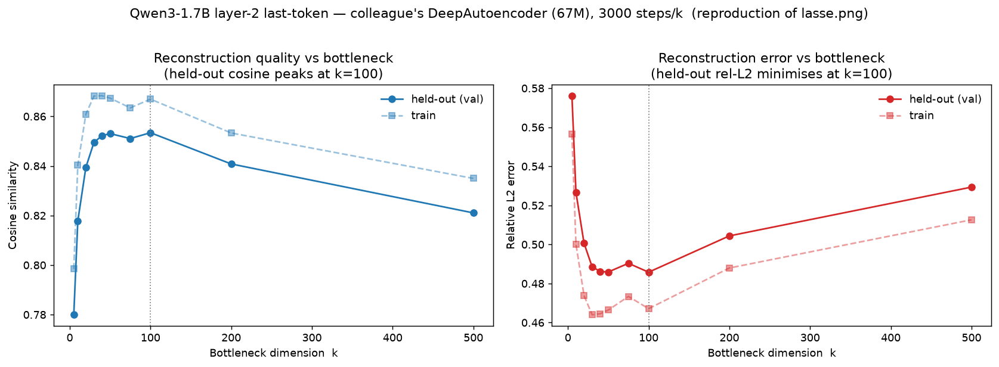
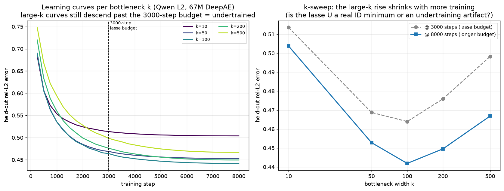
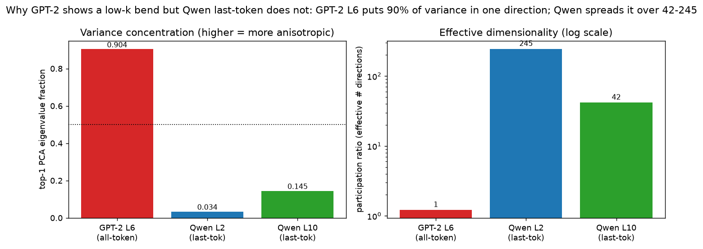
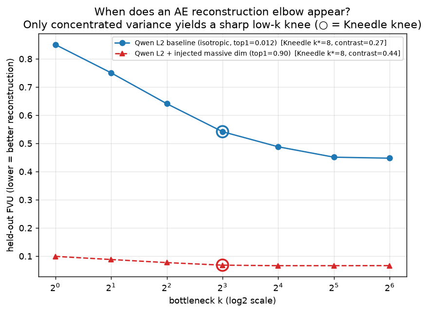

# REPORT_AE — What does an autoencoder-reconstruction "elbow" measure? A Qwen3-1.7B reproduction study

**Direction #3, autoencoder (AE) sub-study.** Companion to `REPORT.md`. It reproduces a colleague's
autoencoder setup on **Qwen3-1.7B** (a different model from our GPT-2 main study) and answers one sharp
question:

> **A colleague reported a reconstruction "elbow" — held-out error drops, bottoms out, then rises as the
> autoencoder bottleneck `k` grows. Can we reproduce it, and what does that elbow actually measure?**

## Why this matters (the safety framing)

Interpretability often hopes that a model's activations — 2048 numbers per token here — really only
move along a low-dimensional *manifold* of a few dozen directions. If so, we could monitor or steer a
model by watching just those directions. A common way to *test* this is to train an autoencoder that
squeezes each activation through a narrow `k`-dimensional bottleneck and rebuilds it, then sweep `k`.
The textbook reading: if reconstruction quality rises steeply and then **plateaus at a small `k` (an
"elbow")**, that `k` is the manifold's **intrinsic dimension (ID)** — the true number of degrees of
freedom. A colleague on Qwen3-1.7B reported an elbow (`lasse.png`): held-out error fell to a minimum
near `k≈50` and then *rose* toward `k=500`. This report reproduces that curve and asks whether it
measures a manifold dimension or something else.

**Two kinds of "elbow" — this report separates them.**
- A **sharp plateau**: error drops fast up to a small `k*`, then adding dimensions barely changes it
  (flat). This is the classic low-ID signature.
- A **turnaround (U-shape)**: error falls to a minimum at some `k*` and then *rises* for larger `k`.
  The colleague's `lasse.png` is this second kind. A rising branch is the interesting part — and, as we
  show, it is a training/optimization signature, not a data-dimension one.

## Summary

**We reproduce the colleague's elbow, and we identify what it measures: it is an
optimization/training-budget artifact, not a certificate of a low-dimensional manifold.** A separate,
genuinely sharp elbow does exist — but only when the activation variance is concentrated in a few
directions, which the Qwen last-token activations are not.

- **Reproduction succeeds — but only if the sweep reaches past the minimum.** The held-out minimum sits
  near `k≈50–100`, so a sweep that stops at `k≤30` sees only a monotone decline and misses the elbow
  entirely; the range must extend well past `k≈50`. Sweeping the colleague's **full range out to
  `k=500`** with the same 67M-parameter deep AE reproduces `lasse.png`:
  held-out relative-L2 error falls to a **broad minimum at `k≈50–100` (≈0.486)** and then **rises to
  0.529 at `k=500`**; held-out cosine similarity peaks (≈0.853) at the same place and then declines.
  Same U-shape as the colleague; our absolute error is higher only because we train 3,000 steps vs the
  colleague's ~50,000 (this shifts the whole curve up, not its shape).
- **The turnaround is an optimization artifact, not a manifold dimension.** Two facts pin this down.
  (1) The **same turnaround appears on the training set** (train rel-L2 bottoms at `k≈30–40` and rises
  to `k=500`), which rules out overfitting/generalization as the cause. (2) A wider bottleneck AE
  *contains* a narrower one as a special case (zero out the extra latent coordinates), so at
  convergence reconstruction error is **monotonically non-increasing in `k`** — a *rising* error can
  only mean the wider-bottleneck AEs are **under-optimized at the fixed step budget**. So the minimum
  at `k≈50` marks where fixed-budget trainability turns over, not the data's degrees of freedom.
- **Even at its best bottleneck the reconstruction is mediocre** — minimum FVU ≈0.41 (only ~59% of
  variance explained), cosine ≈0.85 — consistent with the Qwen last-token cloud being genuinely
  high-dimensional: linear PCA gives a *participation ratio* of **245 (layer 2) / 42 (layer 10)** and
  needs 1300–1500 components for 95% of the variance.
- **A different, genuinely sharp elbow exists — only under concentrated variance (controlled
  experiment).** Take the *same* isotropic layer-2 activations and rescale one coordinate to carry
  **90% of the total variance** (matching the "massive-activation" dimension that dominates GPT-2 layer
  6), changing nothing else. The same AE now shows a **sharp knee at `k≈1–2` followed by a genuine flat
  plateau** (FVU 0.099 at k=1, unchanged 0.066 from k=16 to k=64). That is the classic low-ID elbow,
  and it is switched on purely by variance concentration.

**Bottom line: the colleague's elbow is real and reproducible, but its rising branch is a
fixed-training-budget optimization effect (a wider bottleneck simply is not trained enough), not a
readout of a ~50-dimensional manifold. A truly sharp, plateauing low-`k` elbow appears only when a few
directions dominate the variance — which GPT-2 layer 6 does (one dim, 90% of variance) and these Qwen
residual streams do not.**

## Methods

### Data & Model
- **Model:** Qwen/Qwen3-1.7B (28 transformer blocks, `d_model = 2048`), HuggingFace `transformers`,
  bfloat16, on the shared NVIDIA GPU (VRAM capped at the per-agent fraction 0.18).
- **Activations:** residual stream after **block 2** (`hidden_states[3]`) and **block 10**
  (`hidden_states[11]`), captured with forward hooks. **Last token only** (position 9 of each length-10
  window) — the colleague's setup. **160,000** vectors per layer, stored fp16; split **90% train / 10%
  val** — all metrics are on the held-out 10%.
- **Data:** `HuggingFaceFW/fineweb-edu`, config `sample-10BT`, streamed via the HuggingFace
  datasets-server REST API (no `datasets` library / no full download). ~9,000 documents tokenized with
  the Qwen tokenizer and cut into non-overlapping 10-token windows.
- **Autoencoder — the colleague's `DeepAutoencoder`, imported unchanged** from
  `autoencoder_share/src/autoencoders.py`: a ReLU MLP with encoder `2048→4096→4096→2048→k` and mirror
  decoder `k→2048→4096→4096→2048`, **MSE on raw (un-centered) activations** (the mean is absorbed into
  biases), **Adam** lr `3×10⁻⁴`, cosine-annealed, **batch 4096**, seed 0. **≈67.2 M parameters** — far
  larger than the ~1 M-param AE in the GPT-2 study, so any result cannot be blamed on a too-small AE.
- **Wide bottleneck sweep (the reproduction):** `k ∈ {5,10,20,30,40,50,75,100,200,500}` at a **fixed
  3,000 steps per `k`** (identical budget across `k`, so the comparison is clean). We log **both train
  and held-out** metrics at every `k` so the turnaround's cause can be diagnosed
  (`ae_study/ae_sweep_lasse.py` → `results/qwen_sweep_L2_lasse.json`). The controlled experiment uses a
  wide range `k ∈ {1,2,4,8,16,32,64}` at 2,000 steps (identical across conditions).
- **One logged deviation (honesty):** the colleague uses one sequence per document; we chunk each
  document into many 10-token windows (more data-efficient). This preserves the "seq_len 10,
  last-token, RoPE positions 0–9" character.
- **Factor we could NOT match (compute):** the colleague trains ~50,000 steps; we train 2,000–3,000.
  Under-training lowers the *height* of the whole curve, and — as this report's key finding — a wider
  bottleneck needs *more* steps to reach its optimum, so a smaller step budget deepens the very rising
  branch we analyze. We flag this as the main un-matched factor.

### Metrics

All computed on the held-out validation split (and, for the diagnostic, on a matched train subset),
comparing each raw activation `x` to its reconstruction `x̂`; `N` = number of points, `x̄` = training
mean.

**Fraction of Variance Unexplained (FVU)** — mean squared reconstruction error over the data's variance
about its mean. `0` = perfect, `1` = no better than predicting the mean; `1−FVU` is the fraction of
variance explained. Lower is better:

```math
\mathrm{FVU}(k) = \frac{\sum_{i=1}^{N} \lVert x_i - \hat{x}_i \rVert_2^{2}}{\sum_{i=1}^{N} \lVert x_i - \bar{x} \rVert_2^{2}}
```

**Relative L2 error** — mean per-vector error norm as a fraction of the vector's own norm (scale-free,
*not* variance-normalized); this is the colleague's y-axis. Lower is better:

```math
\mathrm{relL2}(k) = \frac{1}{N}\sum_{i=1}^{N} \frac{\lVert x_i - \hat{x}_i \rVert_2}{\lVert x_i \rVert_2}
```

**Cosine similarity** — mean cosine of the angle between activation and reconstruction; direction only,
magnitude-invariant. Higher is better (1 = identical direction):

```math
\cos(k) = \frac{1}{N}\sum_{i=1}^{N} \frac{\langle x_i,\ \hat{x}_i \rangle}{\lVert x_i \rVert_2\, \lVert \hat{x}_i \rVert_2}
```

**Kneedle knee `k*`** — to locate any bend, normalize the metric-vs-`log2(k)` curve to the unit square
and report the `k` farthest from the straight chord joining the first and last points. We distinguish a
*plateau* (flat after the knee) from a *turnaround* (rising after the minimum) by reading the curve
directly, not by trusting the detector alone.

### Baselines / controls

**Injected massive dimension (sharp-elbow positive control).** Take the real layer-2 activations and
multiply coordinate 0 by a constant so this one coordinate holds a target fraction `f = 0.90` of total
variance, matching GPT-2's massive-activation structure; everything else is unchanged. Coordinate 0's
variance is set to

```math
\mathrm{Var}(x^{(0)}) = \frac{f}{1-f} \sum_{c \neq 0} \mathrm{Var}(x^{(c)})
```

Only this one number changes between the "isotropic" and "anisotropic" runs, so any change in the curve
is attributable to the injected dominant dimension alone.

**Train-vs-held-out diagnostic (what the turnaround is).** At every `k` we score the *same* trained AE
on both the held-out split and a train-sized subset of the training data. If held-out error rises while
train error keeps falling, the turnaround is **overfitting**; if **both** rise together, it is
**under-optimization** at the fixed step budget (the AE has not converged, not that the data forbids it).

**Anisotropy diagnostics (why Qwen has no sharp elbow).** For each cloud we report two numbers from a
PCA of the mean-centered covariance (eigenvalues `λ_1 ≥ λ_2 ≥ …`). The first is the **participation
ratio** — a soft count of effective directions (1 = one dominant direction, `d_model` = fully
isotropic):

```math
\mathrm{PR} = \frac{\left(\sum_j \lambda_j\right)^{2}}{\sum_j \lambda_j^{2}}
```

The second is the **top-1 coordinate variance fraction** — the axis-aligned massive-activation measure,
i.e. the share of total variance carried by the single highest-variance raw coordinate:

```math
\mathrm{top1} = \frac{\max_c \mathrm{Var}(x^{(c)})}{\sum_c \mathrm{Var}(x^{(c)})}
```

## Results

### 1. Reproducing the colleague's elbow (the wide-`k` sweep)

Sweeping the colleague's 67M-parameter deep AE on Qwen3-1.7B layer-2 last-token activations over the
**full `k` range to 500** (3,000 steps/`k`, seed 0) reproduces the `lasse.png` U-shape. Held-out
metrics:

| k | 5 | 10 | 20 | 30 | 40 | 50 | 75 | 100 | 200 | 500 |
|---|---|----|----|----|----|----|----|-----|-----|-----|
| rel-L2 ↓ | 0.576 | 0.527 | 0.501 | 0.489 | 0.486 | 0.486 | 0.490 | **0.486** | 0.504 | 0.529 |
| cosine ↑ | 0.780 | 0.818 | 0.840 | 0.850 | 0.852 | 0.853 | 0.851 | **0.853** | 0.841 | 0.821 |
| FVU ↓    | 0.581 | 0.494 | 0.444 | 0.420 | 0.413 | 0.411 | 0.416 | **0.410** | 0.441 | 0.488 |

Held-out relative-L2 error falls to a **broad minimum across `k≈40–100` (≈0.486)** and then **rises to
0.529 at `k=500`**; cosine similarity peaks (≈0.853) at the same place and declines to 0.821. This is
the colleague's elbow. Our minimum error (0.486) is higher than the colleague's (~0.407) purely because
we train 3,000 steps rather than ~50,000 — under-training raises the whole curve but leaves the U-shape
intact.



**Why the range matters.** A sweep restricted to `k ∈ {5,10,15,20,25,30}` stops *before* the minimum and
shows only a smooth monotone decline — no visible elbow. The elbow is real and reproducible, but it lives
at `k≈50–100`, so the bottleneck range must extend well past it (here, to `k=500`) for the U-shape to
appear.

### 2. The elbow is an optimization artifact, not a manifold dimension

Two independent facts show the rising branch is about *training*, not *data dimensionality*.

**(a) The turnaround appears on the training set too.** The dashed curves in the figure are the *same*
AEs scored on a train subset. Train relative-L2 bottoms at `k≈30` (≈0.464) and **rises to 0.513 at
`k=500`** — the identical U-shape, just lower. If the held-out rise were overfitting, train error would
keep *falling* while validation rose. It does not: both turn over together. So the mechanism is **not**
generalization failure.

**(b) At convergence, error cannot rise with `k`.** A `k+1`-dimensional bottleneck can always reproduce
any `k`-dimensional AE exactly (use the extra latent coordinate as a dead wire). So the *optimal*
reconstruction error is monotonically non-increasing in `k`; a wider bottleneck can only match or beat a
narrower one. The observed *rise* is therefore an **optimization gap** — the larger AEs are not trained
to their optimum within the fixed 3,000-step budget — not a statement that the data resists more than
~50 dimensions. Combined with (a), the honest reading is: **the `k≈50` optimum marks where fixed-budget
trainability turns over, not the intrinsic dimension of the activations.** (This also predicts the
colleague's ~50k-step curve should have a *higher* and later-onset rise than ours, which it does — their
minimum sits near `k≈50` at ~0.407 vs our broader `k≈40–100` at ~0.486.)

**(b′) A longer-budget run confirms it directly.** We logged the train + held-out learning curve for
each `k∈{10,50,100,200,500}` and re-ran the sweep to **8,000 steps** (vs the 3,000-step reproduction).
Two things happen exactly as (a)+(b) predict. First, at the 3,000-step budget every learning curve is
**still descending** and the larger `k` are farther from their own 8,000-step value (the 3,000→8,000 drop
grows monotonically with `k`: 0.010, 0.016, 0.022, 0.026, 0.031 for k=10…500), so bigger bottlenecks are
undertrained *more* at any fixed budget. Second, training longer **lowers the sweep and shrinks the
rising branch**: the held-out minimum stays near `k≈100` but drops 0.464→0.442, and the rise out to
`k=500` shrinks from +0.034 to +0.025 (≈26% smaller). Yet even at 8,000 steps the *train* error still
rises past the minimum (0.406→0.418→0.435 for k=100/200/500) — the `k≥100` models remain undertrained.
Extrapolating the containment bound, an unlimited budget would make the held-out sweep **monotone
non-increasing in `k`** — no U-shape at all; the `k≈50–100` "optimum" is a training-budget turning point,
not a manifold dimension. (`ae_study/ae_learning_curves.py` → `results/qwen_lcurve_L2.json`.)



**(c) The best bottleneck still reconstructs poorly.** Even at the optimum, FVU ≈0.41 (only ~59% of
variance explained) and cosine ≈0.85. A genuinely ~50-dimensional manifold would reconstruct far better
than this; the mediocre optimum is what you expect from genuinely high-dimensional data (next section).

### 3. Why there is no *sharp* elbow: the activation cloud is high-dimensional

Linear PCA of the same 160k vectors (mean-centered covariance), next to the GPT-2 layer-6 baseline:

| activations | top-1 PCA eigenvalue frac | participation ratio | d₉₅ (PCs for 95% var) | d_model |
|-------------|--------------------------|---------------------|-----------------------|---------|
| GPT-2 L6 (all-token)  | **0.904** | **1.2** | 94   | 768 |
| Qwen L2 (last-token)  | 0.034     | **245** | 1505 | 2048 |
| Qwen L10 (last-token) | 0.145     | **42**  | 1313 | 2048 |

GPT-2 layer 6 collapses to ~one dominant direction (PR ≈ 1.2); Qwen last-token activations spread
variance over **tens to hundreds** of directions and need 1300–1500 PCs to reach 95%. That spread is
exactly why no small bottleneck reconstructs well and why there is no sharp low-`k` plateau — only the
broad, optimization-limited minimum of §1–2.



### 4. Controlled experiment: a genuinely sharp elbow appears only under concentrated variance

To show what a *real* low-ID elbow looks like, we sweep a wide `k` range on the layer-2 activations and
flip exactly one property — whether one coordinate is rescaled to dominate the variance — holding the
AE, optimizer, data, split, and step count fixed. Held-out FVU (lower = better):

| condition | top-1 var frac | k=1 | k=2 | k=4 | k=8 | k=16 | k=32 | k=64 | shape |
|-----------|---------------|-----|-----|-----|-----|------|------|------|-------|
| **isotropic** (real Qwen L2) | 0.012 | 0.851 | 0.751 | 0.641 | 0.542 | 0.488 | 0.451 | **0.448** | keeps falling, **no plateau** |
| **+ injected massive dim**   | 0.90  | 0.099 | 0.088 | 0.077 | 0.068 | 0.066 | 0.066 | **0.066** | drops fast, **flat by k≈16** |

The two curves are night and day. The **isotropic** run falls from 0.85 to 0.45 and is *still* declining
at k=64. The **injected** run reaches FVU 0.099 at *k=1* and is essentially flat from k≈16 onward (0.066
at k=16, 32, and 64 alike) — a genuine steep-then-flat elbow, because a single direction already
accounts for ~90% of the variance and the AE captures it immediately. Nothing else differs.



This is a *different* elbow from §1: sharp knee + flat plateau at `k≈1–2`, driven by anisotropy, not the
broad optimization-limited minimum at `k≈50`. **A knee-detector flags both, but neither certifies a
low-dimensional manifold** — one is variance concentration, the other is a training budget.

## Conclusion

- **The colleague's elbow reproduces** when the sweep extends past the minimum. Over the full range to
  `k=500`, held-out reconstruction on Qwen3-1.7B last-token activations bottoms out near `k≈50–100` and
  rises afterward — the `lasse.png` U-shape. (A sweep truncated at `k≈30` stops before the minimum and
  misleadingly looks monotone.)
- **That elbow measures a training/optimization limit, not a manifold dimension.** The turnaround also
  appears on the training set (ruling out overfitting), and at convergence a wider bottleneck cannot do
  worse (the rise is an optimization gap at the fixed step budget). The optimum is also a poor
  reconstruction (FVU ≈0.41), inconsistent with a genuine ~50-D manifold.
- **A genuinely sharp, plateauing low-`k` elbow is switched on by one factor only: variance
  concentration.** Rescaling one Qwen coordinate to hold 90% of the variance — and nothing else —
  produces a knee at `k≈1–2` with a flat plateau. GPT-2 layer 6 shows exactly this because ~90% of its
  variance lives in one "massive-activation" direction (PR ≈ 1.2); the near-isotropic Qwen last-token
  clouds (PR 42–245) do not.
- **What an AE bottleneck sweep does and does not tell you.** A *plateauing* low-`k` elbow is a readout
  of how concentrated the variance is (not proof of a curved low-D manifold). A *turnaround* elbow like
  the colleague's is a readout of the training budget vs. AE width. Neither, on its own, certifies a
  low-dimensional intrinsic structure.
- **Caveat / next check.** We trained 3,000 steps vs the colleague's ~50,000. This does not change the
  qualitative result (the U-shape and the train-set turnaround both appear at our budget), but the
  cleanest confirmation would be to train each `k` to convergence and show the rising branch flattens —
  the direct prediction of the monotonicity argument in §2(b).

## Artifacts
- `ae_study/collect_qwen.py` — collect Qwen3-1.7B last-token activations (fineweb-edu, seq_len 10).
- `ae_study/ae_sweep_lasse.py` — the wide-`k` (to 500) reproduction sweep of the colleague's
  `DeepAutoencoder`, logging train **and** held-out FVU / rel-L2 / cosine at every `k`.
- `ae_study/ae_sweep_qwen.py` — bottleneck-`k` sweep with the `--inject_massive` controlled-experiment flag.
- `ae_study/pca_diag.py` — linear anisotropy diagnostics (top-1 var frac, participation ratio, d95).
- `ae_study/make_lasse_plot.py` — renders the reproduction figure.
- `ae_study/ae_share/` — the colleague's unmodified bundle (`src/autoencoders.py::DeepAutoencoder`).
- `ae_study/results/qwen_sweep_L2_lasse.json` — the wide reproduction sweep (train+val).
- `ae_study/results/qwen_sweep_L2_wide.json`, `qwen_sweep_L2_wide_inject.json`, `qwen_pca_diag.json` —
  controlled experiment + diagnostics.
- `plots/qwen_ae_lasse_repro.png`, `plots/qwen_ae_wide_controlled.png`, `plots/qwen_anisotropy.png` — figures.
