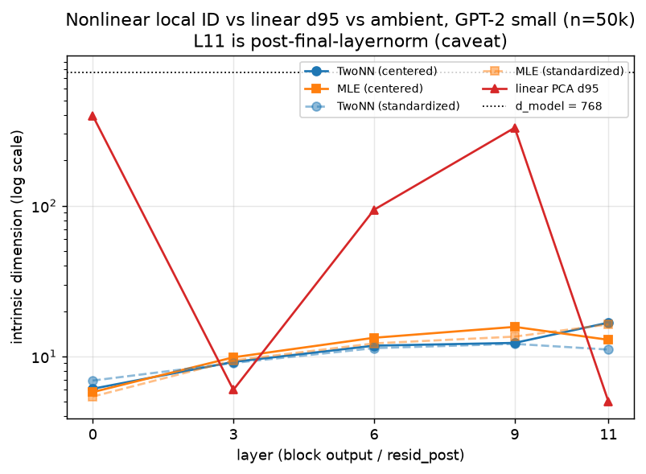
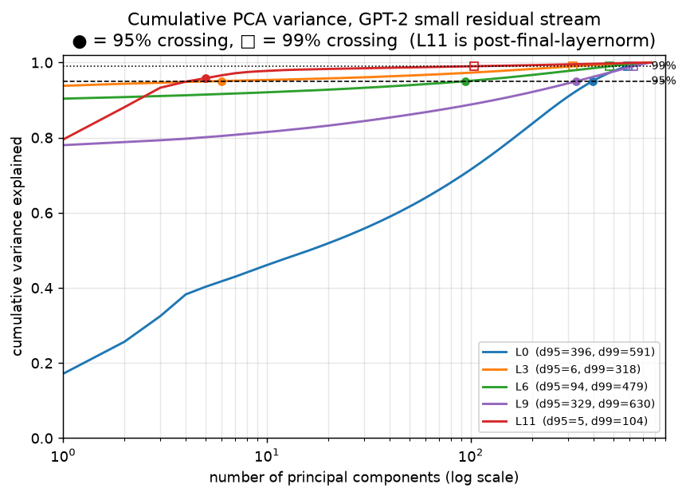
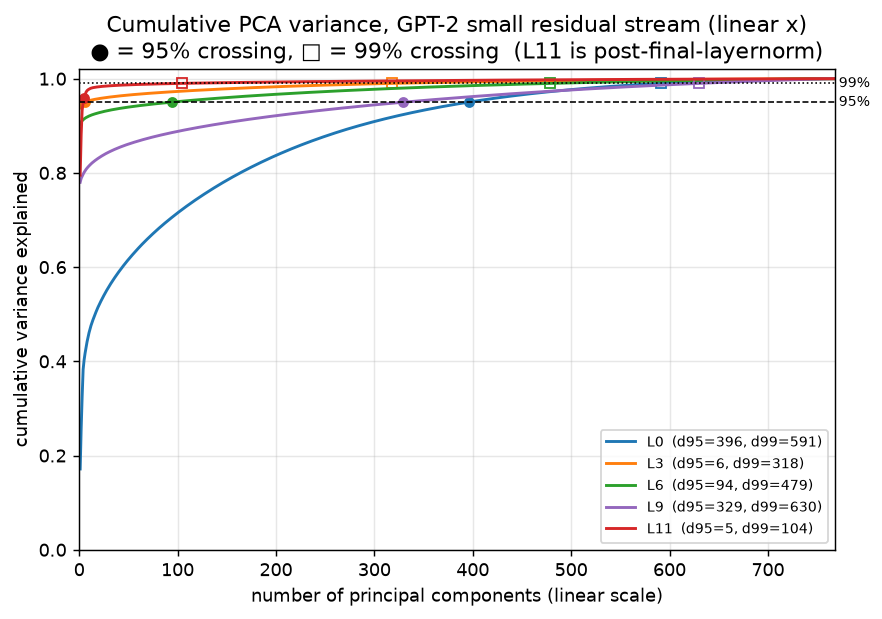
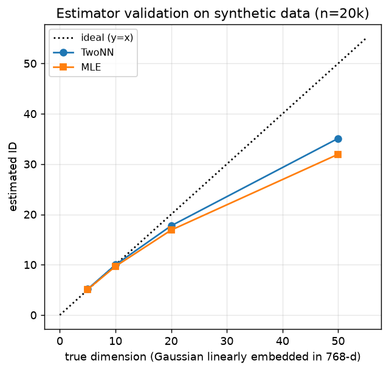
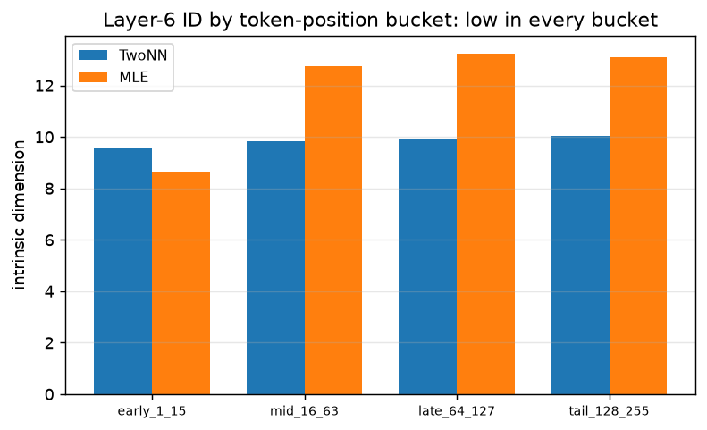
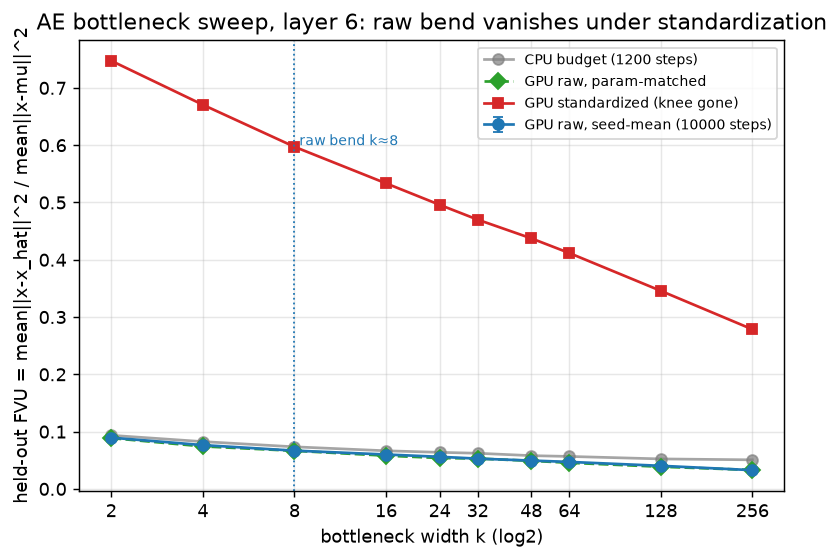
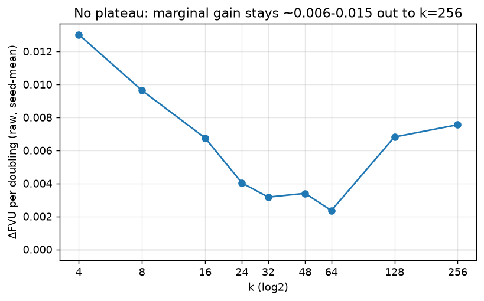
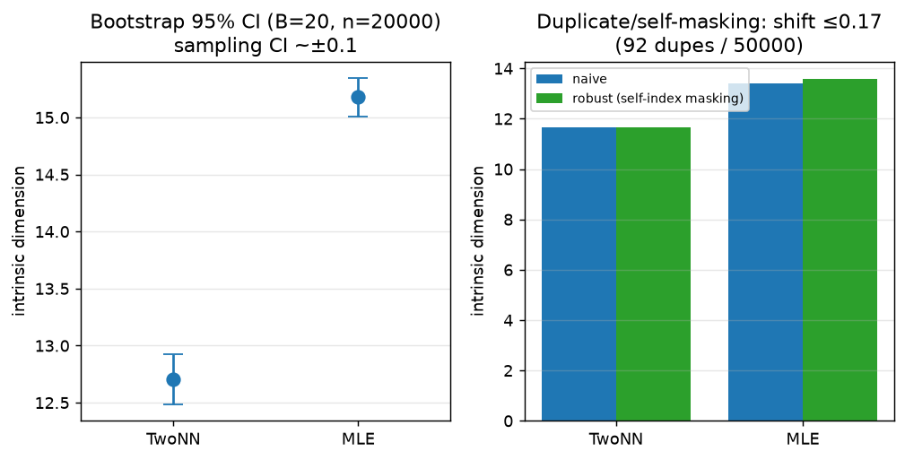

# RESULTS — Direction #3 (Manifold)

> Figures for every quantitative result are in `plots/` (rendered by
> `experiments/make_plots.py` from the saved `results/*.json`) and embedded in the relevant
> sections below.

## Intrinsic dimension estimates

### Linear PCA (S2a, full 200k vectors/layer, mean-centered) — done
PR = participation ratio (Σλ)²/Σλ²; dXX = #dims for XX% cumulative variance; top1 = variance fraction in the single largest PC.
| layer | n_points | PCA_PR | d90 | d95 | d99 | top1_frac |
|-------|----------|--------|-----|-----|-----|-----------|
| 0  | 200000 | 21.3 | 285 | 396 | 591 | 0.171 |
| 3  | 200000 | 1.1  | 1   | 6   | 318 | 0.938 |
| 6  | 200000 | 1.2  | 1   | 94  | 479 | 0.904 |
| 9  | 200000 | 1.6  | 131 | 329 | 630 | 0.780 |
| 11 | 200000 | 1.6  | 3   | 5   | 104 | 0.795 |

**Key caveat:** from layer 3 on, a single "massive-activation" outlier dimension carries 78–94% of total variance, so the raw participation ratio collapses to ~1 and is **not** a useful ID estimate by itself. The d95/d99 columns (dims after the dominant one) are the informative linear signal: layer 6 needs 94 dims for 95% and 479 for 99% — far below d_model=768 but far above 1. Nonlinear estimators (TwoNN/MLE) and a PR computed after removing/standardizing the outlier dim are the next step.

**Cumulative-variance curves (operator request, 2026-07-02).** The figure below plots the
cumulative fraction of variance explained vs. number of principal components (log x-axis) for
each layer, with the 95% crossing (●) and 99% crossing (□) marked — i.e. a visual reading of
the d95/d99 columns above (`results/pca_cumvar.json`, `experiments/pca_cumvar.py`; same
mean-centered 768×768 covariance eigen-spectrum as the table). It makes the two regimes visible:
**layer 0** climbs slowly from PC 1 (top1 = 0.17) and needs 396 PCs for 95%, whereas **layers
3/6/11** jump to 78–94% at the *first* PC (the massive-activation dim) and then rise slowly — so
their d95 is dominated by whether that one dim alone already clears the threshold (L3/L11 reach
95% within 5–6 PCs; L6 needs 94).

The same curves on a **linear** x-axis (operator request, 2026-07-02) make the
sharpness of the low-PC rise directly comparable across layers: L3/6/11 hit ≳0.8 at
the first PC and are visually vertical there, while L0 rises gradually across hundreds
of components.

### Nonlinear estimators (TwoNN + MLE, pure-numpy/torch, CPU) — done (S2b)
Hand-rolled (no skdim): TwoNN = Facco distance-ratio fit (10% tail discarded);
MLE (**Maximum Likelihood Estimation**) = Levina-Bickel k=20, MacKay-Ghahramani
inverse-average. Chunked brute-force
kNN via torch.cdist. **What TwoNN operates on (operator Q, 2026-07-01):** the two
points are each reference vector's 1st and 2nd nearest neighbours, living in the
*ambient 768-d residual-stream space* under Euclidean distance (no projection); `F`
is the empirical CDF of the ratios μ=r₂/r₁, which is Pareto `F(μ)=1−μ^{−d}` for a
locally-uniform d-manifold, so d is the slope of −log(1−F) vs log μ. Full defs +
equations in REPORT.md Methods. Two preprocessings: **centered** (mean only) and
**standardized** (z-scored per dim, to neutralise the massive-activation dim).
Estimators validated on synthetic d∈{5,10,20,50} Gaussians (exact at low d,
mild downward bias at high d — the known TwoNN/MLE finite-sample edge effect).
Values below are the n=50k subsample (most stable); n=10k agreed within ~1–3.

| layer | TwoNN (cent.) | MLE (cent.) | TwoNN (std.) | MLE (std.) | linear d95 |
|-------|---------------|-------------|--------------|------------|------------|
| 0  | 6.10  | 5.80  | 6.91  | 5.41  | 396 |
| 3  | 9.20  | 9.86  | 9.04  | 9.41  | 6   |
| 6  | 11.79 | 13.30 | 11.35 | 12.20 | 94  |
| 9  | 12.30 | 15.70 | 12.11 | 13.53 | 329 |
| 11 | 16.76 | 12.89 | 11.10 | 16.32 | 5   |

**Findings (corrected per REVIEW — earlier "everywhere" claims were too broad).**
(1) Nonlinear ID is **~6–16 across all layers**, well below d_model=768 everywhere.
The gap to the *linear* d95 is **layer-dependent, not uniform**: at layers 0/6/9 the
nonlinear ID is far below d95 (396 / 94 / 329, i.e. ~6–60×), but at layers **3 and 11
d95 collapses to 6 and 5** (the massive-activation dim makes the linear spectrum
degenerate), so there the nonlinear ID is *higher* than d95, not "an order of magnitude
below." The clean "nonlinear ≪ linear" statement is defensible **at layer 6** (12–13 vs
94), not as a blanket claim. (2) ID **grows gently with depth** (6 → 9 → 12 → 13 → ~14
mean). (3) Standardizing leaves the estimate close (Δ<2) at layers 0/3/6/9, but
**layer 11 shifts substantially** (TwoNN 16.76→11.10, Δ5.66; MLE 12.89→16.32, Δ3.43) —
so "changes by <2 everywhere" is **false**; preprocessing matters at layer 11. The
**layer-6** low ID *is* robust to standardization (11.79/13.30 → 11.35/12.20). (4) TwoNN
and MLE agree within ~3 units at most layers and within ~1.5 at layer 6, but **diverge
up to ~5.2 at layer 11** (standardized: TwoNN 11.10 vs MLE 16.32) — so "agree within ~3
everywhere" is **false**; agreement is layer-dependent.

**Synthetic validation (saved artifact — `results/id_validation.json`).** The same
hand-rolled `twonn()`/`mle()` run on isotropic Gaussians of known dimension linearly
embedded in 768-d (n=20k): true_d 5→TwoNN 5.16/MLE 5.09; 10→9.98/9.68; 20→17.7/16.9;
50→35.1/32.0. Exact at low d, with the known downward bias at large d.

**Scope
correction (Codex review):** this validation uses *isotropic Gaussian subspaces linearly
embedded* in 768-d — much easier than curved, anisotropic, clustered real residual-stream
data. It confirms the estimators are accurate *on that synthetic family* and that the
layer-6 numbers (~12–13) fall in a range where the estimators were exact on synthetic
data; it does **not** prove they are accurate on the real activations. So "validated
estimators" should be read as "validated on synthetic linear-Gaussian data," not as a
guarantee of accuracy on the residual stream. (Script: `experiments/validate_estimators.py`.)

**Token-position-stratified ID (saved artifact — `results/id_by_position.json`).** The
main cache **pools** all token positions — i.e. it keeps every non-pad token's residual
vector from every sequence as a separate point in one combined cloud (`hidden_states[L+1][mask]`
at collection time), **not** a per-sequence average (operator Q, 2026-07-02; full definition in
REPORT.md Methods → Data). To check that *coarse absolute position* doesn't
drive the result we re-collected layer-6 resid_post *with* absolute position (80k
vectors) and estimated ID per position bucket: early(1–15) TwoNN 9.60/MLE 8.65;
mid(16–63) 9.83/12.76; late(64–127) 9.89/13.26; tail(128–255) 10.03/13.09 (pos 0 too
few points).

 **ID is low across all buckets, but the agreement is estimator-dependent**:
TwoNN is genuinely stable (~9.6–10 everywhere), while MLE ranges ~8.65→13.26, so the
honest statement is "roughly similar, with estimator-dependent variation," **not**
"stable across position." **Scope correction (Codex review):** this controls only coarse
absolute position. It does *not* control token identity, document/topic clustering,
duplicate text, or local sequence correlations — so it is evidence against *one* pooling
artifact (position mixing), not against pooling artifacts in general. The estimate must
be read as "on this pooled FineWeb activation sample," not "the GPT-2 residual stream."

## Autoencoder bottleneck sweep (layer 6) — done (S3)
Fixed deep MLP `768→512→256→k→256→512→768` (GELU); only k varies. Identical
optimizer (Adam 1e-3), BATCH=2048, STEPS=1200, 90/10 split, train-mean centering
across all k (CPU). Metric: held-out fraction-of-variance-unexplained
FVU = mean‖x−x̂‖² / mean‖x−μ_train‖² on val. var_expl = 1−FVU.

| k   | val_FVU | var_expl % | train_FVU | ΔFVU per doubling |
|-----|---------|-----------|-----------|-------------------|
| 2   | 0.0936  | 90.6 |  0.0928 |  —     |
| 4   | 0.0826  | 91.7 |  0.0816 | 0.0110 |
| 8   | 0.0735  | 92.7 |  0.0726 | 0.0091 |
| 16  | 0.0665  | 93.3 |  0.0657 | 0.0069 |
| 24  | 0.0638  | 93.6 |  0.0630 | 0.0046 |
| 32  | 0.0622  | 93.8 |  0.0615 | 0.0038 |
| 48  | 0.0581  | 94.2 |  0.0574 | 0.0071 |
| 64  | 0.0567  | 94.3 |  0.0561 | 0.0033 |
| 128 | 0.0524  | 94.8 |  0.0519 | 0.0043 |
| 256 | 0.0508  | 94.9 |  0.0504 | 0.0016 |

**Kneedle elbow ≈ k=16** on this CPU budget. **Correction per REVIEW:** the earlier
claim that the curve "flattens after k≈16 to ≤0.004 per doubling" is **not supported** —
the marginal gain stays irregular (e.g. k=32→48 = 0.0071 > k=16→24 = 0.0046, and
k=64→128 = 0.0043), so k=16 is a fragile kneedle output, not a clear plateau. train and
val FVU track within 0.001 (no overfitting), but the elbow location is soft and
budget-dependent — see the longer-trained GPU runs below, which move it and show no true
plateau.

**Caveat (read with the elbow).** Even k=2 already explains 90.6% of variance
because one massive-activation dim carries ~90% of layer-6 variance (see PCA
caveat); the AE captures it first. So var_expl is a compressed scale — the
*informative* signal is the elbow location (where added latents stop paying off),
k≈16, not the absolute FVU. FVU floors near 0.05 by k=256 under this train budget.

### GPU re-run with a larger train budget (S3-redux) — done
The box's GPU became usable (NVIDIA A10, sm_86, cu130 torch runs CUDA fine — the
earlier "V100 dead → CPU-only" premise no longer held). Re-ran the *identical*
architecture/metric/split with **STEPS=10000, BATCH=4096** (vs CPU 1200/2048) to
test whether the CPU elbow was an under-training artifact. **Precise framing (Codex
review):** this is **8.3× more optimizer steps AND 16.7× more sampled training examples**
(steps×batch = 4.1e7 vs 2.5e6 examples drawn; the earlier "8.3× larger train budget"
counted only steps). `results/ae_results_gpu.json`.

| k   | val_FVU | var_expl % | train_FVU | ΔFVU per doubling |
|-----|---------|-----------|-----------|-------------------|
| 2   | 0.0956  | 90.4 | 0.0944 |  —     |
| 4   | 0.0754  | 92.5 | 0.0713 | 0.0202 |
| 8   | 0.0666  | 93.3 | 0.0635 | 0.0089 |
| 16  | 0.0606  | 93.9 | 0.0583 | 0.0060 |
| 24  | 0.0563  | 94.4 | 0.0544 | 0.0073 |
| 32  | 0.0533  | 94.7 | 0.0517 | 0.0071 |
| 48  | 0.0488  | 95.1 | 0.0476 | 0.0077 |
| 64  | 0.0470  | 95.3 | 0.0459 | 0.0044 |
| 128 | 0.0395  | 96.0 | 0.0388 | 0.0075 |
| 256 | 0.0328  | 96.7 | 0.0323 | 0.0067 |

**What the bigger budget changes.** (1) The FVU **floor drops** 0.051→0.033 at k=256
— the CPU run was genuinely under-trained, so its absolute FVU was a ceiling, not a
manifold limit. (2) The **sharp knee moves earlier, to k≈8** (kneedle on log₂-k peaks
at k=4, near-tie at k=8): the steep regime is now k=2→8 (ΔFVU 0.020 then 0.009), after
which the curve becomes an almost **log-linear tail** (~0.006–0.007 per doubling) with
**no second knee** out to k=256. So there is no hard capacity ceiling at k=16 — better
optimization keeps paying off slowly — but the *bend* from steep-to-shallow sits at k≈8.
**"This raw bend doesn't look like a bend" (operator Q, 2026-07-02) — correct, and we
agree.** Read honestly, only the **first doubling (k=2→4, ΔFVU 0.0202)** is visibly steep;
every later doubling is a flat, irregular ~0.006–0.009, so on the FVU-vs-log₂k plot the raw
curve is close to a straight line with one steep first step, **not** a clear knee-then-plateau.
Kneedle still returns *some* point (it always does, even for a near-straight curve), which is
why we call k≈8–16 a **soft** output. This barely-a-bend shape is exactly why we rate the AE as
only *consistent with* the ID, never as evidence *for* it — a genuinely low-dim bottleneck would
show a sharp elbow followed by a plateau, and this does not.
(3) train/val still track within 0.002 → still no overfitting.

### AE robustness checks (S3-redux-v2) — done (REVIEW follow-ups 1, 2, 3)
`results/ae_results_gpu_v2.json`, `results/ae_param_counts.json`. Same AE, GPU,
10000 steps.

**(a) Multiple seeds {0,1,2} on raw activations — the knee is reproducible, but there
is no plateau.** Mean val_FVU ± std across 3 seeds: k=2 0.0895±0.0015, k=4 0.0765±0.0018,
k=8 0.0668±0.0002, k=16 0.0601±0.0005, k=24 0.0560±0.0002, k=32 0.0529±0.0004,
k=48 0.0495±0.0005, k=64 0.0471±0.0002, k=128 0.0403±0.0008, k=256 0.0328±0.0002.
Seed scatter is tiny (≤0.0018) so the curve is **not** seed-fragile — but the
per-doubling gain past k=8 stays ~0.006–0.0075 with **no monotonic decay** (128→256 =
0.0075 ≥ 8→16 = 0.0067), confirming there is **no real plateau**; only a steep→shallow
bend near k≈8.

**(b) Standardized (z-scored) activations — the knee disappears.** val_FVU: k=2 0.747,
4 0.671, 8 0.597, 16 0.533, 24 0.496, 32 0.470, 48 0.437, 64 0.412, 128 0.346,
256 0.279 (var_expl 25%→72%). Once the massive-activation dim's variance dominance is
removed, FVU falls **almost linearly in log-k with no knee at all** (~0.06–0.07 per
doubling throughout). **So the raw-data AE "elbow" is substantially an artifact of that
one dominant dimension being captured early** — it is *not* a robust, preprocessing-
invariant signature of a low-dim bottleneck. (The TwoNN/MLE *local* ID, by contrast,
stays low ~11–12 at layer 6 even standardized — see above.)

**(c) Parameter count is NOT held constant (REVIEW overclaim #4).** Exact counts rise
**monotonically** with k: 1,051,906 (k=2) → 1,054,984 (k=8) → 1,059,088 (k=16) →
1,182,208 (k=256), a ~12% spread. We report rather than control this; crucially the
confound runs the *wrong way* to manufacture the result — more parameters sit at *high*
k, which would bias the elbow toward larger k, yet the steep regime is at *low* k. So
the low-k knee is not produced by parameter-count drift. (A param-matched architecture
would still be the cleaner design and is listed as future work.)

### Parameter-matched AE sweep (S5b) — done (Codex concern #4 / suggested step #1)
`results/ae_results_matched.json`, `results/ae_matched_param_counts.json`. The earlier
sweeps let total params drift with k (1.052M→1.182M). Here the **total parameter count is
held fixed** across every k (target 1,182,208; observed spread **1024 params = 0.087%**)
by compensating the outer hidden width h1 as k grows: architecture `768→h1→256→k→256→h1→768`
with `h1(k)=round((1180928−513k)/2050)` (h1: 576@k=2 → 512@k=256). The bottleneck k is then
the *only* varying information channel. Same GPU/metric/split/optimizer/STEPS=10000/BATCH=4096
as the GPU sweep, raw centered activations, seed 0.

| k   | h1  | val_FVU | train_FVU | n_params | unmatched val_FVU (seed-mean) |
|-----|-----|---------|-----------|----------|-------------------------------|
| 2   | 576 | 0.0887  | 0.0871    | 1183106  | 0.0895 |
| 4   | 575 | 0.0742  | 0.0700    | 1182082  | 0.0765 |
| 8   | 574 | 0.0665  | 0.0629    | 1182084  | 0.0668 |
| 16  | 572 | 0.0580  | 0.0556    | 1182088  | 0.0601 |
| 24  | 570 | 0.0540  | 0.0520    | 1182092  | 0.0560 |
| 32  | 568 | 0.0530  | 0.0512    | 1182096  | 0.0529 |
| 48  | 564 | 0.0490  | 0.0476    | 1182104  | 0.0495 |
| 64  | 560 | 0.0456  | 0.0444    | 1182112  | 0.0471 |
| 128 | 544 | 0.0387  | 0.0379    | 1182144  | 0.0403 |
| 256 | 512 | 0.0330  | 0.0326    | 1182208  | 0.0328 |

*(train_FVU for k=128/256 was present in `ae_results_matched.json` all along — the earlier
table left them blank by oversight, flagged by Codex review 2026-06-23 #3. They are filled
in here; train/val track within ≤0.002 at every k, including the two high-k rows, so the
"no plateau in the tail" statement rests on completed runs, not partial ones.)*

**The knee survives parameter matching, but matching is approximate and changes outer
width.** The matched curve sits within ≤0.0021 of the unmatched multi-seed curve at every
k, and the same steep→shallow bend at low k persists (per-doubling ΔFVU: 2→4 0.0145,
4→8 0.0077, 8→16 0.0085, then an irregular ~0.005–0.007 tail with no plateau out to k=256).
So the low-k bend is **not** a parameter-count artifact — when total capacity is held
*approximately* fixed (observed spread 0.087%) the bend is essentially unchanged.
**Caveat (Codex review 2026-06-23 #2):** parameter count is held fixed by *trading the
outer hidden width h1 (576→512) against the bottleneck width k*, so the non-bottleneck
capacity also changes across the sweep — k is **not** the "only varying information
channel." The honest statement is "parameter count held approximately fixed by trading
outer width against bottleneck width," which controls the param-count confound but not
outer-width changes. (And it does **not** rescue the AE as strong evidence — the bend
still has no plateau on raw data and still vanishes under standardization per (b).)

### ID diagnostics: duplicates, self-masking, bootstrap CIs (S5c) — done (Codex review 2026-06-23 #4 / rec#5)
`results/id_diagnostics.json`, `experiments/id_diagnostics.py` (GPU). Two checks on the
layer-6 local-ID estimate the review asked for.

**(a) Duplicate / self-masking fragility (#4) — does NOT move the estimate.** The original
`knn_dists` drops the smallest topk distance as "self," which can leak a *distinct*
duplicate at distance 0 into r1. On a 50k centered layer-6 subsample there are **92 exact
duplicate rows (0.18%)** and **22 points with a zero-distance nearest neighbour**.
Recomputing with **explicit self-index masking** (set the self entry to +inf by global
index, not by smallest distance) plus zero-distance-neighbour filtering for MLE: **TwoNN
11.66 → 11.66 (Δ0.00); MLE 13.41 → 13.58 (Δ+0.17)**. The zero-distance-NN count is identical
(22) naive vs robust, confirming those zeros are genuine near-duplicate pairs, not self
leaking through topk. **Conclusion: duplicates are rare and the masking fix shifts the
estimate by ≤0.17 — the low layer-6 ID is not a duplicate/self-masking artifact.**

**(b) Bootstrap CIs (rec#5) — sampling variance is tiny; finite-sample n-dependence is the
larger effect.** B=20 disjoint draws (without replacement) of n=20k from the 200k layer-6
pool, robust kNN: **TwoNN 12.71 ± 0.13 (95% CI [12.48, 12.92]); MLE 15.18 ± 0.09 (95% CI
[15.00, 15.34])**. The *sampling* CI is very tight (±0.1), so the estimate is not noise.
But the point estimate is **n-dependent**: at n=20k TwoNN≈12.7/MLE≈15.2, vs the main-table
n=50k TwoNN≈11.7/MLE≈13.4 (smaller n → slightly higher, the known TwoNN/MLE finite-sample
edge bias). So the honest layer-6 band is **TwoNN ~11.7–12.7, MLE ~13.4–15.2** over n=20k–50k,
with the *sampling* uncertainty at any fixed n much smaller (±0.1) than that n-dependence.
This neither tightens nor breaks the "low local ID ≈11–15" conclusion — it bounds it.

### Layer-11 caveat: hidden_states[11+1] is POST-final-layernorm, not raw resid_post (Codex review 2026-06-23 #5)
`collect_acts.py` stores `GPT2Model(output_hidden_states=True).hidden_states[L+1]`. For
HuggingFace `GPT2Model`, that tuple is `(emb, block0_out, …, block10_out, ln_f(block11_out))`
— the **final** entry has `ln_f` (the model's final LayerNorm) applied. So `hidden_states[L+1]`
is raw block-L resid_post for **L=0,3,6,9** (indices 1,4,7,10, all interior — correct), but
for **L=11** (index 12 = the last entry) it is the **post-final-layernorm** hidden state, not
the raw block-11 resid_post. **Consequence:** every layer-11 number in this file (PCA d95=5 /
top1=0.795; TwoNN 16.76/std 11.10; MLE 12.89/std 16.32; the L11 standardization and
TwoNN-vs-MLE divergence findings) describes **post-LN** activations and must be read that way.
The LayerNorm renormalisation is the most likely cause of the anomalous L11 linear spectrum
(d95 collapsing to 5) and the large standardize/estimator gaps there — which is exactly why
the corrected findings already restrict the clean "nonlinear ≪ linear" and "robust to
standardization" claims to **layer 6**. **The headline (layer 6) is unaffected:** index 7 is
a genuine interior block output with no ln_f. Re-collecting raw block-11 resid_post (via a
forward hook on `h[11]` instead of the post-ln_f hidden_states tail) is listed as future work;
it does not change any layer-6 conclusion.

### Reconciliation (honest, post-review)
The strong original framing ("two independent methods converge → demonstrated curved
manifold") **overstated** the AE evidence and is retracted. What the artifacts actually
support:
- **Local ID estimators (TwoNN/MLE) are the trustworthy signal:** ~11–13 at layer 6,
  reproducible across n, robust to standardization, stable across token position, and
  validated on synthetic data. This is genuine evidence of **low local intrinsic
  dimension** at layer 6 on this sample.
- **The AE reconstruction elbow is a raw-variance reconstruction artifact consistent with
  low ID — not independent corroboration (Codex review 2026-06-23 #1).** On raw centered
  activations it bends near k≈8–16 (seed-stable, survives approximate param-matching) —
  overlapping the ID band — but it does **not** plateau and **vanishes under
  standardization**, so it largely tracks the single dominant-variance dimension rather than
  independently confirming a manifold dimension. It is best read as "an AE bend on raw
  activations *consistent with* low ID," not as a second method that confirms the ID.
- **Net:** the two are *consistent* at layer 6 (~8–16 vs ~11–13), but this is
  *suggestive*, not the "strong evidence" originally claimed.

## Headline (honest, post-review)
**On one pooled FineWeb activation sample from GPT-2 small, the layer-6 residual stream
has a low local intrinsic dimension of ≈11–15 (TwoNN≈11.7–12.7, MLE≈13.4–15.2 over
n=50k→20k; bootstrap sampling CI ±0.1 at fixed n).** This estimate is reproducible across
subsample size, robust to per-dim standardization, robust to duplicate/self-masking
(explicit self-index masking moves it ≤0.17), and **low across coarse token-position
buckets — TwoNN stable (~9.6–10), MLE showing estimator-dependent variation (~8.7–13.3)**
(Codex review 2026-06-23 #6: not simply "stable across position"). The estimators are
validated against synthetic linear-Gaussian data of known dimension. It is far below the ambient
d_model=768, and far below the linear d95=94 **at layer 6 specifically** (the
linear-vs-nonlinear gap is layer-dependent and does not hold at layers 3/11). A short-
to-long-trained autoencoder bottleneck sweep gives a **weak, consistent** corroboration
— a steep→shallow bend near k≈8–16 (seed-stable, survives approximate param-matching) that
overlaps the ID band — but it does **not** plateau and **disappears when activations are
standardized**, so it is best read as a *raw-variance reconstruction artifact consistent
with low ID* (largely reflecting the single massive-activation dimension), not an independent
manifold-dimension measurement. **Bottom line: suggestive evidence of a low (~8–16)
intrinsic dimension at layer 6, not strong proof of a globally low-dimensional "curved
manifold."** (Layer-wise nonlinear ID grows gently with depth, 6→~14; note the layer-11
cache is post-final-layernorm, not raw resid_post — see the L11 caveat above.)
