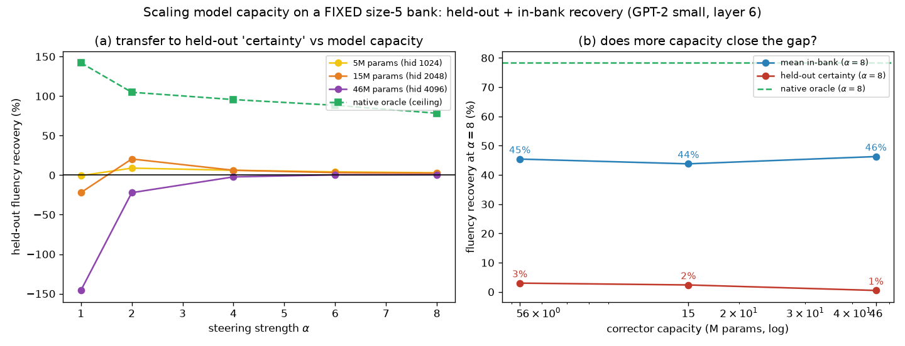
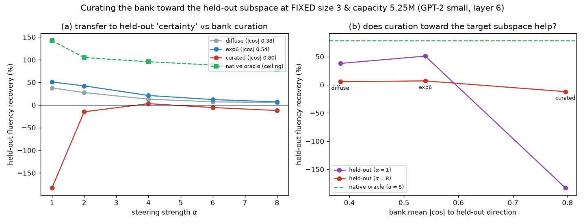
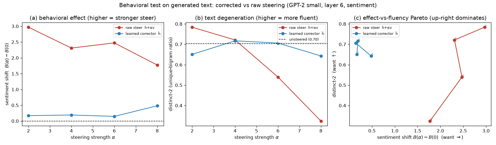
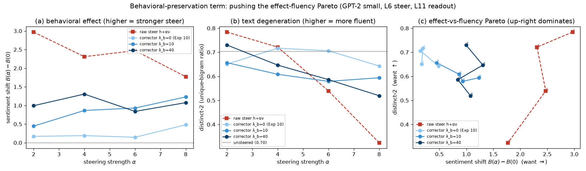

# ColdSteer — on-manifold correction for activation steering

> Final, presentable, current-best only (history in CHANGELOG.md).

## Summary

**Activation steering** is a popular way to control a language model's behavior at
inference time: you find a direction `v` in the model's hidden state that corresponds to a
concept (say, "positive sentiment"), then add `α·v` to the activations as the model runs,
where `α` sets the strength. The problem is that pushing hard on `α` drags the activation
away from the region of activations the model actually produces on real text — it goes
**off-manifold** — and the model's fluency collapses.

This direction asks whether a small **corrector** can preserve the intended steering effect
while making the activation safe for the model. This report covers three steps.

**Step 1 — quantifying the failure mode.** Using GPT-2 small and a sentiment steering
direction, we show that as steering strength `α` grows, the steered activation moves
monotonically off-manifold by three independent measures, and the model's language modeling
loss degrades by up to +2.78 nats (≈16× perplexity). This establishes both the problem and
the metrics a corrector is judged against.

**Step 2 — a surprising negative result.** We build the natural first corrector: it stays in
the ColdSteer form `ĥ = z + P_{v⊥}r` (a correction orthogonal to `v`, so the steering
projection along `v` is preserved *exactly*), and it uses the **provably optimal** correction
for a Gaussian model of the manifold — the shift that lowers the Mahalanobis distance the most
at matched projection. It does lower that distance (by 22% at `α=8`) and preserves the
projection to the digit. **Yet it makes the language model dramatically worse**, not better:
`ΔLM` rises to +4.2 nats, and even at weak steering where raw steering is nearly harmless
(+0.08 nats) the "corrected" activation is catastrophic (+3.31 nats). The lesson is sharp:
**statistical "on-manifold" and "safe for the LM" are decoupled** — you can reduce the
off-manifold distance while multiplying LM loss ~40×.

**Step 3 — the corrector that works.** We keep the exact same projection-preserving form but
replace the Gaussian-optimal shift with a small **MLP trained end-to-end against the downstream
LM loss** (the frozen model's next-token cross-entropy), with `α` sampled during training. This
learned corrector **beats raw steering at every strength** and, at `α=8`, cuts the fluency damage
from +2.78 nats to **+0.44 nats — an 84% reduction** — while preserving the layer-6 steering
projection along `v`. Strikingly, it does so by moving *further* off the Gaussian manifold, not closer
(the exact opposite of Step 2). The two lessons combine into the direction's thesis: the correction
that keeps a strongly-steered activation fluent exists and is easy to learn, but it lives
**off** the statistical manifold, so only a **downstream-LM objective** — never a manifold-distance
surrogate — can find it.

Two generalization checks close the report. The learned corrector **extrapolates** past its training
strengths (still removing 60% of the fluency damage at `α = 12`, 50% beyond the trained ceiling), and
it is **direction-specific**: a corrector trained on the sentiment direction gives no benefit on a
near-orthogonal formality direction, but retraining the identical recipe on that direction recovers
83–104% of the damage — so ColdSteer generalizes as a *recipe*, applied per steering vector. Finally,
a **direction-conditional** corrector (given `v̂` as input) trained on a *bank* of three directions is
**one model that corrects them all** (55–70% recovery at strong steering) and **begins to transfer**
to a held-out direction (51% recovery at weak steering, fading to 7% at strong), turning "one model
per vector" into "one model per bank." Neither scaling axis, however, closes the held-out gap: enlarging
the bank from three to five directions *lowers* both held-out transfer and per-direction recovery, and
scaling the corrector itself 9× wider (5.2M → 46.2M parameters) leaves in-bank recovery flat (~45%) and
overfits at weak steering; and *curating* the bank **toward** the target subspace backfires worst of all —
at fixed size and capacity the most target-aligned bank transfers catastrophically (α=1 recovery −183%),
while a diverse bank transfers best, so bank **diversity**, not target alignment, is what matters. So
amortized cross-direction correction is capped not by coverage, parameter count, or subspace alignment
but by the **training signal** — and the reliable route to a genuinely unseen direction remains a
**per-direction native corrector**.

One caveat frames all of the above. The `ΔLM` recoveries are measured at matched projection at a single
layer. A behavioral test on *generated* text (Experiment 10) shows the corrector prevents raw steering's
collapse into repetition — keeping generation fluent — but its output is only weakly steered (roughly
one-sixth of raw's behavioral effect), because the projection-preserving correction, though orthogonal
to `v` in activation space, is not orthogonal to the downstream concept readout. Matched layer-6
projection does not guarantee matched behavioral steering: the fluency win is partly a weaker propagated
edit, and behavioral effect on generation must be measured directly. Acting on that, a follow-up
(Experiment 11) adds a term that preserves the downstream concept readout during training; it recovers
2–6× more behavioral effect while staying fluent and turns the tradeoff into outright dominance over raw
at moderate steering — though the projection-preserving corrector still cannot match raw's strong
pre-collapse effect, so the frontier is pushed out, not erased.

## Methods

### Data & Model

**Model.** GPT-2 small (124M parameters), via HuggingFace `transformers`. We hook the
**residual stream after block 6** (`resid_post`, the middle of GPT-2's 12 blocks), a 768-dim
vector per token. In HuggingFace terms this is `hidden_states[7]` (index `layer+1`, since
`hidden_states[0]` is the embedding).

**Text data.** FineWeb documents (a large open web-text corpus). We fit activation
statistics on **49,218 token activations** from 400 documents (128 tokens each) and measure
LM degradation on a **held-out 100 documents**.

**Steering vector.** A **DiffMean** sentiment direction: mean activation over 20 clearly
positive sentences minus mean activation over 20 matched negative sentences, at block 6.
It is used in **raw activation units** (not renormalized), giving `|v| = 11.1`; for
reference the mean clean-activation norm is `|h| = 112.2`. Steering strength `α` is therefore
in multiples of one "natural sentiment shift." We form the steered activation for a clean
activation `h`:

```math
z = h + \alpha\, v
```

and sweep `α ∈ {0, 1, 2, 3, 4, 6, 8}`.

### Metrics

All three metrics measure how far steering pushes the activation off the real-text
manifold; **higher = more off-manifold / more damage** for all three.

**Mahalanobis distance `D_M`** — distance from the steered activation to the cloud of real
activations, fit as a single Gaussian with mean `μ` and covariance `Σ` (estimated on the
49,218 clean tokens, with a small ridge `10⁻³·I` added to `Σ` for invertibility). It counts
how many standard deviations, in the whitened activation space, the point sits from typical
activations:

```math
D_M(x) = \sqrt{(x-\mu)^{\top}\, \Sigma^{-1}\, (x-\mu)}
```

We report the mean `D_M` over a 20,000-token sample. The reference value for **real
activations** is `D_M = 27.3`; a steered activation scoring well above this is off-manifold.

**Norm inflation ratio** — how much steering blows up the activation's length relative to a
clean activation:

```math
\rho(\alpha) = \frac{\mathbb{E}\,\lVert z \rVert}{\mathbb{E}\,\lVert h \rVert}
```

A value of 1 means the steered activation has a typical length; `ρ > 1` means it is
abnormally large.

**Δ LM loss** — the practical cost of steering. We patch `z = h + α·v` into `resid_post` at
block 6 for **every token position** during a forward pass and measure the mean next-token
cross-entropy (natural log), then subtract the unsteered baseline `α = 0`:

```math
\Delta\mathrm{LM}(\alpha) = \mathrm{CE}_{\text{next-token}}(z=h+\alpha v)\; -\; \mathrm{CE}_{\text{next-token}}(z=h)
```

`ΔLM` is in nats; `+ln(k)` nats means perplexity got `k×` worse. Larger = more fluency
damage.

**Projection retention (Experiment 2)** — how much of the intended steering edit survives
in the corrected activation, measured as the component of the net edit along the unit
steering direction `v̂ = v/|v|`. This is the quantity a corrector must NOT destroy (destroying
it would just be "turn off the steer"):

```math
\mathrm{retention} = \big\langle\, \hat{h} - h,\; \hat{v} \,\big\rangle
```

For raw steering and any correction of the form `ĥ = z + P_{v⊥}r`, this equals `α|v|` exactly,
so those methods are compared at **matched projection**.

**Behavioral metrics on generated text (Experiment 10).** `ΔLM` and projection retention are both
measured under teacher forcing at a single layer; neither certifies that the corrector, used to
*generate*, still steers the output. Experiment 10 measures two quantities on the model's own greedy
generations. We generate 30 continuation tokens from 48 held-out 12-token prompts with the steer applied
at `resid_post` block 6 at every position, then **re-encode the generated text with a clean forward pass
(no steer)** and score it. The **sentiment effect** is the mean projection of the continuation's block-6
activations onto `v̂`, reported as the shift from the unsteered greedy continuation `B(0)` (higher =
the produced text reads more strongly steered):

```math
B(\alpha) - B(0), \qquad B(\alpha) = \mathbb{E}_{t \in \text{continuation}}\big\langle\, h^{(6)}_t,\; \hat{v} \,\big\rangle
```

**Degeneration** is measured by **distinct-2**, the ratio of unique bigrams to total bigrams in the
generated continuation, averaged over prompts (lower = more repetitive / collapsed text; the unsteered
baseline is `0.70`):

```math
\text{distinct-2} = \mathbb{E}_{\text{prompts}}\; \frac{\lvert \{\, (w_i, w_{i+1}) \,\} \rvert}{(\text{\#continuation tokens}) - 1}
```

### The corrector and its baselines (Experiment 2)

**ColdSteer parameterization.** The corrector returns a residual `r` and adds only its
component orthogonal to `v`, which guarantees the steering projection is preserved:

```math
\hat{h} = z + P_{v^{\perp}}\, r, \qquad P_{v^{\perp}} = I - \hat{v}\hat{v}^{\top}
```

**`cov_corr` — analytic optimal correction under the Gaussian manifold.** Among all constant
shifts `Δ` that achieve the target projection `⟨Δ, v̂⟩ = α|v|`, the one that minimizes the
whitened movement cost `ΔᵀΣ⁻¹Δ` (i.e. the smallest step in Mahalanobis geometry, hence the
lowest added off-manifold distance) has a closed form:

```math
\Delta \;=\; \Sigma\,\hat{v}\;\frac{\alpha\,\lVert v\rVert}{\hat{v}^{\top}\Sigma\,\hat{v}}
```

This is a rotation of the raw shift `α v` toward how activations actually covary; it satisfies
`Δ - αv ⟂ v`, so it is exactly a ColdSteer residual. Kantorovich's inequality guarantees its
Mahalanobis penalty is `≤` that of raw steering, so it always lowers `D_M`.

**`norm_clip` — norm-clipping baseline.** Rescale each steered activation to the clean mean
norm `|h| = 112.2`: `ĥ = z·|h|/|z|`. Fixes the norm-inflation symptom but does not preserve the
projection exactly.

**`naive_inversion` — negative control.** Set `ĥ = h` (undo the steer). By construction
projection retention is 0 and there is no LM damage; it exists only to confirm the evaluation
is not "rewarded" for silently erasing the steer.

### The learned corrector (Experiment 3)

**`learned` — an MLP trained on the downstream LM loss.** Same parameterization
`ĥ = z + P_{v⊥}r_θ(h, z, α)`, but `r_θ` is now a **4-layer MLP** (hidden width 1024, GELU,
4.46M parameters; inputs `h`, `z`, `α` scaled to `O(1)`; last layer zero-initialised so the
corrector starts equal to raw steering). We freeze all GPT-2 weights and train `r_θ` end-to-end
against the **real next-token cross-entropy of the frozen model**: each step patches `ĥ` into
resid_post at block 6, runs the forward pass, and backpropagates the LM loss into `r_θ` only
(the clean activation `h` is detached, so no gradient reaches the lower blocks). The training
objective is

```math
\mathcal{L} = \mathrm{CE}_{\text{next-token}}(\hat{h}) \;+\; \lambda_{\text{near}}\, \big\langle \lVert P_{v^{\perp}} r_\theta \rVert^2 \big\rangle
```

with `λ_near = 0.05` a light penalty preferring a minimal correction. Steering strength is
sampled `α ∼ U(0.5, 8)` per step so one corrector serves all strengths. Trained for 6 epochs
(≈230 steps) on **300 FineWeb documents** (64 tokens each), disjoint from the fit and evaluation
sets. Because the correction is still orthogonal to `v`, projection retention stays `α|v|` —
identical to raw steering — so Experiment 3 is again a **matched-projection** comparison, now
against both raw steering and the analytic `cov_corr` of Experiment 2.

### Generalization eval (Experiment 4)

To test whether the corrector learned a transferable rule or merely fit the trained strengths,
we take the **same trained corrector** (α sampled `U(0.5, 8)`) and evaluate it at
`α ∈ {1, 2, 4, 6, 8, 10, 12}` on the same held-out documents. The values `α = 10` and `α = 12`
are strictly **outside the training range** (the corrector never saw `α > 8`), so they measure
extrapolation. Everything else — parameterization, projection, metrics — is unchanged, so this is
still a matched-projection comparison against raw steering.

### Held-out steering vector (Experiment 5)

To test whether the corrector overfits to the one direction it was trained on, we build a
**second** DiffMean steering vector `v₂` for an unrelated concept — **formality** — as the mean
block-6 activation over 20 formal sentences minus the mean over 20 informal sentences. In raw units
`|v₂| = 34.0`, and it is nearly orthogonal to the sentiment vector (`cos(v₁, v₂) = 0.014`), so it is
a genuinely different behavior family. Crucially, `r_θ` never takes `v` as an explicit input — it
sees the direction only through `z = h + α v` — so evaluating on `v₂` a corrector trained on `v₁` is
a true held-out-vector test. We compare three methods on `v₂` at matched projection `α|v₂|`:

- **`raw`** — `z = h + α v₂`, the baseline damage on the new direction.
- **`transfer`** — the Experiment-3 corrector, **trained on the sentiment vector `v₁`** and applied
  **unchanged** to `v₂`'s steered activations. This measures cross-direction generalization of a
  single frozen corrector.
- **`native`** — the identical architecture and training recipe **retrained on `v₂`** (α ∼ U(0.5, 8),
  same seed/data/steps). This is the direction-specific oracle: it measures whether the *method*
  reproduces on a new direction.

### Direction-conditional corrector on a vector bank (Experiment 6)

Experiment 5's corrector is direction-specific because `r_θ` sees the steering vector only implicitly
through `z`. The natural fix is to (i) make the corrector **conditional on the direction** by feeding
the unit vector `v̂` as an explicit input, `r_θ(h, z, v̂, α)`, and (ii) train **one** such corrector on
a **bank** of directions. We build a bank of three DiffMean directions at block 6 — **sentiment**
(`|v|=11.1`), **formality** (`|v|=34.0`), **concreteness** (`|v|=64.5`, concrete/sensory ↔
abstract/conceptual) — and hold out a fourth, **certainty** (`|v|=32.8`, assertive ↔ hedged). Pairwise
cosines: sentiment is near-orthogonal to all three others (`|cos| ≤ 0.03`); formality, concreteness
and certainty share a subspace (`|cos|` between 0.76 and 0.82), so the held-out `certainty` lies
largely **within** the bank's span.

The parameterization is unchanged and still projection-preserving,
`ĥ = z + P_{v⊥} r_θ(h, z, v̂, α)`; the only architectural change from Experiment 3 is the extra `v̂`
input (so `r_θ` is a 4-layer MLP with input dimension `3d+1`, 5.25M parameters). Training samples a
`(direction, α)` pair per step — direction uniformly from the bank, `α ∼ U(0.5, 8)` — with the same
frozen-LM downstream objective, 8 epochs, same data/seed. We compare, at matched projection:

- **`bank`** — the single conditional corrector, evaluated on each of the three in-bank directions and
  on the held-out `certainty` (transfer). This tests whether one model can serve many directions and
  whether it transfers to an unseen one.
- **`native`** (held-out direction only) — the identical conditional architecture retrained on
  `certainty` alone: the direction-specific oracle / ceiling.

### Scaling the vector bank (Experiment 7)

Experiment 6 leaves one direct question: does simply putting **more** directions in the training bank
close the residual held-out-transfer gap at strong steering? We hold out the same `certainty` direction
and train the **same** conditional corrector (5.25M parameters, identical recipe / seed / data / 8
epochs) on **nested** training banks of increasing size:

- **size 1:** `[sentiment]`
- **size 3:** `[sentiment, formality, concreteness]` (Experiment 6's bank)
- **size 5:** `[sentiment, formality, concreteness, politeness, complexity]`

The two directions added at size 5 are new DiffMean vectors at block 6: **politeness** (courteous ↔
blunt, `|v| = 15.6`) and **complexity** (elaborate/nested ↔ plain/simple, `|v| = 58.4`), each built
from 16 contrastive sentence pairs. Their cosines to the held-out `certainty` are −0.35 (politeness,
weakly related) and −0.80 (complexity, strongly related), so enlarging the bank adds one direction that
should improve coverage of `certainty`'s subspace and one that mostly does not. For each bank we
measure transfer to `certainty` at matched projection across `α ∈ {1, 2, 4, 6, 8}`, and — for the
size-5 model — the per-direction in-bank recovery, to see whether adding directions trades off against
correcting the ones already present. The native oracle (Experiment 6) is the ceiling. The recovery
metric used throughout Experiments 5–7 is the fraction of raw steering's fluency damage removed:

```math
\mathrm{recovery}(\alpha) = \frac{\Delta\mathrm{LM}_{\text{raw}}(\alpha) - \Delta\mathrm{LM}_{\text{corr}}(\alpha)}{\Delta\mathrm{LM}_{\text{raw}}(\alpha)}
```

where 100% means the corrector fully restores the unsteered LM loss and 0% means it matches raw
steering.

### Scaling model capacity (Experiment 8)

Experiment 7 attributes the bank-scaling failure to *capacity interference* — five directions competing
for a fixed 5.25M-parameter MLP — but never varies the model size. Experiment 8 tests that hypothesis
directly. We **hold the bank fixed** at Experiment 7's size-5 set `[sentiment, formality, concreteness,
politeness, complexity]` (the bank with the worst held-out transfer) and **scale only the corrector's
hidden width** `H \in \{1024, 2048, 4096\}`, giving **5.2M / 14.7M / 46.2M** parameters — a 9× capacity
range — under the identical recipe / seed / data / 8 epochs. We report held-out `certainty` recovery
across `α ∈ {1,2,4,6,8}` and, at `α = 8`, the per-direction in-bank recovery averaged over the five
bank directions, versus capacity. The native oracle (retrained on `certainty`, 5.25M) is the ceiling;
the `H = 1024` point re-runs Experiment 7's size-5 model as a reproducibility check.

### Curating the bank toward the target subspace (Experiment 9)

Experiments 7 and 8 both point to the same untested lever: curate the training bank *toward* the
held-out target's subspace. Experiment 9 tests it in the cleanest controlled way — **fix the bank size
at 3 and the corrector at 5.25M parameters** (`H = 1024`), and vary only *which* three of the five pool
directions are trained, ranked by their mean absolute cosine to the held-out `certainty`:

- **diffuse** — `[sentiment, politeness, formality]`, mean `|cos|` to certainty ≈ 0.38 (angularly spread);
- **exp6** — `[sentiment, formality, concreteness]`, mean `|cos|` ≈ 0.54 (Experiment 6/7's bank);
- **curated** — `[formality, concreteness, complexity]`, mean `|cos|` ≈ 0.80 (aligned to the target).

`diffuse` and `curated` share exactly one member (formality) and differ only in the other two, so the
contrast isolates alignment at fixed size and capacity. If *subspace coverage* of the target were the
binding constraint, held-out transfer should rise monotonically diffuse → exp6 → curated. We report
held-out `certainty` recovery across `α ∈ {1,2,4,6,8}` and, at `α = 8`, the mean in-bank per-direction
recovery for each bank, versus the native oracle (retrained on `certainty`). The `exp6` point re-runs
Experiment 6/7's size-3 bank as a reproducibility check.

### Behavioral-preservation term (Experiment 11)

Experiment 10 shows the flagship corrector under-steers in generation because its layer-6 correction,
though orthogonal to `v`, is not orthogonal to the downstream concept readout. Experiment 11 supervises
that readout directly. We keep the Experiment-3 corrector, recipe, data and seed unchanged and add **one
loss term**. During each teacher-forced training step we also read out the sentiment projection at a
**downstream layer** `L2 = 11` (the final `resid_post`, `hidden_states[12]`, which feeds `ln_f` + the
output head), using a downstream DiffMean sentiment direction `ŵ` (unit vector; built once as the mean
block-11 activation over the 20 positive minus the 20 negative sentences, `|w| = 3.87`). For the corrected
activation `ĥ` this gives `p_corr` = the block-11 activation projected onto `ŵ`; for **raw** steering
`z = h + α v` (a separate no-grad forward in the same step) it gives the target `p_raw`. The behavioral term pushes the
corrected downstream readout toward raw steering's, and is added with weight `λ_b`:

```math
\mathcal{L} = \mathrm{CE}_{\text{next-token}}(\hat{h}) \;+\; \lambda_{\text{near}}\,\big\langle \lVert P_{v^{\perp}} r_\theta \rVert^2 \big\rangle \;+\; \lambda_{b}\, \Big\langle \big( (p_{\text{corr}} - p_{\text{raw}})/100 \big)^2 \Big\rangle
```

We train the family `λ_b ∈ {0, 10, 40}` (`λ_b = 0` recovers the Experiment-10 corrector exactly) and
score every one on the **identical Experiment-10 generation protocol** — 30 greedy tokens from 48
held-out prompts, sentiment effect `B(α)−B(0)` and distinct-2 on a clean re-encode — with raw steering
as the shared reference. This asks whether an explicit behavioral term moves the effect-vs-fluency Pareto
frontier of Experiment 10 outward.

### Baselines

The **reference points** shared across experiments are:

- **Unsteered activation (`α = 0`)** — the clean baseline for `ΔLM` (zero by construction)
  and for norm (ratio ≈ 1).
- **Real-activation Mahalanobis (`D_M = 27.3`)** — the on-manifold reference line. A steered
  activation is "off-manifold" precisely when its `D_M` climbs above this.
- **Raw steering (`z = h + α v`)** — the method to beat: the learned and analytic correctors
  are judged on whether they lower `ΔLM` at a given `α` **while preserving the projection of the
  edit along `v`** (matched projection).

## Results


As steering strength `α` rises from 0 to 8, all three off-manifold measures increase
monotonically:

| α | Mahalanobis `D_M` | `|z|/|h|` | Δ LM loss (nats) |
|---|-------------------|-----------|------------------|
| 0 | 27.3 | 0.98 | 0.00 |
| 1 | 27.8 | 0.98 | +0.08 |
| 2 | 29.2 | 1.00 | +0.32 |
| 3 | 31.4 | 1.03 | +0.74 |
| 4 | 34.1 | 1.07 | +1.22 |
| 6 | 41.0 | 1.17 | +2.11 |
| 8 | 49.0 | 1.30 | +2.78 |

**Interpretation.** The damage is small at weak steering (`α ≤ 2`: `ΔLM < 0.35` nats,
`D_M` barely above the real-activation reference) but accelerates. By `α = 8` the steered
activation is ~1.8× as far from the real-activation cloud as a typical real activation is,
its norm is inflated by 30%, and the model's next-token loss is +2.78 nats worse — roughly a
**16× increase in perplexity**. This is exactly the regime where practitioners want strong
steering but where raw linear steering fails, and it is the regime where an on-manifold
corrector should help most.

### Experiment 2 — the Gaussian-manifold corrector reduces `D_M` but breaks the LM


The corrector behaves exactly as designed on the manifold metric and the projection, and
exactly *wrong* on the LM:

| α | `D_M` raw | `D_M` cov_corr | ΔLM raw (nats) | ΔLM cov_corr (nats) | retention (raw = cov_corr) |
|---|-----------|----------------|----------------|---------------------|----------------------------|
| 1 | 27.8 | **27.5** | +0.08 | **+3.31** | 11.1 |
| 2 | 29.2 | **28.1** | +0.33 | **+3.84** | 22.2 |
| 4 | 34.1 | **30.4** | +1.22 | **+4.09** | 44.3 |
| 6 | 41.0 | **33.9** | +2.11 | **+4.18** | 66.5 |
| 8 | 49.0 | **38.1** | +2.78 | **+4.20** | 88.6 |

**Interpretation.** Reading across the row at `α=8`: the corrector cut the off-manifold
distance from 49.0 to 38.1 and kept the steering projection identical to raw (88.6), so by the
two quantities it was built to control it *succeeded*. But its LM loss is +4.2 nats versus raw
steering's +2.78 — **worse, not better.** The contradiction is starkest at weak steering: at
`α=1` raw steering costs only +0.08 nats while the "on-manifold" correction costs +3.31 nats,
a ~40× larger fluency hit despite sitting *closer* to the Gaussian manifold. The norm-clip
baseline (see figure) neither helps `ΔLM` nor stays on-manifold at low `α`. The mechanism: the
Mahalanobis-minimizing correction direction `Σv̂` concentrates in GPT-2's handful of very
high-variance "outlier" activation dimensions. Moving there is cheap in Mahalanobis terms
(large variance ⇒ small whitened cost) but those dimensions are precisely the ones the LM
reads most sharply, so the edit is maximally destructive downstream.

**Why this matters.** It falsifies the tempting assumption behind manifold-projection steering
methods — that pulling a steered activation back toward the statistical activation cloud makes
it safer for the model. Here the two objectives are not just different, they are **anti-correlated**
in the operative regime. Any corrector that optimizes a statistical manifold surrogate (Gaussian
Mahalanobis, and likely PCA/whitening variants that share the same geometry) can be actively
harmful. The corrector must instead see the downstream LM loss.

### Experiment 3 — the learned, LM-supervised corrector recovers most of the fluency


Trained against the downstream LM loss — same projection-preserving form, matched projection —
the learned corrector reverses the Experiment-2 outcome and beats raw steering everywhere:

| α | ΔLM raw (nats) | ΔLM cov_corr | **ΔLM learned** | `D_M` raw | `D_M` learned | retention (all matched) |
|---|----------------|--------------|------------------|-----------|----------------|--------------------------|
| 1 | +0.08 | +3.31 | **−0.07** | 27.8 | 31.9 | 11.1 |
| 2 | +0.33 | +3.84 | **−0.05** | 29.2 | 36.1 | 22.2 |
| 4 | +1.22 | +4.09 | **+0.06** | 34.1 | 49.9 | 44.3 |
| 6 | +2.11 | +4.18 | **+0.22** | 41.0 | 65.4 | 66.5 |
| 8 | +2.78 | +4.20 | **+0.44** | 49.0 | 79.5 | 88.6 |

**Interpretation.** At `α=8` the learned corrector cuts the fluency damage from +2.78 nats to
**+0.44 nats — an 84% reduction** — while holding the steering projection identical to raw (88.6).
At weak-to-medium steering it is essentially free, and slightly *better* than doing nothing
(`ΔLM ≈ −0.05` at `α=1,2`; a small effect, within noise of zero but consistently non-positive on
held-out text). The `D_M` column is the punchline: the learned corrector's activations are
**further** from the Gaussian manifold than raw steering (49.0→79.5 at `α=8`), the exact opposite
of the `cov_corr` corrector that moved *toward* the manifold and broke the LM. The LM-safe
correction lives off the statistical manifold, and only a downstream-supervised objective locates
it. A single MLP, trained on 300 documents with `α` sampled during training, generalizes across
the full strength range on held-out text.

### Experiment 4 — the corrector generalizes beyond its training range


The corrector was trained only on `α ∼ U(0.5, 8)`. Evaluated past that ceiling it keeps working:

| α | in training range? | ΔLM raw (nats) | **ΔLM learned** | fluency recovered | `D_M` raw | `D_M` learned |
|---|--------------------|----------------|------------------|-------------------|-----------|----------------|
| 8 | yes (boundary) | +2.78 | **+0.44** | 84% | 49.0 | 79.5 |
| 10 | **no (extrapolation)** | +3.31 | **+0.76** | 77% | 57.7 | 91.2 |
| 12 | **no (extrapolation)** | +3.74 | **+1.50** | 60% | 66.8 | 101.2 |

**Interpretation.** At `α = 10` — a strength never seen in training — the learned corrector still
removes **77%** of raw steering's fluency damage, and even at `α = 12` (50% beyond the training
ceiling) it removes **60%**. The recovered fraction declines smoothly as `α` leaves the training
region (84% → 77% → 60%) rather than dropping off a cliff, so the corrector **degrades gracefully**
on unseen strengths. In-range points (`α ≤ 8`) reproduce Experiment 3 exactly (same seed, same
data). This indicates the 4.46M-parameter MLP learned an actual correction rule that transfers to
stronger steering, not a memorized response on the trained `α` grid — an important sanity check
before trusting the method at strengths a practitioner might dial past those used to fit it.

### Experiment 5 — the correction rule is direction-specific, but the recipe generalizes


Evaluated on the held-out **formality** direction `v₂` (nearly orthogonal to sentiment,
`cos = 0.014`), the two ways of reusing the method diverge sharply:

| α | ΔLM raw (nats) | ΔLM transfer | **ΔLM native** | recovery transfer | recovery native | `D_M` raw | `D_M` native |
|---|----------------|--------------|----------------|-------------------|-----------------|-----------|--------------|
| 1 | +0.57 | +0.53 | **−0.03** | 7% | 104% | 28.4 | 32.4 |
| 2 | +2.09 | +2.02 | **+0.07** | 4% | 97% | 31.3 | 38.7 |
| 4 | +4.47 | +4.52 | **+0.35** | −1% | 92% | 40.9 | 61.5 |
| 6 | +5.78 | +5.82 | **+0.73** | −1% | 87% | 53.2 | 91.8 |
| 8 | +6.49 | +6.53 | **+1.12** | −1% | 83% | 66.6 | 123.1 |

**Interpretation.** The **transfer** corrector — trained on sentiment, applied to formality — gives
essentially no benefit: its ΔLM lies on top of raw steering (recovery ≈ 0%, marginally negative at
strong steering). A single trained corrector is therefore **overfit to its steering direction**,
exactly the proposal's Failure Mode 4. But the **native** corrector — the same 4-layer MLP and the
same LM-supervised recipe, retrained on `v₂` — recovers **83–104%** of raw steering's fluency damage
(ΔLM +6.49 → +1.12 at α=8), reproducing Experiment 3's result on a larger, unrelated behavior family,
and again by moving *further* off the Gaussian manifold (`D_M` 66.6 → 123.1). So ColdSteer is a
working **recipe** that generalizes across concepts, but must be **instantiated per steering
direction** — or made direction-conditional (feed `v` to `r_θ`) or trained on a bank of vectors —
rather than reused as one frozen operator. This is the expected consequence of `r_θ` seeing the
direction only through `z`: it learns the correction geometry of the *specific* `z`-distribution it
trained on.

### Experiment 6 — a direction-conditional corrector amortizes across a vector bank


A **single** conditional corrector, trained on the three-direction bank, corrects every in-bank
direction at once — and begins to transfer to the held-out one:

| direction | in bank? | ΔLM raw @α=8 | **ΔLM bank @α=8** | recovery @α=8 | recovery @α=2 |
|---|---|---|---|---|---|
| sentiment | bank | +2.78 | **+1.24** | 55% | 64% |
| formality | bank | +6.49 | **+1.95** | 70% | 90% |
| concreteness | bank | +4.40 | **+3.65** | 17% | 70% |
| certainty | **HELD-OUT** | +3.71 | **+3.45** | 7% | 42% |

Held-out `certainty` across the full sweep, against the native (retrained) oracle:

| α | ΔLM raw | **ΔLM bank (transfer)** | ΔLM native (oracle) | recovery bank | recovery native |
|---|---------|-------------------------|---------------------|---------------|-----------------|
| 1 | +0.22 | **+0.11** | −0.09 | 51% | 141% |
| 2 | +0.99 | **+0.57** | −0.05 | 42% | 105% |
| 4 | +2.62 | **+2.07** | +0.11 | 21% | 96% |
| 6 | +3.35 | **+2.94** | +0.39 | 12% | 88% |
| 8 | +3.71 | **+3.45** | +0.80 | 7% | 78% |

**Interpretation.** Two findings. **(1) One conditional model serves a whole bank.** The single
corrector recovers 55–70% of raw steering's fluency damage on two of three in-bank directions at
`α=8` (formality +6.49→+1.95) and more at moderate strength — replacing Experiments 3/5's "one trained
model per direction" with one model for the bank. The price of sharing is real: per-direction recovery
is below a dedicated corrector (sentiment 84%→55%, formality 83%→70% at `α=8`), and one direction is
handled poorly at strong steering (concreteness, 17% at `α=8` though 70% at `α=2`), a signature of
capacity interference between directions competing for the same MLP. **(2) Conditioning + a bank
starts to transfer to unseen directions.** On the held-out `certainty` — never trained, yet strongly
correlated with two bank members — the bank corrector recovers **51% at `α=1`, declining to 7% at
`α=8`**. This is a genuine improvement over Experiment 5's frozen single-vector transfer (≈0% at every
`α`): making the corrector direction-conditional and showing it a small bank does begin to generalize
across directions, most at moderate strength. But it remains far below the native oracle (which
recovers 78–141% on `certainty`), so a 3-vector bank does not yet solve held-out transfer at strong
steering. Whether *enlarging* the bank fixes this is Experiment 7.

### Experiment 7 — a bigger bank does not close the held-out gap; capacity interference binds


Training the same conditional corrector on nested banks of 1, 3, and 5 directions, transfer to the
held-out `certainty` is **non-monotone and peaks at bank size 3**:

| α | ΔLM raw | recovery bank=1 | **recovery bank=3** | recovery bank=5 | recovery native (oracle) |
|---|---------|-----------------|---------------------|-----------------|--------------------------|
| 1 | +0.22 | 14% | **51%** | −1% | 142% |
| 2 | +0.99 | 8% | **42%** | 9% | 105% |
| 4 | +2.62 | 1% | **21%** | 6% | 96% |
| 6 | +3.35 | 0% | **12%** | 4% | 88% |
| 8 | +3.71 | 0% | **7%** | 3% | 78% |

The size-5 model's per-direction in-bank recovery at `α=8` shows why:

| direction | cos to certainty | ΔLM raw @α=8 | ΔLM size-5 bank | recovery @α=8 |
|---|---|---|---|---|
| sentiment | +0.03 | +2.78 | +1.21 | 57% |
| formality | +0.77 | +6.49 | +3.55 | 45% |
| concreteness | −0.82 | +4.40 | +3.84 | 13% |
| politeness | −0.35 | +4.47 | +1.27 | 72% |
| complexity | −0.80 | +5.39 | +3.18 | 41% |

**Interpretation.** Naively enlarging the bank **does not** close the held-out gap — at fixed model
capacity it makes transfer *worse*. Going from 3 to 5 training directions dropped held-out recovery at
every strength (`α=1` 51%→−1%, `α=8` 7%→3%), even though one of the two directions added (complexity,
`|cos| = 0.80`) is strongly correlated with `certainty` and should have improved coverage of its
subspace. The corroborating signal is in-bank: under the size-5 model, per-direction recovery at `α=8`
is *lower* than the size-3 model delivered (formality 70%→45%, concreteness 17%→13%), while the two
new directions are corrected at 41–72%. So a fixed-capacity 5.25M corrector, asked to serve five
directions instead of three, does **each** one worse — the held-out direction included. **The binding
constraint is not coverage of the held-out direction's subspace** (extra directions hurt). This revises
Experiment 6's optimistic "scale the bank" reading: closing the held-out gap needs **a bank curated
toward the target's subspace and/or a stronger training signal**, not simply more directions in a
same-size model. The natural next hypothesis — that raw model capacity binds — is tested and rejected in
Experiment 8. The direction itself is fully correctable — the native oracle retrained on `certainty`
still recovers 78–142% — so the gap is a cost of amortization, not an intrinsic hardness of `certainty`.

### Experiment 8 — more model capacity does not close the gap either; the ceiling is the training signal



Holding the bank fixed at the size-5 set and scaling the corrector 9× wider (5.2M → 46.2M parameters),
neither held-out transfer nor in-bank recovery improves:

| corrector capacity | rec @α=1 | @α=2 | @α=4 | @α=6 | @α=8 |
|---|---|---|---|---|---|
| 5.2M (H=1024) | −1% | 9% | 6% | 4% | **3%** |
| 14.7M (H=2048) | −22% | 20% | 6% | 3% | **2%** |
| 46.2M (H=4096) | −146% | −22% | −2% | 0% | **1%** |
| native oracle | 142% | 105% | 96% | 88% | **78%** |

Per-direction in-bank recovery at `α=8`, averaged over the five bank directions, is flat across the same
9× range: **45.4% → 43.8% → 46.3%** (individual directions: sentiment 57/63/59, formality 45/38/42,
concreteness 13/7/24, politeness 72/73/75, complexity 41/38/32).

**Interpretation.** More capacity **does not** close the held-out gap, and simple width scaling is not
the fix. The shared MLP was not width-starved: mean in-bank recovery saturates near 45% while parameters
grow 9×, so adding capacity does not correct the five *training* directions any better. Held-out
transfer at `α=8` is flat-to-falling (3%→2%→1%), and at weak steering the widest model *actively harms*
the unseen direction — recovery falls to **−146%** at `α=1` (the 46.2M model adds +0.32 nats to a
nearly-harmless weak steer), the signature of overfitting to the bank directions. So Experiment 7's
"capacity interference" reading is only half right: the ceiling on amortized cross-direction correction
is set by the **training signal** — which directions are in the bank, how the corrector is conditioned,
the objective — **not by parameter count**. The per-direction native oracle (78–142%) is unchanged and
remains the only reliable route to a genuinely unseen direction: the correction is fundamentally
direction-specific, and neither more directions (Experiment 7) nor more parameters (Experiment 8)
amortizes it away.

### Experiment 9 — curating the bank toward the target backfires; bank diversity, not alignment, drives transfer



At fixed size (3) and fixed capacity (5.25M), transfer to the held-out `certainty` does **not** rise
with the bank's alignment to it — it *collapses* at the most-aligned bank:

| α | ΔLM raw | rec diffuse (\|cos\| 0.38) | rec exp6 (\|cos\| 0.54) | rec curated (\|cos\| 0.80) | rec native (oracle) |
|---|---------|----------------------------|-------------------------|----------------------------|---------------------|
| 1 | +0.22 | 38% | **51%** | **−183%** | 142% |
| 2 | +0.99 | 28% | **42%** | −15% | 105% |
| 4 | +2.62 | 13% | **21%** | 3% | 96% |
| 6 | +3.35 | 7% | **12%** | −5% | 88% |
| 8 | +3.71 | 6% | **7%** | −12% | 78% |

Mean in-bank per-direction recovery at `α=8` tells the mechanism — it *falls* as the bank's own
directions grow more internally correlated:

| bank | mean \|cos\| to certainty | member recoveries @α=8 | mean in-bank recovery |
|---|---|---|---|
| diffuse | 0.38 | sentiment 65%, politeness 74%, formality 60% | **67%** |
| exp6 | 0.54 | sentiment 55%, formality 70%, concreteness 17% | **48%** |
| curated | 0.80 | formality 37%, concreteness 17%, complexity 35% | **30%** |

**Interpretation.** Curating the bank *toward* the target's subspace does **not** close the gap — it
makes transfer *catastrophically worse*. Held-out recovery is **non-monotone in bank→target alignment**
and collapses at the most-aligned `curated` bank, which is net-negative at every strength and *actively
damages* the unseen direction at weak steering (`α=1` recovery **−183%**: it adds +0.40 nats to a
near-harmless +0.22-nat steer). The moderately-aligned, angularly *diverse* `exp6` bank transfers best.
The in-bank table gives the cause: the three `curated` directions are pairwise near-collinear
(`|cos|` 0.76–0.82), so the direction-conditional corrector cannot disambiguate them from its `v̂` input
and cannot specialize — it learns a single shared-subspace correction that over-fires on any nearby
unseen direction. Correcting *any* one direction well needs the bank's directions to be *separable*, not
clustered; a diverse bank (diffuse: 67% mean in-bank) beats an aligned one (curated: 30%). So the real
lever is bank **angular diversity**, not coverage of the target subspace — curating toward the target is
exactly the wrong move. This is the third corrective negative in a row: neither more directions
(Experiment 7), more parameters (Experiment 8), nor a target-aligned bank (Experiment 9) amortizes the
correction away. The `exp6` bank reproduces Experiment 6/7's size-3 model to the digit (recovery
51/42/21/12/7), and the native oracle (78–142%) is unchanged — the correction remains fully available
per-direction, and the ceiling on *sharing* it is set by the training signal, with bank composition
mattering through diversity rather than alignment.

### Experiment 10 — behavioral reality-check: matched projection is not matched steering in generation



Every result above scores the corrector under teacher forcing at *matched projection* along `v`. That is
a proxy: it fixes the layer-6 edit but says nothing about what the corrector does when used to *generate*.
Using the flagship sentiment corrector, we greedily generate continuations under raw vs. corrected
steering and measure, on a clean re-encode of the output, the sentiment effect `B(α)−B(0)` (unsteered
baseline `B(0)=+0.34`) and distinct-2 (unsteered baseline `0.70`):

| α | effect raw `B−B₀` | effect corr `B−B₀` | distinct-2 raw | distinct-2 corr |
|---|-------------------|--------------------|----------------|-----------------|
| 2 | **+2.97** | +0.17 | 0.78 | 0.65 |
| 4 | **+2.31** | +0.19 | 0.72 | 0.72 |
| 6 | **+2.47** | +0.15 | 0.54 | 0.71 |
| 8 | +1.77 | +0.48 | **0.32** | **0.64** |

**Interpretation.** The corrector's fluency win is real but is **not free** — it comes partly at the cost
of the behavioral steer, a tradeoff the matched-projection `ΔLM` metric hid. Raw steering strongly
steers the text (`+2.97` at α=2, e.g. *"the weather is perfect. The temperature is perfect"*) but
collapses into repetition as α grows (distinct-2 `0.78→0.32`; α=8: *"the Southern-the-Bt and the
second-t-t-t-t-t-t"*). The corrector **fixes the degeneration** — its generations stay coherent and
near-baseline-diverse at every strength (distinct-2 `0.64–0.72`; α=8: *"It is located in the heart of
the city … a place to watch the city's skyline"*) — **but its text is only weakly steered** (effect
`+0.15–0.48`, ~one-sixth of raw's pre-collapse effect). The projection-preserving correction is
orthogonal to `v` in *activation* space yet **not** orthogonal to the downstream sentiment *readout*, so
minimizing LM loss at matched layer-6 projection drives the corrector to near-normal, lightly-steered
text. On the effect-vs-fluency Pareto neither method dominates: raw buys effect at the price of fluency,
the corrector buys fluency at the price of effect. The large `ΔLM` recoveries of Experiments 3–9 truly
measure reduced *disruption to processing real text*, but a substantial part of that reduction is a
**weaker propagated edit** in generation — so any deployment must verify behavioral effect on generated
text, not `ΔLM` alone.

### Experiment 11 — a behavioral-preservation term pushes the Pareto out (but a ceiling remains)



Adding one term that preserves the *downstream* sentiment readout (`λ_b`, pushing the corrector's
final-layer projection toward raw steering's) recovers much of the behavioral effect Experiment 10 lost,
while keeping generation fluent:

| α | eff raw | eff λ_b=0 | eff λ_b=10 | eff λ_b=40 | d2 raw | d2 λ_b=0 | d2 λ_b=10 | d2 λ_b=40 |
|---|---------|-----------|------------|------------|--------|----------|-----------|-----------|
| 2 | **+2.97** | +0.17 | +0.45 | +0.99 | 0.78 | 0.65 | 0.66 | **0.73** |
| 4 | **+2.31** | +0.19 | +0.87 | +1.31 | 0.72 | 0.72 | 0.61 | 0.65 |
| 6 | **+2.47** | +0.15 | +0.93 | +0.84 | 0.54 | 0.71 | 0.58 | 0.59 |
| 8 | +1.77 | +0.48 | +1.23 | +1.08 | **0.32** | 0.64 | 0.59 | 0.52 |

(`eff` = sentiment shift `B(α)−B(0)`, higher = more steered; `d2` = distinct-2, higher = more fluent;
unsteered baselines `B(0)=+0.34`, distinct-2 `0.70`. `λ_b=0` reproduces Experiment 10 to the digit.)

**Interpretation.** The behavioral term is a **real, cheap win that pushes the effect-fluency frontier
outward — but only at the fluent end.** Three findings. **(1) It recovers effect cheaply.** Adding `λ_b`
lifts the generated sentiment effect from Experiment 10's `+0.15–0.48` to `+0.8–1.3` (2–6×) while
distinct-2 stays `0.52–0.73` — well above raw steering's high-α collapse (0.32 at α=8) and near the
unsteered baseline of 0.70. **(2) The corrector now Pareto-dominates raw at moderate steering.** For a
sentiment effect around `+1`, the `λ_b=40` corrector holds distinct-2 at **0.73** (α=2, essentially
unsteered fluency), whereas raw steering only reaches an effect that low (`+1.77` at α=8) *after* it has
collapsed into repetition (distinct-2 0.32). Where Experiment 10 found "neither method dominates," an
explicit behavioral term yields a corrector that gets **both more steer and more fluency** than raw — so
long as moderate steering suffices. **(3) A hard ceiling remains.** No `λ_b` lifts the generated effect
past ≈+1.3; increasing `λ_b` from 10 to 40 stops raising it (it even falls at α=6, +0.93→+0.84) and only
raises training LM loss. The cause is a second layer of the same proxy gap Experiment 10 exposed: the
term successfully matches raw's *teacher-forced* downstream readout (the training behavioral loss falls to
~0.005, `p_corr ≈ p_raw`), yet matching a teacher-forced readout only *partially* transfers to the
autoregressive generation effect. So a behavioral-preservation term is the right next move — it converts
Experiment 10's non-dominating tradeoff into outright dominance over raw at moderate steering — but the
projection-preserving corrector still cannot reproduce raw's *strong* pre-collapse behavioral steering;
the Pareto is pushed out, not erased.

## Conclusion

Raw linear activation steering in GPT-2 trades off strength against fluency in a sharp,
measurable way: the stronger the steer, the further off-manifold the activation and the worse
the language model behaves. The natural fix — pulling the activation back toward the
statistical manifold while preserving the steering projection — **backfires**: a
provably-optimal Gaussian-manifold corrector lowers the off-manifold distance by 22% yet
raises LM loss to +4.2 nats, because it moves along the LM's most sensitive (high-variance)
directions. But keeping the *same* projection-preserving form and instead training the
correction against the **downstream LM loss** works decisively: the learned corrector recovers
**84%** of the fluency lost at strong steering (`ΔLM` +2.78→+0.44 at `α=8`) with the steering
edit intact at layer 6. It does so by moving *further* from the Gaussian manifold — confirming that
statistical "on-manifold" and "safe for the LM" are not just decoupled but that the LM-safe
correction is genuinely off-manifold. A behavioral reality-check (Experiment 10) qualifies this: when
the corrector *generates*, it prevents raw steering's collapse into repetition (distinct-2 stays near
baseline while raw's crashes 0.78→0.32) but its output is only weakly steered — the projection-preserving
correction is orthogonal to `v` in activation space yet not to the downstream readout, so the fluency
win comes partly at the cost of the behavioral edit. Matched layer-6 projection is **not** matched
behavioral steering. Adding an explicit behavioral-preservation term (Experiment 11) — pushing the
corrector's *downstream* concept readout toward raw steering's during training — recovers 2–6× more of
the behavioral effect while keeping generation fluent, and converts the tradeoff into outright dominance
over raw at moderate steering; but no weighting reaches raw's strong pre-collapse effect, because matching
a teacher-forced readout only partially transfers to autoregressive generation. The frontier moves out,
not away.

The takeaway for on-manifold steering methods: keep the projection-preserving parameterization

```math
\hat{h} = z + P_{v^{\perp}}\, r_\theta(h, z, v, \alpha)
```

but supervise `r_θ` with the **downstream LM objective**, never a manifold-distance surrogate.
Experiments 2 and 3 are the two halves of one claim: the surrogate points the wrong way, and the
downstream loss points the right way — to a correction that is easy to learn (one small MLP,
300 documents) and generalizes across steering strength on held-out text. Experiment 5 sharpens the
scope: this correction is **direction-specific** — a corrector trained on one concept does not
transfer to a near-orthogonal one — but the *recipe* reproduces on a new direction (83–104% recovery
on a formality vector), so ColdSteer should be trained per steering vector, or amortized. Experiment 6
takes the amortization step: a **direction-conditional** corrector (given `v̂`) trained on a *bank* of
three directions is a single model that corrects all of them (55–70% recovery at strong steering) and
partially transfers to a held-out direction (51% recovery at weak steering, 7% at strong) — a real
gain over the ≈0% frozen single-vector transfer, though a small bank does not yet match a
direction-specific oracle at strong steering. Experiments 7 and 8 then test the two obvious
next moves and reject both. Adding *directions* (Experiment 7: bank 3→5) *lowers* held-out transfer
(`α=8` recovery 7%→3%) and per-direction in-bank recovery. Adding *parameters* (Experiment 8: a 9×
wider corrector, 5.2M→46.2M, on the same bank) leaves in-bank recovery flat (~45%) and worsens
weak-steering held-out transfer through overfitting (`α=1` recovery −1%→−146%). And the tempting last
lever — *curating* the bank **toward** the target's subspace (Experiment 9) — is the worst move of all:
at fixed size and capacity the most target-aligned bank transfers *catastrophically* (`α=1` recovery
−183%, net-negative at every strength), while a moderately-aligned, angularly *diverse* bank transfers
best, because near-collinear bank directions cannot be disambiguated by the conditional corrector. So
the path to a reusable corrector is neither "more directions," "a bigger model," nor "a target-aligned
bank": amortized cross-direction correction is capped by the **training signal** — with bank composition
mattering through *diversity*, not target alignment — and the reliable route to a genuinely unseen
direction remains the **per-direction native corrector** (78–142% recovery). Stronger direction
conditioning, diverse (not target-clustered) banks, and a richer objective are the open directions for
follow-up work.

**Limitations.** (1) The manifold is modeled as a single Gaussian, so `D_M` captures
scale/correlation but not multimodal or nonlinear structure — Experiments 2 and 3 show this is a
defining flaw of the *metric as a training target*, not merely a modeling nicety. (2) `ΔLM` is a
teacher-forced fluency proxy measured at matched projection at *one layer*. Experiment 10 shows this is
**not** the same as matched behavioral steering in generation: the projection along `v` is preserved
exactly at layer 6, but the correction is not orthogonal to the downstream concept readout, so the
corrector's generated text is only weakly steered (sentiment effect ~one-sixth of raw's) even as it stays
fluent. The fluency win therefore reflects, in part, a weaker propagated edit — behavioral effect on
generated text must be measured directly, not inferred from `ΔLM`. Experiment 11 acts on this: a corrector
objective that explicitly preserves the downstream concept readout recovers 2–6× more behavioral effect
and dominates raw at moderate steering, but still cannot reach raw's strong pre-collapse effect (matching
a teacher-forced readout transfers only partially to generation), so the effect–fluency frontier is pushed
out, not eliminated. (3) Generalization is now tested across steering *strength* (Experiment 4: the corrector extrapolates
to α up to 12, 50% beyond its training ceiling) and across steering *direction* (Experiment 5: a
single trained corrector does **not** transfer to a held-out formality vector, but retraining the
recipe recovers 83–104% there) and across *direction-conditioning + a vector bank* (Experiment 6: one
conditional corrector corrects three in-bank directions at 55–70% and partially transfers to a
held-out direction, 51%→7% recovery from weak to strong steering; Experiment 7: enlarging the bank from
3 to 5 directions does **not** close that gap and in fact lowers transfer; Experiment 8: scaling the
corrector 9× wider does not close it either, and overfits at weak steering; Experiment 9: curating the
bank *toward* the target's subspace at fixed size/capacity backfires — the most target-aligned bank
transfers catastrophically, and bank *diversity* rather than target alignment drives transfer). Held-out
transfer at strong steering thus remains unsolved by bank-size, model-size, **or** target-aligned bank
curation alone (the native per-direction oracle is still needed); stronger direction-conditioning, a
richer training objective, diverse-bank composition, plus multi-layer, multi-model and
held-out-prompt-family generalization, remain open. (4) The small
non-positive `ΔLM` at low `α`
is within noise of zero and should not be over-read as the corrector "improving" the base model.
