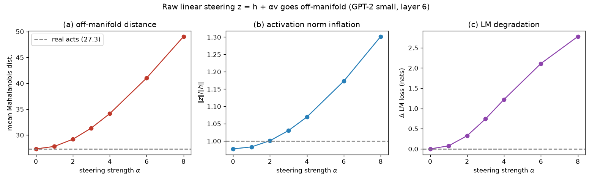
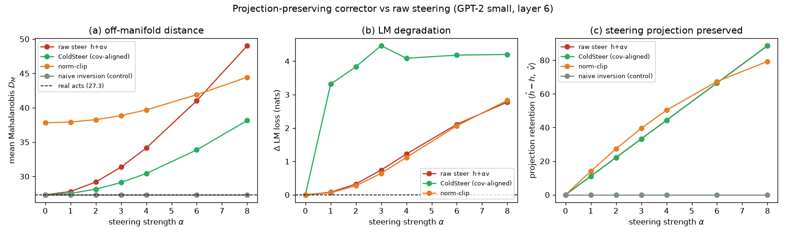
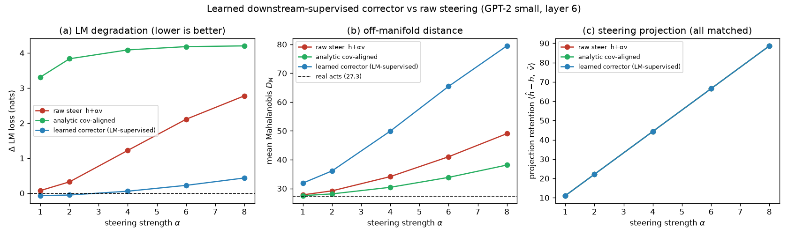
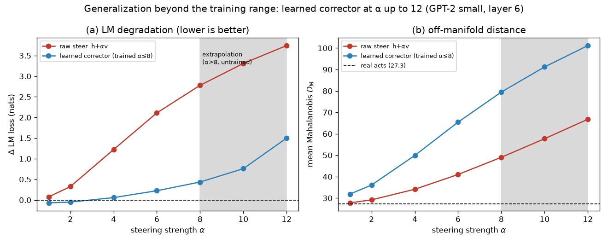
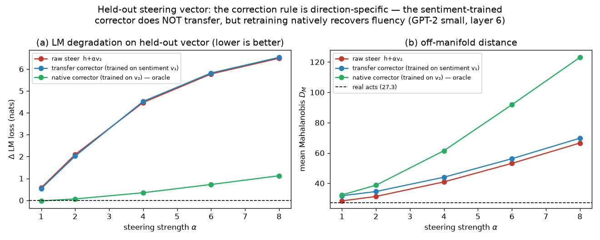
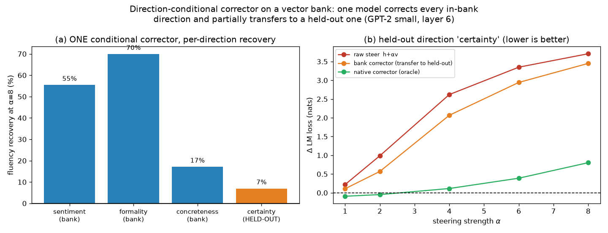
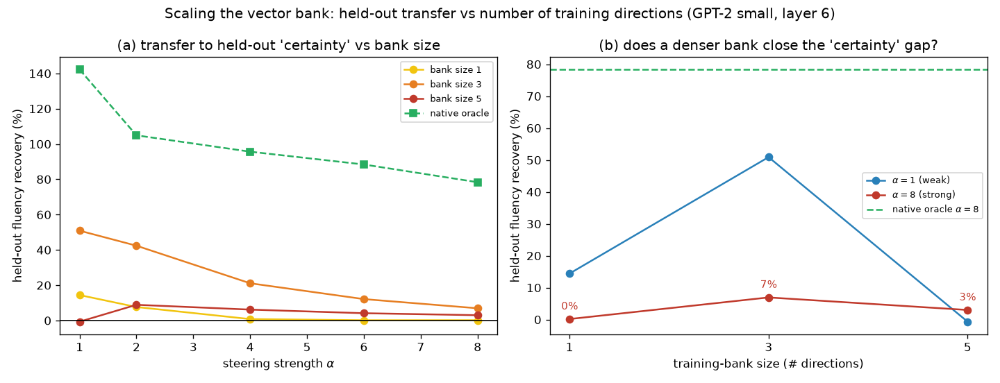

# ColdSteer — on-manifold correction for activation steering

> Final, presentable, current-best only (history in CHANGELOG.md).

## Summary

**Activation steering** is a popular way to control a language model's behavior at
inference time: you find a direction `v` in the model's hidden state that corresponds to a
concept (say, "positive sentiment"), then add `α·v` to the activations as the model runs,
where `α` sets the strength. The problem is that pushing hard on `α` drags the activation
away from the region of activations the model actually produces on real text — it goes
**off-manifold** — and the model's fluency collapses.

This direction asks whether a small **corrector** can preserve the intended steering effect
while making the activation safe for the model. This report covers three steps.

**Step 1 — quantifying the failure mode.** Using GPT-2 small and a sentiment steering
direction, we show that as steering strength `α` grows, the steered activation moves
monotonically off-manifold by three independent measures, and the model's language modeling
loss degrades by up to +2.78 nats (≈16× perplexity). This establishes both the problem and
the metrics a corrector is judged against.

**Step 2 — a surprising negative result.** We build the natural first corrector: it stays in
the ColdSteer form `ĥ = z + P_{v⊥}r` (a correction orthogonal to `v`, so the steering
projection along `v` is preserved *exactly*), and it uses the **provably optimal** correction
for a Gaussian model of the manifold — the shift that lowers the Mahalanobis distance the most
at matched projection. It does lower that distance (by 22% at `α=8`) and preserves the
projection to the digit. **Yet it makes the language model dramatically worse**, not better:
`ΔLM` rises to +4.2 nats, and even at weak steering where raw steering is nearly harmless
(+0.08 nats) the "corrected" activation is catastrophic (+3.31 nats). The lesson is sharp:
**statistical "on-manifold" and "safe for the LM" are decoupled** — you can reduce the
off-manifold distance while multiplying LM loss ~40×.

**Step 3 — the corrector that works.** We keep the exact same projection-preserving form but
replace the Gaussian-optimal shift with a small **MLP trained end-to-end against the downstream
LM loss** (the frozen model's next-token cross-entropy), with `α` sampled during training. This
learned corrector **beats raw steering at every strength** and, at `α=8`, cuts the fluency damage
from +2.78 nats to **+0.44 nats — an 84% reduction** — while preserving the full steering edit
along `v`. Strikingly, it does so by moving *further* off the Gaussian manifold, not closer
(the exact opposite of Step 2). The two lessons combine into the direction's thesis: the correction
that keeps a strongly-steered activation fluent exists and is easy to learn, but it lives
**off** the statistical manifold, so only a **downstream-LM objective** — never a manifold-distance
surrogate — can find it.

Two generalization checks close the report. The learned corrector **extrapolates** past its training
strengths (still removing 60% of the fluency damage at `α = 12`, 50% beyond the trained ceiling), and
it is **direction-specific**: a corrector trained on the sentiment direction gives no benefit on a
near-orthogonal formality direction, but retraining the identical recipe on that direction recovers
83–104% of the damage — so ColdSteer generalizes as a *recipe*, applied per steering vector. Finally,
a **direction-conditional** corrector (given `v̂` as input) trained on a *bank* of three directions is
**one model that corrects them all** (55–70% recovery at strong steering) and **begins to transfer**
to a held-out direction (51% recovery at weak steering, fading to 7% at strong), turning "one model
per vector" into "one model per bank." Enlarging that bank further, however, does **not** close the
held-out gap: at fixed model capacity, growing from three to five directions *lowers* both held-out
transfer and per-direction recovery — the directions interfere for the shared model's capacity — so the
route to a reusable corrector is more capacity or a curated bank, not simply more directions.

## Methods

### Data & Model

**Model.** GPT-2 small (124M parameters), via HuggingFace `transformers`. We hook the
**residual stream after block 6** (`resid_post`, the middle of GPT-2's 12 blocks), a 768-dim
vector per token. In HuggingFace terms this is `hidden_states[7]` (index `layer+1`, since
`hidden_states[0]` is the embedding).

**Text data.** FineWeb documents (a large open web-text corpus). We fit activation
statistics on **49,218 token activations** from 400 documents (128 tokens each) and measure
LM degradation on a **held-out 100 documents**.

**Steering vector.** A **DiffMean** sentiment direction: mean activation over 20 clearly
positive sentences minus mean activation over 20 matched negative sentences, at block 6.
It is used in **raw activation units** (not renormalized), giving `|v| = 11.1`; for
reference the mean clean-activation norm is `|h| = 112.2`. Steering strength `α` is therefore
in multiples of one "natural sentiment shift." We form the steered activation for a clean
activation `h`:

```math
z = h + \alpha\, v
```

and sweep `α ∈ {0, 1, 2, 3, 4, 6, 8}`.

### Metrics

All three metrics measure how far steering pushes the activation off the real-text
manifold; **higher = more off-manifold / more damage** for all three.

**Mahalanobis distance `D_M`** — distance from the steered activation to the cloud of real
activations, fit as a single Gaussian with mean `μ` and covariance `Σ` (estimated on the
49,218 clean tokens, with a small ridge `10⁻³·I` added to `Σ` for invertibility). It counts
how many standard deviations, in the whitened activation space, the point sits from typical
activations:

```math
D_M(x) = \sqrt{(x-\mu)^{\top}\, \Sigma^{-1}\, (x-\mu)}
```

We report the mean `D_M` over a 20,000-token sample. The reference value for **real
activations** is `D_M = 27.3`; a steered activation scoring well above this is off-manifold.

**Norm inflation ratio** — how much steering blows up the activation's length relative to a
clean activation:

```math
\rho(\alpha) = \frac{\mathbb{E}\,\lVert z \rVert}{\mathbb{E}\,\lVert h \rVert}
```

A value of 1 means the steered activation has a typical length; `ρ > 1` means it is
abnormally large.

**Δ LM loss** — the practical cost of steering. We patch `z = h + α·v` into `resid_post` at
block 6 for **every token position** during a forward pass and measure the mean next-token
cross-entropy (natural log), then subtract the unsteered baseline `α = 0`:

```math
\Delta\mathrm{LM}(\alpha) = \mathrm{CE}_{\text{next-token}}(z=h+\alpha v)\; -\; \mathrm{CE}_{\text{next-token}}(z=h)
```

`ΔLM` is in nats; `+ln(k)` nats means perplexity got `k×` worse. Larger = more fluency
damage.

**Projection retention (Experiment 2)** — how much of the intended steering edit survives
in the corrected activation, measured as the component of the net edit along the unit
steering direction `v̂ = v/|v|`. This is the quantity a corrector must NOT destroy (destroying
it would just be "turn off the steer"):

```math
\mathrm{retention} = \big\langle\, \hat{h} - h,\; \hat{v} \,\big\rangle
```

For raw steering and any correction of the form `ĥ = z + P_{v⊥}r`, this equals `α|v|` exactly,
so those methods are compared at **matched projection**.

### The corrector and its baselines (Experiment 2)

**ColdSteer parameterization.** The corrector returns a residual `r` and adds only its
component orthogonal to `v`, which guarantees the steering projection is preserved:

```math
\hat{h} = z + P_{v^{\perp}}\, r, \qquad P_{v^{\perp}} = I - \hat{v}\hat{v}^{\top}
```

**`cov_corr` — analytic optimal correction under the Gaussian manifold.** Among all constant
shifts `Δ` that achieve the target projection `⟨Δ, v̂⟩ = α|v|`, the one that minimizes the
whitened movement cost `ΔᵀΣ⁻¹Δ` (i.e. the smallest step in Mahalanobis geometry, hence the
lowest added off-manifold distance) has a closed form:

```math
\Delta \;=\; \Sigma\,\hat{v}\;\frac{\alpha\,\lVert v\rVert}{\hat{v}^{\top}\Sigma\,\hat{v}}
```

This is a rotation of the raw shift `α v` toward how activations actually covary; it satisfies
`Δ - αv ⟂ v`, so it is exactly a ColdSteer residual. Kantorovich's inequality guarantees its
Mahalanobis penalty is `≤` that of raw steering, so it always lowers `D_M`.

**`norm_clip` — norm-clipping baseline.** Rescale each steered activation to the clean mean
norm `|h| = 112.2`: `ĥ = z·|h|/|z|`. Fixes the norm-inflation symptom but does not preserve the
projection exactly.

**`naive_inversion` — negative control.** Set `ĥ = h` (undo the steer). By construction
projection retention is 0 and there is no LM damage; it exists only to confirm the evaluation
is not "rewarded" for silently erasing the steer.

### The learned corrector (Experiment 3)

**`learned` — an MLP trained on the downstream LM loss.** Same parameterization
`ĥ = z + P_{v⊥}r_θ(h, z, α)`, but `r_θ` is now a **4-layer MLP** (hidden width 1024, GELU,
4.46M parameters; inputs `h`, `z`, `α` scaled to `O(1)`; last layer zero-initialised so the
corrector starts equal to raw steering). We freeze all GPT-2 weights and train `r_θ` end-to-end
against the **real next-token cross-entropy of the frozen model**: each step patches `ĥ` into
resid_post at block 6, runs the forward pass, and backpropagates the LM loss into `r_θ` only
(the clean activation `h` is detached, so no gradient reaches the lower blocks). The training
objective is

```math
\mathcal{L} = \mathrm{CE}_{\text{next-token}}(\hat{h}) \;+\; \lambda_{\text{near}}\, \big\langle \lVert P_{v^{\perp}} r_\theta \rVert^2 \big\rangle
```

with `λ_near = 0.05` a light penalty preferring a minimal correction. Steering strength is
sampled `α ∼ U(0.5, 8)` per step so one corrector serves all strengths. Trained for 6 epochs
(≈230 steps) on **300 FineWeb documents** (64 tokens each), disjoint from the fit and evaluation
sets. Because the correction is still orthogonal to `v`, projection retention stays `α|v|` —
identical to raw steering — so Experiment 3 is again a **matched-projection** comparison, now
against both raw steering and the analytic `cov_corr` of Experiment 2.

### Generalization eval (Experiment 4)

To test whether the corrector learned a transferable rule or merely fit the trained strengths,
we take the **same trained corrector** (α sampled `U(0.5, 8)`) and evaluate it at
`α ∈ {1, 2, 4, 6, 8, 10, 12}` on the same held-out documents. The values `α = 10` and `α = 12`
are strictly **outside the training range** (the corrector never saw `α > 8`), so they measure
extrapolation. Everything else — parameterization, projection, metrics — is unchanged, so this is
still a matched-projection comparison against raw steering.

### Held-out steering vector (Experiment 5)

To test whether the corrector overfits to the one direction it was trained on, we build a
**second** DiffMean steering vector `v₂` for an unrelated concept — **formality** — as the mean
block-6 activation over 20 formal sentences minus the mean over 20 informal sentences. In raw units
`|v₂| = 34.0`, and it is nearly orthogonal to the sentiment vector (`cos(v₁, v₂) = 0.014`), so it is
a genuinely different behavior family. Crucially, `r_θ` never takes `v` as an explicit input — it
sees the direction only through `z = h + α v` — so evaluating on `v₂` a corrector trained on `v₁` is
a true held-out-vector test. We compare three methods on `v₂` at matched projection `α|v₂|`:

- **`raw`** — `z = h + α v₂`, the baseline damage on the new direction.
- **`transfer`** — the Experiment-3 corrector, **trained on the sentiment vector `v₁`** and applied
  **unchanged** to `v₂`'s steered activations. This measures cross-direction generalization of a
  single frozen corrector.
- **`native`** — the identical architecture and training recipe **retrained on `v₂`** (α ∼ U(0.5, 8),
  same seed/data/steps). This is the direction-specific oracle: it measures whether the *method*
  reproduces on a new direction.

### Direction-conditional corrector on a vector bank (Experiment 6)

Experiment 5's corrector is direction-specific because `r_θ` sees the steering vector only implicitly
through `z`. The natural fix is to (i) make the corrector **conditional on the direction** by feeding
the unit vector `v̂` as an explicit input, `r_θ(h, z, v̂, α)`, and (ii) train **one** such corrector on
a **bank** of directions. We build a bank of three DiffMean directions at block 6 — **sentiment**
(`|v|=11.1`), **formality** (`|v|=34.0`), **concreteness** (`|v|=64.5`, concrete/sensory ↔
abstract/conceptual) — and hold out a fourth, **certainty** (`|v|=32.8`, assertive ↔ hedged). Pairwise
cosines: sentiment is near-orthogonal to all three others (`|cos| ≤ 0.03`); formality, concreteness
and certainty share a subspace (`|cos|` between 0.76 and 0.82), so the held-out `certainty` lies
largely **within** the bank's span.

The parameterization is unchanged and still projection-preserving,
`ĥ = z + P_{v⊥} r_θ(h, z, v̂, α)`; the only architectural change from Experiment 3 is the extra `v̂`
input (so `r_θ` is a 4-layer MLP with input dimension `3d+1`, 5.25M parameters). Training samples a
`(direction, α)` pair per step — direction uniformly from the bank, `α ∼ U(0.5, 8)` — with the same
frozen-LM downstream objective, 8 epochs, same data/seed. We compare, at matched projection:

- **`bank`** — the single conditional corrector, evaluated on each of the three in-bank directions and
  on the held-out `certainty` (transfer). This tests whether one model can serve many directions and
  whether it transfers to an unseen one.
- **`native`** (held-out direction only) — the identical conditional architecture retrained on
  `certainty` alone: the direction-specific oracle / ceiling.

### Scaling the vector bank (Experiment 7)

Experiment 6 leaves one direct question: does simply putting **more** directions in the training bank
close the residual held-out-transfer gap at strong steering? We hold out the same `certainty` direction
and train the **same** conditional corrector (5.25M parameters, identical recipe / seed / data / 8
epochs) on **nested** training banks of increasing size:

- **size 1:** `[sentiment]`
- **size 3:** `[sentiment, formality, concreteness]` (Experiment 6's bank)
- **size 5:** `[sentiment, formality, concreteness, politeness, complexity]`

The two directions added at size 5 are new DiffMean vectors at block 6: **politeness** (courteous ↔
blunt, `|v| = 15.6`) and **complexity** (elaborate/nested ↔ plain/simple, `|v| = 58.4`), each built
from 16 contrastive sentence pairs. Their cosines to the held-out `certainty` are −0.35 (politeness,
weakly related) and −0.80 (complexity, strongly related), so enlarging the bank adds one direction that
should improve coverage of `certainty`'s subspace and one that mostly does not. For each bank we
measure transfer to `certainty` at matched projection across `α ∈ {1, 2, 4, 6, 8}`, and — for the
size-5 model — the per-direction in-bank recovery, to see whether adding directions trades off against
correcting the ones already present. The native oracle (Experiment 6) is the ceiling. The recovery
metric used throughout Experiments 5–7 is the fraction of raw steering's fluency damage removed:

```math
\mathrm{recovery}(\alpha) = \frac{\Delta\mathrm{LM}_{\text{raw}}(\alpha) - \Delta\mathrm{LM}_{\text{corr}}(\alpha)}{\Delta\mathrm{LM}_{\text{raw}}(\alpha)}
```

where 100% means the corrector fully restores the unsteered LM loss and 0% means it matches raw
steering.

### Baselines

The **reference points** shared across experiments are:

- **Unsteered activation (`α = 0`)** — the clean baseline for `ΔLM` (zero by construction)
  and for norm (ratio ≈ 1).
- **Real-activation Mahalanobis (`D_M = 27.3`)** — the on-manifold reference line. A steered
  activation is "off-manifold" precisely when its `D_M` climbs above this.
- **Raw steering (`z = h + α v`)** — the method to beat: the learned and analytic correctors
  are judged on whether they lower `ΔLM` at a given `α` **while preserving the projection of the
  edit along `v`** (matched projection).

## Results



As steering strength `α` rises from 0 to 8, all three off-manifold measures increase
monotonically:

| α | Mahalanobis `D_M` | `|z|/|h|` | Δ LM loss (nats) |
|---|-------------------|-----------|------------------|
| 0 | 27.3 | 0.98 | 0.00 |
| 1 | 27.8 | 0.98 | +0.08 |
| 2 | 29.2 | 1.00 | +0.32 |
| 3 | 31.4 | 1.03 | +0.74 |
| 4 | 34.1 | 1.07 | +1.22 |
| 6 | 41.0 | 1.17 | +2.11 |
| 8 | 49.0 | 1.30 | +2.78 |

**Interpretation.** The damage is small at weak steering (`α ≤ 2`: `ΔLM < 0.35` nats,
`D_M` barely above the real-activation reference) but accelerates. By `α = 8` the steered
activation is ~1.8× as far from the real-activation cloud as a typical real activation is,
its norm is inflated by 30%, and the model's next-token loss is +2.78 nats worse — roughly a
**16× increase in perplexity**. This is exactly the regime where practitioners want strong
steering but where raw linear steering fails, and it is the regime where an on-manifold
corrector should help most.

### Experiment 2 — the Gaussian-manifold corrector reduces `D_M` but breaks the LM



The corrector behaves exactly as designed on the manifold metric and the projection, and
exactly *wrong* on the LM:

| α | `D_M` raw | `D_M` cov_corr | ΔLM raw (nats) | ΔLM cov_corr (nats) | retention (raw = cov_corr) |
|---|-----------|----------------|----------------|---------------------|----------------------------|
| 1 | 27.8 | **27.5** | +0.08 | **+3.31** | 11.1 |
| 2 | 29.2 | **28.1** | +0.33 | **+3.84** | 22.2 |
| 4 | 34.1 | **30.4** | +1.22 | **+4.09** | 44.3 |
| 6 | 41.0 | **33.9** | +2.11 | **+4.18** | 66.5 |
| 8 | 49.0 | **38.1** | +2.78 | **+4.20** | 88.6 |

**Interpretation.** Reading across the row at `α=8`: the corrector cut the off-manifold
distance from 49.0 to 38.1 and kept the steering projection identical to raw (88.6), so by the
two quantities it was built to control it *succeeded*. But its LM loss is +4.2 nats versus raw
steering's +2.78 — **worse, not better.** The contradiction is starkest at weak steering: at
`α=1` raw steering costs only +0.08 nats while the "on-manifold" correction costs +3.31 nats,
a ~40× larger fluency hit despite sitting *closer* to the Gaussian manifold. The norm-clip
baseline (see figure) neither helps `ΔLM` nor stays on-manifold at low `α`. The mechanism: the
Mahalanobis-minimizing correction direction `Σv̂` concentrates in GPT-2's handful of very
high-variance "outlier" activation dimensions. Moving there is cheap in Mahalanobis terms
(large variance ⇒ small whitened cost) but those dimensions are precisely the ones the LM
reads most sharply, so the edit is maximally destructive downstream.

**Why this matters.** It falsifies the tempting assumption behind manifold-projection steering
methods — that pulling a steered activation back toward the statistical activation cloud makes
it safer for the model. Here the two objectives are not just different, they are **anti-correlated**
in the operative regime. Any corrector that optimizes a statistical manifold surrogate (Gaussian
Mahalanobis, and likely PCA/whitening variants that share the same geometry) can be actively
harmful. The corrector must instead see the downstream LM loss.

### Experiment 3 — the learned, LM-supervised corrector recovers most of the fluency



Trained against the downstream LM loss — same projection-preserving form, matched projection —
the learned corrector reverses the Experiment-2 outcome and beats raw steering everywhere:

| α | ΔLM raw (nats) | ΔLM cov_corr | **ΔLM learned** | `D_M` raw | `D_M` learned | retention (all matched) |
|---|----------------|--------------|------------------|-----------|----------------|--------------------------|
| 1 | +0.08 | +3.31 | **−0.07** | 27.8 | 31.9 | 11.1 |
| 2 | +0.33 | +3.84 | **−0.05** | 29.2 | 36.1 | 22.2 |
| 4 | +1.22 | +4.09 | **+0.06** | 34.1 | 49.9 | 44.3 |
| 6 | +2.11 | +4.18 | **+0.22** | 41.0 | 65.4 | 66.5 |
| 8 | +2.78 | +4.20 | **+0.44** | 49.0 | 79.5 | 88.6 |

**Interpretation.** At `α=8` the learned corrector cuts the fluency damage from +2.78 nats to
**+0.44 nats — an 84% reduction** — while holding the steering projection identical to raw (88.6).
At weak-to-medium steering it is essentially free, and slightly *better* than doing nothing
(`ΔLM ≈ −0.05` at `α=1,2`; a small effect, within noise of zero but consistently non-positive on
held-out text). The `D_M` column is the punchline: the learned corrector's activations are
**further** from the Gaussian manifold than raw steering (49.0→79.5 at `α=8`), the exact opposite
of the `cov_corr` corrector that moved *toward* the manifold and broke the LM. The LM-safe
correction lives off the statistical manifold, and only a downstream-supervised objective locates
it. A single MLP, trained on 300 documents with `α` sampled during training, generalizes across
the full strength range on held-out text.

### Experiment 4 — the corrector generalizes beyond its training range



The corrector was trained only on `α ∼ U(0.5, 8)`. Evaluated past that ceiling it keeps working:

| α | in training range? | ΔLM raw (nats) | **ΔLM learned** | fluency recovered | `D_M` raw | `D_M` learned |
|---|--------------------|----------------|------------------|-------------------|-----------|----------------|
| 8 | yes (boundary) | +2.78 | **+0.44** | 84% | 49.0 | 79.5 |
| 10 | **no (extrapolation)** | +3.31 | **+0.76** | 77% | 57.7 | 91.2 |
| 12 | **no (extrapolation)** | +3.74 | **+1.50** | 60% | 66.8 | 101.2 |

**Interpretation.** At `α = 10` — a strength never seen in training — the learned corrector still
removes **77%** of raw steering's fluency damage, and even at `α = 12` (50% beyond the training
ceiling) it removes **60%**. The recovered fraction declines smoothly as `α` leaves the training
region (84% → 77% → 60%) rather than dropping off a cliff, so the corrector **degrades gracefully**
on unseen strengths. In-range points (`α ≤ 8`) reproduce Experiment 3 exactly (same seed, same
data). This indicates the 4.46M-parameter MLP learned an actual correction rule that transfers to
stronger steering, not a memorized response on the trained `α` grid — an important sanity check
before trusting the method at strengths a practitioner might dial past those used to fit it.

### Experiment 5 — the correction rule is direction-specific, but the recipe generalizes



Evaluated on the held-out **formality** direction `v₂` (nearly orthogonal to sentiment,
`cos = 0.014`), the two ways of reusing the method diverge sharply:

| α | ΔLM raw (nats) | ΔLM transfer | **ΔLM native** | recovery transfer | recovery native | `D_M` raw | `D_M` native |
|---|----------------|--------------|----------------|-------------------|-----------------|-----------|--------------|
| 1 | +0.57 | +0.53 | **−0.03** | 7% | 104% | 28.4 | 32.4 |
| 2 | +2.09 | +2.02 | **+0.07** | 4% | 97% | 31.3 | 38.7 |
| 4 | +4.47 | +4.52 | **+0.35** | −1% | 92% | 40.9 | 61.5 |
| 6 | +5.78 | +5.82 | **+0.73** | −1% | 87% | 53.2 | 91.8 |
| 8 | +6.49 | +6.53 | **+1.12** | −1% | 83% | 66.6 | 123.1 |

**Interpretation.** The **transfer** corrector — trained on sentiment, applied to formality — gives
essentially no benefit: its ΔLM lies on top of raw steering (recovery ≈ 0%, marginally negative at
strong steering). A single trained corrector is therefore **overfit to its steering direction**,
exactly the proposal's Failure Mode 4. But the **native** corrector — the same 4-layer MLP and the
same LM-supervised recipe, retrained on `v₂` — recovers **83–104%** of raw steering's fluency damage
(ΔLM +6.49 → +1.12 at α=8), reproducing Experiment 3's result on a larger, unrelated behavior family,
and again by moving *further* off the Gaussian manifold (`D_M` 66.6 → 123.1). So ColdSteer is a
working **recipe** that generalizes across concepts, but must be **instantiated per steering
direction** — or made direction-conditional (feed `v` to `r_θ`) or trained on a bank of vectors —
rather than reused as one frozen operator. This is the expected consequence of `r_θ` seeing the
direction only through `z`: it learns the correction geometry of the *specific* `z`-distribution it
trained on.

### Experiment 6 — a direction-conditional corrector amortizes across a vector bank



A **single** conditional corrector, trained on the three-direction bank, corrects every in-bank
direction at once — and begins to transfer to the held-out one:

| direction | in bank? | ΔLM raw @α=8 | **ΔLM bank @α=8** | recovery @α=8 | recovery @α=2 |
|---|---|---|---|---|---|
| sentiment | bank | +2.78 | **+1.24** | 55% | 64% |
| formality | bank | +6.49 | **+1.95** | 70% | 90% |
| concreteness | bank | +4.40 | **+3.65** | 17% | 70% |
| certainty | **HELD-OUT** | +3.71 | **+3.45** | 7% | 42% |

Held-out `certainty` across the full sweep, against the native (retrained) oracle:

| α | ΔLM raw | **ΔLM bank (transfer)** | ΔLM native (oracle) | recovery bank | recovery native |
|---|---------|-------------------------|---------------------|---------------|-----------------|
| 1 | +0.22 | **+0.11** | −0.09 | 51% | 141% |
| 2 | +0.99 | **+0.57** | −0.05 | 42% | 105% |
| 4 | +2.62 | **+2.07** | +0.11 | 21% | 96% |
| 6 | +3.35 | **+2.94** | +0.39 | 12% | 88% |
| 8 | +3.71 | **+3.45** | +0.80 | 7% | 78% |

**Interpretation.** Two findings. **(1) One conditional model serves a whole bank.** The single
corrector recovers 55–70% of raw steering's fluency damage on two of three in-bank directions at
`α=8` (formality +6.49→+1.95) and more at moderate strength — replacing Experiments 3/5's "one trained
model per direction" with one model for the bank. The price of sharing is real: per-direction recovery
is below a dedicated corrector (sentiment 84%→55%, formality 83%→70% at `α=8`), and one direction is
handled poorly at strong steering (concreteness, 17% at `α=8` though 70% at `α=2`), a signature of
capacity interference between directions competing for the same MLP. **(2) Conditioning + a bank
starts to transfer to unseen directions.** On the held-out `certainty` — never trained, yet strongly
correlated with two bank members — the bank corrector recovers **51% at `α=1`, declining to 7% at
`α=8`**. This is a genuine improvement over Experiment 5's frozen single-vector transfer (≈0% at every
`α`): making the corrector direction-conditional and showing it a small bank does begin to generalize
across directions, most at moderate strength. But it remains far below the native oracle (which
recovers 78–141% on `certainty`), so a 3-vector bank does not yet solve held-out transfer at strong
steering. Whether *enlarging* the bank fixes this is Experiment 7.

### Experiment 7 — a bigger bank does not close the held-out gap; capacity interference binds



Training the same conditional corrector on nested banks of 1, 3, and 5 directions, transfer to the
held-out `certainty` is **non-monotone and peaks at bank size 3**:

| α | ΔLM raw | recovery bank=1 | **recovery bank=3** | recovery bank=5 | recovery native (oracle) |
|---|---------|-----------------|---------------------|-----------------|--------------------------|
| 1 | +0.22 | 14% | **51%** | −1% | 142% |
| 2 | +0.99 | 8% | **42%** | 9% | 105% |
| 4 | +2.62 | 1% | **21%** | 6% | 96% |
| 6 | +3.35 | 0% | **12%** | 4% | 88% |
| 8 | +3.71 | 0% | **7%** | 3% | 78% |

The size-5 model's per-direction in-bank recovery at `α=8` shows why:

| direction | cos to certainty | ΔLM raw @α=8 | ΔLM size-5 bank | recovery @α=8 |
|---|---|---|---|---|
| sentiment | +0.03 | +2.78 | +1.21 | 57% |
| formality | +0.77 | +6.49 | +3.55 | 45% |
| concreteness | −0.82 | +4.40 | +3.84 | 13% |
| politeness | −0.35 | +4.47 | +1.27 | 72% |
| complexity | −0.80 | +5.39 | +3.18 | 41% |

**Interpretation.** Naively enlarging the bank **does not** close the held-out gap — at fixed model
capacity it makes transfer *worse*. Going from 3 to 5 training directions dropped held-out recovery at
every strength (`α=1` 51%→−1%, `α=8` 7%→3%), even though one of the two directions added (complexity,
`|cos| = 0.80`) is strongly correlated with `certainty` and should have improved coverage of its
subspace. The corroborating signal is in-bank: under the size-5 model, per-direction recovery at `α=8`
is *lower* than the size-3 model delivered (formality 70%→45%, concreteness 17%→13%), while the two
new directions are corrected at 41–72%. So a fixed-capacity 5.25M corrector, asked to serve five
directions instead of three, does **each** one worse — the held-out direction included. **The binding
constraint is capacity interference between directions competing for the same MLP, not coverage of the
held-out direction's subspace.** This revises Experiment 6's optimistic "scale the bank" reading:
closing the held-out gap at strong steering requires **more model capacity and/or a bank curated toward
the target's subspace**, not simply more directions poured into a same-size model. The direction itself
is fully correctable — the native oracle retrained on `certainty` still recovers 78–142% — so the gap
is a cost of amortization, not an intrinsic hardness of `certainty`.

## Conclusion

Raw linear activation steering in GPT-2 trades off strength against fluency in a sharp,
measurable way: the stronger the steer, the further off-manifold the activation and the worse
the language model behaves. The natural fix — pulling the activation back toward the
statistical manifold while preserving the steering projection — **backfires**: a
provably-optimal Gaussian-manifold corrector lowers the off-manifold distance by 22% yet
raises LM loss to +4.2 nats, because it moves along the LM's most sensitive (high-variance)
directions. But keeping the *same* projection-preserving form and instead training the
correction against the **downstream LM loss** works decisively: the learned corrector recovers
**84%** of the fluency lost at strong steering (`ΔLM` +2.78→+0.44 at `α=8`) with the steering
edit fully intact. It does so by moving *further* from the Gaussian manifold — confirming that
statistical "on-manifold" and "safe for the LM" are not just decoupled but that the LM-safe
correction is genuinely off-manifold.

The takeaway for on-manifold steering methods: keep the projection-preserving parameterization

```math
\hat{h} = z + P_{v^{\perp}}\, r_\theta(h, z, v, \alpha)
```

but supervise `r_θ` with the **downstream LM objective**, never a manifold-distance surrogate.
Experiments 2 and 3 are the two halves of one claim: the surrogate points the wrong way, and the
downstream loss points the right way — to a correction that is easy to learn (one small MLP,
300 documents) and generalizes across steering strength on held-out text. Experiment 5 sharpens the
scope: this correction is **direction-specific** — a corrector trained on one concept does not
transfer to a near-orthogonal one — but the *recipe* reproduces on a new direction (83–104% recovery
on a formality vector), so ColdSteer should be trained per steering vector, or amortized. Experiment 6
takes the amortization step: a **direction-conditional** corrector (given `v̂`) trained on a *bank* of
three directions is a single model that corrects all of them (55–70% recovery at strong steering) and
partially transfers to a held-out direction (51% recovery at weak steering, 7% at strong) — a real
gain over the ≈0% frozen single-vector transfer, though a small bank does not yet match a
direction-specific oracle at strong steering. Experiment 7 then tests the obvious next move — just add
more directions — and finds it **does not work at fixed model capacity**: growing the bank from 3 to 5
directions *lowers* both held-out transfer (`α=8` recovery 7%→3%) and per-direction in-bank recovery,
because the directions interfere for the shared MLP's capacity. So the path to a reusable corrector is
not "more directions in the same model," but **more model capacity and/or a bank curated toward the
target subspace** — a concrete, corrected direction for follow-up work.

**Limitations.** (1) The manifold is modeled as a single Gaussian, so `D_M` captures
scale/correlation but not multimodal or nonlinear structure — Experiments 2 and 3 show this is a
defining flaw of the *metric as a training target*, not merely a modeling nicety. (2) `ΔLM` is a
fluency/loss-level proxy; it does not yet measure downstream *concept strength* or generated-text
quality on the steered behavior, which is the natural next evaluation (the projection along `v` is
preserved exactly, so concept strength is held fixed by construction, but text-level effects are
unmeasured). (3) Generalization is now tested across steering *strength* (Experiment 4: the corrector extrapolates
to α up to 12, 50% beyond its training ceiling) and across steering *direction* (Experiment 5: a
single trained corrector does **not** transfer to a held-out formality vector, but retraining the
recipe recovers 83–104% there) and across *direction-conditioning + a vector bank* (Experiment 6: one
conditional corrector corrects three in-bank directions at 55–70% and partially transfers to a
held-out direction, 51%→7% recovery from weak to strong steering; Experiment 7: at fixed model
capacity, enlarging the bank from 3 to 5 directions does **not** close that gap and in fact lowers
transfer, because directions interfere for shared capacity). Held-out transfer at strong steering thus
remains unsolved by bank-size alone (the native per-direction oracle is still needed); scaling model
capacity, curating the bank toward the target subspace, plus multi-layer, multi-model and
held-out-prompt-family generalization, remain open. (4) The small
non-positive `ΔLM` at low `α`
is within noise of zero and should not be over-read as the corrector "improving" the base model.
