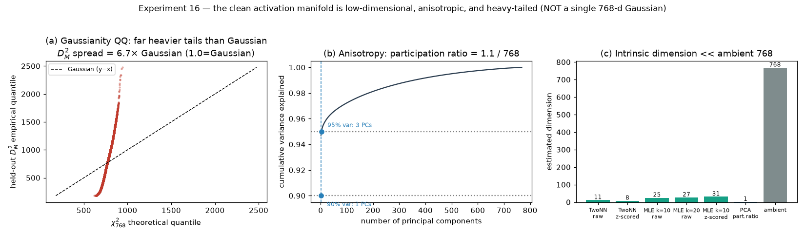
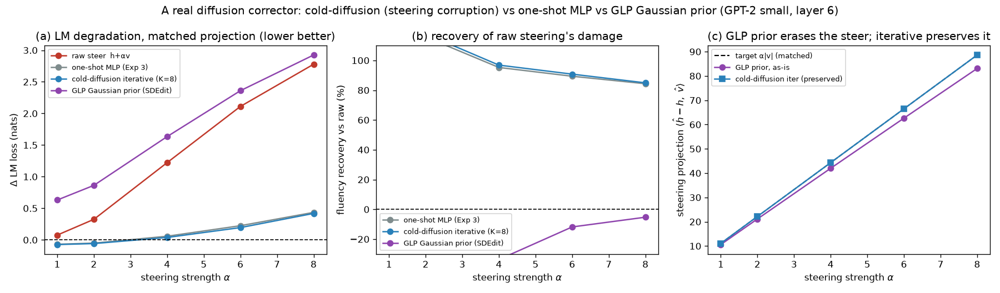

# ColdSteer — Part 1: The core result: correcting off-manifold steering

> One of four topic-focused parts of the ColdSteer report (see REPORT.md for the index). Final, presentable, current-best only; history in CHANGELOG.md.

## Summary

Activation steering is a lightweight way to control a language model's behavior: add `α·v` to a hidden direction inside the network and the output shifts toward (or away from) some concept — more positive sentiment, more formality, and so on. The catch is strength. A small `α` nudges the behavior harmlessly, but a large `α` pushes the activation off the manifold of activations the model ever sees on real text, and fluency collapses. This report asks one question: can a small "corrector" keep the steering effect while restoring fluency? All experiments use GPT-2 small, the residual stream after block 6, and a DiffMean sentiment direction.

The obvious fix backfires (Experiment 2). We derive the provably optimal correction under the assumption that the activation cloud is a Gaussian: among all edits that keep the steering projection exact, it takes the smallest step in the cloud's own whitened geometry, so it always lowers the off-manifold Mahalanobis distance `D_M`. It does exactly that — `D_M` drops 22% at α=8 and the projection is preserved perfectly — yet LM loss climbs to +4.2 nats. Even at weak steering where raw is nearly harmless (+0.08 nats), the "corrected" activation is catastrophic (+3.31 nats). The lesson: being statistically "on-manifold" and being "safe for the LM" are decoupled, and in this regime they are anti-correlated.

The fix that works keeps the identical form but changes the target (Experiment 3). We keep the projection-preserving parameterization `ĥ = z + P_{v⊥}r` and train a small MLP end-to-end against the frozen model's own downstream next-token loss. It beats raw steering at every strength, and at α=8 it cuts fluency damage from +2.78 to +0.44 nats — an 84% reduction — while preserving the layer-6 projection. Strikingly, it does this by moving *further* off the Gaussian manifold, the exact opposite of Experiment 2.

The correction transfers as a recipe (Experiments 4, 5). The learned corrector extrapolates past its training strengths (still ~60% recovery at α=12, 50% beyond the trained ceiling). It is direction-specific: a sentiment-trained corrector gives essentially no benefit on a near-orthogonal formality direction. But retraining the identical recipe on that direction recovers 83–104%, so ColdSteer generalizes as a recipe applied per steering vector rather than as one frozen operator.

Why the Gaussian is the wrong yardstick, and what "diffusion" actually contributes (Experiments 16, 17). The real activation cloud is low-dimensional (intrinsic dimension ~8–34, not 768), near rank-1 anisotropic (PCA participation ratio 1.1), and heavy-tailed (held-out `D_M²` has 6.7× the spread of `χ²₇₆₈`) — so `D_M` is only a diagnostic of departure-from-typical, never a training target. Building the actual iterative diffusion machinery then shows that the Cold-Diffusion *corruption model* plus LM supervision carry the result, not the iteration count: a one-shot MLP and an 8-step iterative corrector both recover 84–85% at α=8, while a generic Gaussian-noise DDPM prior (SDEdit, no LM in the loop) has *negative* recovery (−5% at α=8) and partially erases the steer.

## Methods

### Data & Model

**Model.** GPT-2 small (124M parameters), via HuggingFace `transformers`. We hook the
**residual stream after block 6** (`resid_post`, the middle of GPT-2's 12 blocks), a 768-dim
vector per token. In HuggingFace terms this is `hidden_states[7]` (index `layer+1`, since
`hidden_states[0]` is the embedding).

**Text data.** FineWeb documents (a large open web-text corpus). We fit activation
statistics on **49,218 token activations** from 400 documents (128 tokens each) and measure
LM degradation on a **held-out 100 documents**.

**Steering vector.** A **DiffMean** sentiment direction: mean activation over 20 clearly
positive sentences minus mean activation over 20 matched negative sentences, at block 6.
It is used in **raw activation units** (not renormalized), giving `|v| = 11.1`; for
reference the mean clean-activation norm is `|h| = 112.2`. Steering strength `α` is therefore
in multiples of one "natural sentiment shift." We form the steered activation for a clean
activation `h`:

```math
z = h + \alpha\, v
```

and sweep `α ∈ {0, 1, 2, 3, 4, 6, 8}`.

### Metrics

All three metrics measure how far steering pushes the activation off the real-text
manifold; **higher = more off-manifold / more damage** for all three.

**Mahalanobis distance `D_M`** — distance from the steered activation to the cloud of real
activations, fit as a single Gaussian with mean `μ` and covariance `Σ` (estimated on the
49,218 clean tokens, with a small ridge `10⁻³·I` added to `Σ` for invertibility). It counts
how many standard deviations, in the whitened activation space, the point sits from typical
activations:

```math
D_M(x) = \sqrt{(x-\mu)^{\top}\, \Sigma^{-1}\, (x-\mu)}
```

We report the mean `D_M` over a 20,000-token sample. The reference value for **real
activations** is `D_M = 27.3`; a steered activation scoring well above this is off-manifold.

**Norm inflation ratio** — how much steering blows up the activation's length relative to a
clean activation:

```math
\rho(\alpha) = \frac{\mathbb{E}\,\lVert z \rVert}{\mathbb{E}\,\lVert h \rVert}
```

A value of 1 means the steered activation has a typical length; `ρ > 1` means it is
abnormally large.

**Δ LM loss** — the practical cost of steering. We patch `z = h + α·v` into `resid_post` at
block 6 for **every token position** during a forward pass and measure the mean next-token
cross-entropy (natural log), then subtract the unsteered baseline `α = 0`:

```math
\Delta\mathrm{LM}(\alpha) = \mathrm{CE}_{\text{next-token}}(z=h+\alpha v)\; -\; \mathrm{CE}_{\text{next-token}}(z=h)
```

`ΔLM` is in nats; `+ln(k)` nats means perplexity got `k×` worse. Larger = more fluency
damage.

**Projection retention (Experiment 2)** — how much of the intended steering edit survives
in the corrected activation, measured as the component of the net edit along the unit
steering direction `v̂ = v/|v|`. This is the quantity a corrector must NOT destroy (destroying
it would just be "turn off the steer"):

```math
\mathrm{retention} = \big\langle\, \hat{h} - h,\; \hat{v} \,\big\rangle
```

For raw steering and any correction of the form `ĥ = z + P_{v⊥}r`, this equals `α|v|` exactly,
so those methods are compared at **matched projection**.

### The corrector and its baselines (Experiment 2)

**ColdSteer parameterization.** The corrector returns a residual `r` and adds only its
component orthogonal to `v`, which guarantees the steering projection is preserved:

```math
\hat{h} = z + P_{v^{\perp}}\, r, \qquad P_{v^{\perp}} = I - \hat{v}\hat{v}^{\top}
```

**`cov_corr` — analytic optimal correction under the Gaussian manifold.** Among all constant
shifts `Δ` that achieve the target projection `⟨Δ, v̂⟩ = α|v|`, the one that minimizes the
whitened movement cost `ΔᵀΣ⁻¹Δ` (i.e. the smallest step in Mahalanobis geometry, hence the
lowest added off-manifold distance) has a closed form:

```math
\Delta \;=\; \Sigma\,\hat{v}\;\frac{\alpha\,\lVert v\rVert}{\hat{v}^{\top}\Sigma\,\hat{v}}
```

This is a rotation of the raw shift `α v` toward how activations actually covary; it satisfies
`Δ - αv ⟂ v`, so it is exactly a ColdSteer residual. Kantorovich's inequality guarantees its
Mahalanobis penalty is `≤` that of raw steering, so it always lowers `D_M`.

**`norm_clip` — norm-clipping baseline.** Rescale each steered activation to the clean mean
norm `|h| = 112.2`: `ĥ = z·|h|/|z|`. Fixes the norm-inflation symptom but does not preserve the
projection exactly.

**`naive_inversion` — negative control.** Set `ĥ = h` (undo the steer). By construction
projection retention is 0 and there is no LM damage; it exists only to confirm the evaluation
is not "rewarded" for silently erasing the steer.

### The learned corrector (Experiment 3)

**`learned` — an MLP trained on the downstream LM loss.** Same parameterization
`ĥ = z + P_{v⊥}r_θ(h, z, α)`, but `r_θ` is now a **4-layer MLP** (hidden width 1024, GELU,
4.46M parameters; inputs `h`, `z`, `α` scaled to `O(1)`; last layer zero-initialised so the
corrector starts equal to raw steering). We freeze all GPT-2 weights and train `r_θ` end-to-end
against the **real next-token cross-entropy of the frozen model**: each step patches `ĥ` into
resid_post at block 6, runs the forward pass, and backpropagates the LM loss into `r_θ` only
(the clean activation `h` is detached, so no gradient reaches the lower blocks). The training
objective is

```math
\mathcal{L} = \mathrm{CE}_{\text{next-token}}(\hat{h}) \;+\; \lambda_{\text{near}}\, \big\langle \lVert P_{v^{\perp}} r_\theta \rVert^2 \big\rangle
```

with `λ_near = 0.05` a light penalty preferring a minimal correction. Steering strength is
sampled `α ∼ U(0.5, 8)` per step so one corrector serves all strengths. Trained for 6 epochs
(≈230 steps) on **300 FineWeb documents** (64 tokens each), disjoint from the fit and evaluation
sets. Because the correction is still orthogonal to `v`, projection retention stays `α|v|` —
identical to raw steering — so Experiment 3 is again a **matched-projection** comparison, now
against both raw steering and the analytic `cov_corr` of Experiment 2.

### Generalization eval (Experiment 4)

To test whether the corrector learned a transferable rule or merely fit the trained strengths,
we take the **same trained corrector** (α sampled `U(0.5, 8)`) and evaluate it at
`α ∈ {1, 2, 4, 6, 8, 10, 12}` on the same held-out documents. The values `α = 10` and `α = 12`
are strictly **outside the training range** (the corrector never saw `α > 8`), so they measure
extrapolation. Everything else — parameterization, projection, metrics — is unchanged, so this is
still a matched-projection comparison against raw steering.

### Held-out steering vector (Experiment 5)

To test whether the corrector overfits to the one direction it was trained on, we build a
**second** DiffMean steering vector `v₂` for an unrelated concept — **formality** — as the mean
block-6 activation over 20 formal sentences minus the mean over 20 informal sentences. In raw units
`|v₂| = 34.0`, and it is nearly orthogonal to the sentiment vector (`cos(v₁, v₂) = 0.014`), so it is
a genuinely different behavior family. Crucially, `r_θ` never takes `v` as an explicit input — it
sees the direction only through `z = h + α v` — so evaluating on `v₂` a corrector trained on `v₁` is
a true held-out-vector test. We compare three methods on `v₂` at matched projection `α|v₂|`:

- **`raw`** — `z = h + α v₂`, the baseline damage on the new direction.
- **`transfer`** — the Experiment-3 corrector, **trained on the sentiment vector `v₁`** and applied
  **unchanged** to `v₂`'s steered activations. This measures cross-direction generalization of a
  single frozen corrector.
- **`native`** — the identical architecture and training recipe **retrained on `v₂`** (α ∼ U(0.5, 8),
  same seed/data/steps). This is the direction-specific oracle: it measures whether the *method*
  reproduces on a new direction.

### Manifold geometry: intrinsic dimension and Gaussianity (Experiment 16)

Every off-manifold measure in this report uses `D_M`, which models the cloud of real activations as a
**single 768-dimensional Gaussian** with mean `μ` and covariance `Σ`. Experiment 16 tests that modeling
choice directly, on the clean layer-6 FineWeb activations used throughout (49,218 tokens, **no
steering**), along two axes.

**Intrinsic dimension** — how many degrees of freedom the activations occupy — is estimated with two
standard estimators that recover a manifold's dimension from sampled points. **TwoNN** (Facco et al.
2017) uses, for each point, the ratio of its distances to the 2nd and 1st nearest neighbours; the
maximum-likelihood dimension over `N` points is:

```math
\hat{d}_{\text{TwoNN}} = \frac{N}{\sum_{i=1}^{N} \ln \mu_i}, \qquad \mu_i = \frac{r_2(x_i)}{r_1(x_i)}
```

The **Levina–Bickel MLE** (2004) uses each point's `k` nearest-neighbour distances, ordered
`T_1 < \dots < T_k`, and averages the per-point estimate:

```math
\hat{d}_k = \Big\langle\, m_k(x_i) \,\Big\rangle_i, \qquad m_k(x_i) = \Big[\, \tfrac{1}{k-1}\textstyle\sum_{j=1}^{k-1} \ln \tfrac{T_k(x_i)}{T_j(x_i)} \,\Big]^{-1}
```

We report both on raw activations and on per-dimension z-scored activations (which removes GPT-2's
extreme per-dimension scale differences), and complement them with the linear **PCA participation
ratio**, an effective linear dimension from the sorted covariance eigenvalues:

```math
\mathrm{PR} = \frac{\big(\sum_i \lambda_i\big)^2}{\sum_i \lambda_i^2}
```

`PR = d` for an isotropic Gaussian; `PR = 1` when a single direction carries all the variance.

**Gaussianity** is tested through the held-out squared Mahalanobis distance. If the activations were
Gaussian, then fitting `(μ, Σ)` on one half of the tokens and evaluating on the other half, the held-out
`D_M²` would follow a chi-square law with `d = 768` degrees of freedom exactly:

```math
D_M^2(x) = (x-\mu)^{\top} \Sigma^{-1} (x-\mu) \;\sim\; \chi^2_{d} \quad (\text{mean } d,\; \text{variance } 2d,\; \text{skewness } \sqrt{8/d})
```

We compare the empirical `D_M²` distribution to `χ²₇₆₈` by its moments and a Wilson–Hilferty QQ plot.
The *mean* of `D_M²` is ≈ `d` for **any** distribution once `(μ,Σ)` are fit on matched data (it is
essentially `trace(Σ⁻¹Σ) = d`), so only the *spread* and *shape* are diagnostic. We additionally report
the per-dimension excess kurtosis of the standardized activations, counting "heavy-tailed" dimensions as
those with excess kurtosis above 1 (a Gaussian has 0).

### A real diffusion corrector (Experiment 17)

The direction is named after **Cold Diffusion** (Bansal et al. 2022 — diffusion models built around
non-Gaussian, even deterministic degradations), and the reference **GLP** work trains an *iterative*
diffusion prior over activations. The flagship corrector (Experiment 3), however, is a **one-shot MLP**.
Experiment 17 builds the actual diffusion machinery and compares three correctors at matched steering
projection `α|v|` on the same held-out FineWeb eval set (GPT-2 small, block 6, sentiment vector), all
reusing the Experiment-3 training/eval pipeline. All three are held to equal steering projection, so `ΔLM`
is the only free axis.

**(1) One-shot MLP** — the incumbent from Experiment 3, restated for reference (4.46M params, one forward):

```math
\hat h = z + P_{v\perp}\, r_\theta(h, z, \alpha), \qquad z = h + \alpha v
```

**(2) Cold-diffusion iterative corrector (K=8)** — a same-capacity, weight-shared network `g_\theta` that
additionally takes a step index `t_k = k/K`, integrated over `K=8` steps from `x_K = z` down to `\hat h =
x_0`. Each increment is projected orthogonal to `v`, so the steering projection is preserved at **every**
step by construction:

```math
x_{k-1} = x_k + \tfrac{1}{K}\, P_{v\perp}\, g_\theta(h, x_k, \alpha, t_k), \qquad \hat h = x_0
```

It is trained the same way as Experiment 3 — patch `\hat h` into block 6, run the frozen upper LM, backprop
the next-token cross-entropy — but through the **unrolled** `K`-step trajectory, making it a genuine
flow-matching-style corrector: a time-conditioned velocity field integrated to transport `z` to an LM-safe
activation (4.46M params; last layer zero-initialised so each step starts as the identity).

**(3) GLP Gaussian-noise prior (SDEdit)** — the "generic Gaussian-noise GLP teacher" the proposal names, as
a baseline. A real **DDPM** with a cosine schedule `\bar\alpha(t)` (Nichol & Dhariwal 2021) and
ε-prediction network `\epsilon_\theta`, trained on **clean, standardized** activations with **Gaussian**
corruption and pure MSE — **no LM in the loop** (2.69M params):

```math
x_t = \sqrt{\bar\alpha(t)}\; x_0 + \sqrt{1-\bar\alpha(t)}\; \epsilon, \qquad \mathcal{L} = \big\lVert \epsilon_\theta(x_t, t) - \epsilon \big\rVert_2^2
```

To correct a steered activation `z` it uses **SDEdit** (Meng et al. 2021): standardize, forward-noise to a
start time `t_{\text{start}}`, then DDIM-denoise back to 0, projecting `z` toward the learned clean-activation
manifold. `t_{\text{start}}` is chosen by steelmanning (the value in `{0.15, 0.25, 0.40}` giving the lowest
mean `ΔLM` at α∈{4,8}; the best was 0.15). Because this prior is **unconditional** it partially erases the
steer; we measure that erasure (projection retention before re-imposing) and, for the matched-`ΔLM`
comparison, re-impose the target projection `α|v|` along `\hat v` afterward. **Recovery** is the same metric
as Experiment 4 (percent of raw steering's `ΔLM` removed).

### Baselines

The **reference points** shared across experiments are:

- **Unsteered activation (`α = 0`)** — the clean baseline for `ΔLM` (zero by construction)
  and for norm (ratio ≈ 1).
- **Real-activation Mahalanobis (`D_M = 27.3`)** — the on-manifold reference line. A steered
  activation is "off-manifold" precisely when its `D_M` climbs above this.
- **Raw steering (`z = h + α v`)** — the method to beat: the learned and analytic correctors
  are judged on whether they lower `ΔLM` at a given `α` **while preserving the projection of the
  edit along `v`** (matched projection).

## Results

### Experiment 2 — the Gaussian-manifold corrector reduces `D_M` but breaks the LM


The corrector behaves exactly as designed on the manifold metric and the projection, and
exactly *wrong* on the LM:

| α | `D_M` raw | `D_M` cov_corr | ΔLM raw (nats) | ΔLM cov_corr (nats) | retention (raw = cov_corr) |
|---|-----------|----------------|----------------|---------------------|----------------------------|
| 1 | 27.8 | **27.5** | +0.08 | **+3.31** | 11.1 |
| 2 | 29.2 | **28.1** | +0.33 | **+3.84** | 22.2 |
| 4 | 34.1 | **30.4** | +1.22 | **+4.09** | 44.3 |
| 6 | 41.0 | **33.9** | +2.11 | **+4.18** | 66.5 |
| 8 | 49.0 | **38.1** | +2.78 | **+4.20** | 88.6 |

**Interpretation.** Reading across the row at `α=8`: the corrector cut the off-manifold
distance from 49.0 to 38.1 and kept the steering projection identical to raw (88.6), so by the
two quantities it was built to control it *succeeded*. But its LM loss is +4.2 nats versus raw
steering's +2.78 — **worse, not better.** The contradiction is starkest at weak steering: at
`α=1` raw steering costs only +0.08 nats while the "on-manifold" correction costs +3.31 nats,
a ~40× larger fluency hit despite sitting *closer* to the Gaussian manifold. The norm-clip
baseline (see figure) neither helps `ΔLM` nor stays on-manifold at low `α`. The mechanism: the
Mahalanobis-minimizing correction direction `Σv̂` concentrates in GPT-2's handful of very
high-variance "outlier" activation dimensions. Moving there is cheap in Mahalanobis terms
(large variance ⇒ small whitened cost) but those dimensions are precisely the ones the LM
reads most sharply, so the edit is maximally destructive downstream.

**Why this matters.** It falsifies the tempting assumption behind manifold-projection steering
methods — that pulling a steered activation back toward the statistical activation cloud makes
it safer for the model. Here the two objectives are not just different, they are **anti-correlated**
in the operative regime. Any corrector that optimizes a statistical manifold surrogate (Gaussian
Mahalanobis, and likely PCA/whitening variants that share the same geometry) can be actively
harmful. The corrector must instead see the downstream LM loss.

### Experiment 3 — the learned, LM-supervised corrector recovers most of the fluency


Trained against the downstream LM loss — same projection-preserving form, matched projection —
the learned corrector reverses the Experiment-2 outcome and beats raw steering everywhere:

| α | ΔLM raw (nats) | ΔLM cov_corr | **ΔLM learned** | `D_M` raw | `D_M` learned | retention (all matched) |
|---|----------------|--------------|------------------|-----------|----------------|--------------------------|
| 1 | +0.08 | +3.31 | **−0.07** | 27.8 | 31.9 | 11.1 |
| 2 | +0.33 | +3.84 | **−0.05** | 29.2 | 36.1 | 22.2 |
| 4 | +1.22 | +4.09 | **+0.06** | 34.1 | 49.9 | 44.3 |
| 6 | +2.11 | +4.18 | **+0.22** | 41.0 | 65.4 | 66.5 |
| 8 | +2.78 | +4.20 | **+0.44** | 49.0 | 79.5 | 88.6 |

**Interpretation.** At `α=8` the learned corrector cuts the fluency damage from +2.78 nats to
**+0.44 nats — an 84% reduction** — while holding the steering projection identical to raw (88.6).
At weak-to-medium steering it is essentially free, and slightly *better* than doing nothing
(`ΔLM ≈ −0.05` at `α=1,2`; a small effect, within noise of zero but consistently non-positive on
held-out text). The `D_M` column is the punchline: the learned corrector's activations are
**further** from the Gaussian manifold than raw steering (49.0→79.5 at `α=8`), the exact opposite
of the `cov_corr` corrector that moved *toward* the manifold and broke the LM. The LM-safe
correction lives off the statistical manifold, and only a downstream-supervised objective locates
it. A single MLP, trained on 300 documents with `α` sampled during training, generalizes across
the full strength range on held-out text.

### Experiment 4 — the corrector generalizes beyond its training range


The corrector was trained only on `α ∼ U(0.5, 8)`. Evaluated past that ceiling it keeps working:

| α | in training range? | ΔLM raw (nats) | **ΔLM learned** | fluency recovered | `D_M` raw | `D_M` learned |
|---|--------------------|----------------|------------------|-------------------|-----------|----------------|
| 8 | yes (boundary) | +2.78 | **+0.44** | 84% | 49.0 | 79.5 |
| 10 | **no (extrapolation)** | +3.31 | **+0.76** | 77% | 57.7 | 91.2 |
| 12 | **no (extrapolation)** | +3.74 | **+1.50** | 60% | 66.8 | 101.2 |

**Interpretation.** At `α = 10` — a strength never seen in training — the learned corrector still
removes **77%** of raw steering's fluency damage, and even at `α = 12` (50% beyond the training
ceiling) it removes **60%**. The recovered fraction declines smoothly as `α` leaves the training
region (84% → 77% → 60%) rather than dropping off a cliff, so the corrector **degrades gracefully**
on unseen strengths. In-range points (`α ≤ 8`) reproduce Experiment 3 exactly (same seed, same
data). This indicates the 4.46M-parameter MLP learned an actual correction rule that transfers to
stronger steering, not a memorized response on the trained `α` grid — an important sanity check
before trusting the method at strengths a practitioner might dial past those used to fit it.

### Experiment 5 — the correction rule is direction-specific, but the recipe generalizes


Evaluated on the held-out **formality** direction `v₂` (nearly orthogonal to sentiment,
`cos = 0.014`), the two ways of reusing the method diverge sharply:

| α | ΔLM raw (nats) | ΔLM transfer | **ΔLM native** | recovery transfer | recovery native | `D_M` raw | `D_M` native |
|---|----------------|--------------|----------------|-------------------|-----------------|-----------|--------------|
| 1 | +0.57 | +0.53 | **−0.03** | 7% | 104% | 28.4 | 32.4 |
| 2 | +2.09 | +2.02 | **+0.07** | 4% | 97% | 31.3 | 38.7 |
| 4 | +4.47 | +4.52 | **+0.35** | −1% | 92% | 40.9 | 61.5 |
| 6 | +5.78 | +5.82 | **+0.73** | −1% | 87% | 53.2 | 91.8 |
| 8 | +6.49 | +6.53 | **+1.12** | −1% | 83% | 66.6 | 123.1 |

**Interpretation.** The **transfer** corrector — trained on sentiment, applied to formality — gives
essentially no benefit: its ΔLM lies on top of raw steering (recovery ≈ 0%, marginally negative at
strong steering). A single trained corrector is therefore **overfit to its steering direction**,
exactly the proposal's Failure Mode 4. But the **native** corrector — the same 4-layer MLP and the
same LM-supervised recipe, retrained on `v₂` — recovers **83–104%** of raw steering's fluency damage
(ΔLM +6.49 → +1.12 at α=8), reproducing Experiment 3's result on a larger, unrelated behavior family,
and again by moving *further* off the Gaussian manifold (`D_M` 66.6 → 123.1). So ColdSteer is a
working **recipe** that generalizes across concepts, but must be **instantiated per steering
direction** — or made direction-conditional (feed `v` to `r_θ`) or trained on a bank of vectors —
rather than reused as one frozen operator. This is the expected consequence of `r_θ` seeing the
direction only through `z`: it learns the correction geometry of the *specific* `z`-distribution it
trained on.

### Experiment 16 — the activation manifold is low-dimensional, anisotropic, and non-Gaussian



The clean activation cloud is far from the single 768-d Gaussian that `D_M` assumes. Intrinsic dimension:

| estimator | value | as % of ambient 768 |
|---|---|---|
| TwoNN (raw) | 11.4 | 1.5% |
| TwoNN (per-dim z-scored) | 8.1 | 1.1% |
| Levina–Bickel MLE, k = 10 / 20 (raw) | 25.1 / 26.6 | ~3% |
| Levina–Bickel MLE, k = 10 / 20 (z-scored) | 31.3 / 33.8 | ~4% |
| PCA participation ratio | 1.1 | 0.1% |
| # PCs for 90% / 95% of variance | 1 / 3 | — |

Gaussianity of the fit — held-out `D_M²` against the `χ²₇₆₈` a Gaussian predicts:

| quantity of held-out `D_M²` | observed | Gaussian (`χ²₇₆₈`) | ratio |
|---|---|---|---|
| mean | 765 | 768 | 1.00 (not diagnostic) |
| standard deviation | 263 | 39.2 | **6.7×** |
| skewness | 0.45 | 0.10 | 4.4× |
| excess kurtosis | 0.74 | 0.016 | — |
| # dims with excess kurtosis > 1 | 14 / 768 | ≈ 0 | — |
| max per-dimension excess kurtosis | 118 | ≈ 0 | — |

**Interpretation.** The activation cloud is **not** a single 768-d Gaussian, and confirming this
*sharpens* the report's thesis rather than weakening it. Three facts. **(1) It is low-dimensional.** Every
intrinsic-dimension estimator puts the manifold at **~8–34 dimensions** — one to two orders of magnitude
below the 768-d ambient space — so the activations lie near a thin, curved manifold, not spread through
the space a full-rank Gaussian describes. **(2) It is extremely anisotropic.** The PCA participation ratio
is **1.1**: a single direction carries ~90% of the variance and three carry 95%, the well-documented
signature of GPT-2's "outlier"/"rogue" activation dimensions. **(3) It is heavy-tailed.** Were the Gaussian
correct, held-out `D_M²` would be `χ²₇₆₈` (standard deviation 39); instead its spread is **6.7× larger**
(variance ≈ 45× too big), it is right-skewed (0.45 vs 0.10), and **14** individual dimensions have excess
kurtosis above 1, up to **118**. (The mean of `D_M²` matches 768, but that is guaranteed for any
distribution once the Gaussian is fit on matched data, so it is not evidence of Gaussianity.)

**Why this matters.** This is the mechanism behind Experiment 2's central negative result, made concrete.
Because the Gaussian mis-models the manifold — piling almost all of its probability "volume" into a handful
of high-variance rogue directions — the Mahalanobis-minimizing correction `Σv̂` moves *into* exactly those
directions: cheap in `D_M`, but maximally destructive to a language model that reads them sharply. It also
clarifies what "off the Gaussian manifold" means in Experiments 3 / 5 / 12 / 13: the learned corrector moves
off a **crude Gaussian fit**, which is not the same as moving off the true (low-dimensional, non-Gaussian)
data manifold. `D_M` is a useful *diagnostic* of departure-from-typical, but — as the whole direction
argues — was never, and should never be, a training target. Supervising the corrector with the downstream
LM loss is precisely the right response to a manifold this far from Gaussian.

### Experiment 17 — a real diffusion corrector: the corruption model matters, not the iteration count



Three correctors at matched steering projection `α|v|` on the same held-out eval set. ΔLM (nats, lower is
better) and recovery (percent of raw's damage removed, higher is better):

| α | ΔLM raw | ΔLM one-shot MLP | ΔLM cold-diff iter (K=8) | ΔLM GLP prior | recovery one-shot | recovery iter | recovery GLP |
|---|---|---|---|---|---|---|---|
| 1 | +0.076 | −0.069 | **−0.074** | +0.631 | 191% | **197%** | −731% |
| 2 | +0.325 | −0.051 | **−0.058** | +0.862 | 116% | **118%** | −165% |
| 4 | +1.222 | +0.058 | **+0.039** | +1.634 | 95% | **97%** | −34% |
| 6 | +2.111 | +0.224 | **+0.195** | +2.360 | 89% | **91%** | −12% |
| 8 | +2.778 | +0.435 | **+0.419** | +2.925 | 84% | **85%** | −5% |

All three correctors and raw hold the **same** steering projection (11.1→88.6 across α), except the GLP
prior *before* re-imposing, which erases part of the steer: as-is retention 10.6 / 83.1 vs target 11.1 /
88.6 at α = 1 / 8 (~5–6% lost). Off-Gaussian distance `D_M` at α = 8: raw 49.0, GLP 52.8, one-shot 79.5,
cold-diffusion iterative 75.2.

**Interpretation — three clean answers to the direction's central critique.** **(1) The Cold-Diffusion
*corruption model* is what carries the result, not "diffusion" as a genre.** Both correctors trained on the
*actual steering corruption* `z = h + αv` under LM supervision — the one-shot MLP and the iterative
model — recover **84–85%** of the fluency damage at α = 8. The generic Gaussian-noise GLP prior — the
canonical "denoise back to the activation manifold" recipe, trained with no LM in the loop — has **negative
recovery at every strength** (−5% at α = 8: it leaves the LM *worse than raw steering*, +2.93 vs +2.78
nats). This is Experiment 2's lesson in diffusion clothing: a prior that only models "typical activation"
cannot know which off-typical directions the LM tolerates; only the downstream objective can. **(2) The
iterative diffusion structure essentially ties the one-shot MLP** — a small, consistent edge at every α
(85% vs 84% at α = 8; ΔLM +0.419 vs +0.435), at equal capacity, while sitting slightly *closer* to the
Gaussian (`D_M` 75.2 vs 79.5). The expensive 8-step unroll buys a marginal improvement, not a qualitative
one — so Experiment 3's one-shot MLP was not leaving fluency on the table. The value of "diffusion" here is
the **corruption** (steering, not Gaussian noise) and the **supervision** (LM, not reconstruction), not the
step count. **(3) The unconditional prior erases the steer** — ~5–6% of the target projection lost before
re-imposing — exactly the information-loss the GLP authors flag for unconditional priors, and even with the
projection re-imposed it cannot repair the LM. Conditioning on the clean activation and supervising with the
LM, what ColdSteer does, is the fix.

## Conclusion

Raw activation steering forces a trade: turn `α` up for a stronger behavioral effect and fluency
degrades as the activation leaves the real-text manifold. The intuitive fix — pull the steered
activation back toward the statistical activation cloud — backfires. The provably optimal Gaussian-
manifold correction (Experiment 2) lowers `D_M` and preserves the projection exactly, yet drives LM
loss to +4.2 nats at α=8 and +3.31 nats even at α=1, because the Mahalanobis-cheapest correction
direction moves along GPT-2's highest-variance "rogue" dimensions — precisely the directions the LM
reads most sharply. Statistical on-manifold and LM-safe are decoupled, and in this regime
anti-correlated.

Keeping the identical projection-preserving form `ĥ = z + P_{v⊥}r` but training a small MLP against
the frozen model's downstream next-token loss (Experiment 3) reverses the outcome: 84% recovery at
α=8 (+2.78 → +0.44 nats), achieved by moving *further* off the Gaussian manifold, not toward it. This
is not an accident of the metric: Experiment 16 shows the true manifold is low-dimensional (~8–34
dims), near rank-1 anisotropic (participation ratio 1.1), and heavy-tailed (`D_M²` spread 6.7× the
Gaussian's), so `D_M` is only a diagnostic of departure-from-typical and never a sound training
target. Experiment 17 then isolates what "diffusion" contributes: the Cold-Diffusion corruption model
(steering, not Gaussian noise) plus LM supervision carry the result — one-shot and 8-step iterative
correctors both recover 84–85%, while a generic Gaussian-noise DDPM prior with no LM in the loop has
negative recovery and partially erases the steer. Iteration count is not the active ingredient.

The takeaway is a single design rule: keep the projection-preserving form but supervise it with the
downstream language-model objective, never a manifold-distance surrogate.

```math
\hat{h} = z + P_{v^{\perp}}\, r_\theta(h, z, v, \alpha) \quad\text{trained on}\quad \mathcal{L} = \mathrm{CE}_{\text{next-token}}(\hat{h})
```

One scope caveat: the learned correction is direction-specific — a sentiment corrector gives no
benefit on a near-orthogonal formality direction (Experiment 5) — but the *recipe* reproduces per
direction, recovering 83–104% when retrained on formality. ColdSteer generalizes as a recipe applied
to each steering vector, not as one frozen operator.
