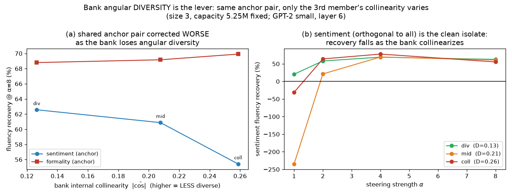

# ColdSteer — Part 2: Amortizing the corrector across many steering directions

> One of four topic-focused parts of the ColdSteer report (see REPORT.md for the index). Final, presentable, current-best only; history in CHANGELOG.md.

## Summary

Steering a language model — adding a fixed "direction" vector to its internal activations to push its behavior (more positive sentiment, more formal, etc.) — damages fluency: the edited activation lands off the manifold of real text and the model's next-token loss rises. An earlier part of this report showed that a small learned corrector fixes most of that damage. The corrector is a tiny MLP in a projection-preserving form, `ĥ = z + P_{v⊥}r`, trained purely on the frozen model's downstream LM loss at GPT-2 small block 6. It recovers most of raw steering's fluency cost. But it is DIRECTION-SPECIFIC: you train one corrector per steering vector. This part asks whether ONE model can correct MANY steering directions at once, and whether it transfers to a direction it never saw.

The first result is encouraging. Making the corrector direction-conditional — feeding it the unit steering vector `v̂` as an explicit input — and training it on a BANK of three directions yields a single model that corrects all three (55–70% fluency recovery at strong steering) and begins to transfer to a held-out fourth direction (51% recovery at weak steering, fading to 7% at strong). That is a real gain over the ≈0% transfer of a frozen single-vector corrector. It turns "one model per vector" into "one model per bank."

The two obvious ways to push transfer further both fail. Enlarging the bank from 3 to 5 directions does not close the held-out gap — it LOWERS both held-out transfer (α=8 recovery 7%→3%) and per-direction in-bank recovery, a signature of capacity interference. Scaling the corrector itself 9× wider (5.2M→46.2M parameters) on the same bank leaves in-bank recovery flat (~45%) and OVERFITS at weak steering (α=1 held-out recovery −1%→−146%).

Curating the bank TOWARD the target's subspace, at fixed size and capacity, backfires worst of all: the most target-aligned bank transfers catastrophically (α=1 recovery −183%), while an angularly DIVERSE bank transfers best. So bank DIVERSITY, not target alignment, drives transfer. A controlled third-member swap (fixed `[sentiment, formality]` anchor, only the third member's collinearity varied) confirms the diversity lever CAUSALLY with the target-alignment confound removed: a member made collinear with a neighbor cannot be specialized (its own recovery collapses 69%→17% at α=8), and the confound-free isolate `sentiment` — orthogonal to every bank member and to the target — is nonetheless corrected worse as the bank collinearizes (63%→55%), which can only be reduced separability.

Overall, amortized cross-direction correction is capped not by coverage, parameter count, or subspace alignment, but by the training signal — with bank composition mattering through diversity. The reliable route to a genuinely unseen direction remains a per-direction native corrector.

## Methods

### Data & Model

**Model.** GPT-2 small (124M parameters), via HuggingFace `transformers`. We hook the
**residual stream after block 6** (`resid_post`, the middle of GPT-2's 12 blocks), a 768-dim
vector per token. In HuggingFace terms this is `hidden_states[7]` (index `layer+1`, since
`hidden_states[0]` is the embedding).

**Text data.** FineWeb documents (a large open web-text corpus). We fit activation
statistics on **49,218 token activations** from 400 documents (128 tokens each) and measure
LM degradation on a **held-out 100 documents**.

**Steering vector.** A **DiffMean** sentiment direction: mean activation over 20 clearly
positive sentences minus mean activation over 20 matched negative sentences, at block 6.
It is used in **raw activation units** (not renormalized), giving `|v| = 11.1`; for
reference the mean clean-activation norm is `|h| = 112.2`. Steering strength `α` is therefore
in multiples of one "natural sentiment shift." We form the steered activation for a clean
activation `h`:

```math
z = h + \alpha\, v
```

and sweep `α ∈ {0, 1, 2, 3, 4, 6, 8}`.

### Metrics

All three metrics measure how far steering pushes the activation off the real-text
manifold; **higher = more off-manifold / more damage** for all three.

**Mahalanobis distance `D_M`** — distance from the steered activation to the cloud of real
activations, fit as a single Gaussian with mean `μ` and covariance `Σ` (estimated on the
49,218 clean tokens, with a small ridge `10⁻³·I` added to `Σ` for invertibility). It counts
how many standard deviations, in the whitened activation space, the point sits from typical
activations:

```math
D_M(x) = \sqrt{(x-\mu)^{\top}\, \Sigma^{-1}\, (x-\mu)}
```

We report the mean `D_M` over a 20,000-token sample. The reference value for **real
activations** is `D_M = 27.3`; a steered activation scoring well above this is off-manifold.

**Norm inflation ratio** — how much steering blows up the activation's length relative to a
clean activation:

```math
\rho(\alpha) = \frac{\mathbb{E}\,\lVert z \rVert}{\mathbb{E}\,\lVert h \rVert}
```

A value of 1 means the steered activation has a typical length; `ρ > 1` means it is
abnormally large.

**Δ LM loss** — the practical cost of steering. We patch `z = h + α·v` into `resid_post` at
block 6 for **every token position** during a forward pass and measure the mean next-token
cross-entropy (natural log), then subtract the unsteered baseline `α = 0`:

```math
\Delta\mathrm{LM}(\alpha) = \mathrm{CE}_{\text{next-token}}(z=h+\alpha v)\; -\; \mathrm{CE}_{\text{next-token}}(z=h)
```

`ΔLM` is in nats; `+ln(k)` nats means perplexity got `k×` worse. Larger = more fluency
damage.

**Projection retention (Experiment 2)** — how much of the intended steering edit survives
in the corrected activation, measured as the component of the net edit along the unit
steering direction `v̂ = v/|v|`. This is the quantity a corrector must NOT destroy (destroying
it would just be "turn off the steer"):

```math
\mathrm{retention} = \big\langle\, \hat{h} - h,\; \hat{v} \,\big\rangle
```

For raw steering and any correction of the form `ĥ = z + P_{v⊥}r`, this equals `α|v|` exactly,
so those methods are compared at **matched projection**.

### Direction-conditional corrector on a vector bank (Experiment 6)

Experiment 5's corrector is direction-specific because `r_θ` sees the steering vector only implicitly
through `z`. The natural fix is to (i) make the corrector **conditional on the direction** by feeding
the unit vector `v̂` as an explicit input, `r_θ(h, z, v̂, α)`, and (ii) train **one** such corrector on
a **bank** of directions. We build a bank of three DiffMean directions at block 6 — **sentiment**
(`|v|=11.1`), **formality** (`|v|=34.0`), **concreteness** (`|v|=64.5`, concrete/sensory ↔
abstract/conceptual) — and hold out a fourth, **certainty** (`|v|=32.8`, assertive ↔ hedged). Pairwise
cosines: sentiment is near-orthogonal to all three others (`|cos| ≤ 0.03`); formality, concreteness
and certainty share a subspace (`|cos|` between 0.76 and 0.82), so the held-out `certainty` lies
largely **within** the bank's span.

The parameterization is unchanged and still projection-preserving,
`ĥ = z + P_{v⊥} r_θ(h, z, v̂, α)`; the only architectural change from Experiment 3 is the extra `v̂`
input (so `r_θ` is a 4-layer MLP with input dimension `3d+1`, 5.25M parameters). Training samples a
`(direction, α)` pair per step — direction uniformly from the bank, `α ∼ U(0.5, 8)` — with the same
frozen-LM downstream objective, 8 epochs, same data/seed. We compare, at matched projection:

- **`bank`** — the single conditional corrector, evaluated on each of the three in-bank directions and
  on the held-out `certainty` (transfer). This tests whether one model can serve many directions and
  whether it transfers to an unseen one.
- **`native`** (held-out direction only) — the identical conditional architecture retrained on
  `certainty` alone: the direction-specific oracle / ceiling.

### Scaling the vector bank (Experiment 7)

Experiment 6 leaves one direct question: does simply putting **more** directions in the training bank
close the residual held-out-transfer gap at strong steering? We hold out the same `certainty` direction
and train the **same** conditional corrector (5.25M parameters, identical recipe / seed / data / 8
epochs) on **nested** training banks of increasing size:

- **size 1:** `[sentiment]`
- **size 3:** `[sentiment, formality, concreteness]` (Experiment 6's bank)
- **size 5:** `[sentiment, formality, concreteness, politeness, complexity]`

The two directions added at size 5 are new DiffMean vectors at block 6: **politeness** (courteous ↔
blunt, `|v| = 15.6`) and **complexity** (elaborate/nested ↔ plain/simple, `|v| = 58.4`), each built
from 16 contrastive sentence pairs. Their cosines to the held-out `certainty` are −0.35 (politeness,
weakly related) and −0.80 (complexity, strongly related), so enlarging the bank adds one direction that
should improve coverage of `certainty`'s subspace and one that mostly does not. For each bank we
measure transfer to `certainty` at matched projection across `α ∈ {1, 2, 4, 6, 8}`, and — for the
size-5 model — the per-direction in-bank recovery, to see whether adding directions trades off against
correcting the ones already present. The native oracle (Experiment 6) is the ceiling. The recovery
metric used throughout Experiments 5–7 is the fraction of raw steering's fluency damage removed:

```math
\mathrm{recovery}(\alpha) = \frac{\Delta\mathrm{LM}_{\text{raw}}(\alpha) - \Delta\mathrm{LM}_{\text{corr}}(\alpha)}{\Delta\mathrm{LM}_{\text{raw}}(\alpha)}
```

where 100% means the corrector fully restores the unsteered LM loss and 0% means it matches raw
steering.

### Scaling model capacity (Experiment 8)

Experiment 7 attributes the bank-scaling failure to *capacity interference* — five directions competing
for a fixed 5.25M-parameter MLP — but never varies the model size. Experiment 8 tests that hypothesis
directly. We **hold the bank fixed** at Experiment 7's size-5 set `[sentiment, formality, concreteness,
politeness, complexity]` (the bank with the worst held-out transfer) and **scale only the corrector's
hidden width** `H \in \{1024, 2048, 4096\}`, giving **5.2M / 14.7M / 46.2M** parameters — a 9× capacity
range — under the identical recipe / seed / data / 8 epochs. We report held-out `certainty` recovery
across `α ∈ {1,2,4,6,8}` and, at `α = 8`, the per-direction in-bank recovery averaged over the five
bank directions, versus capacity. The native oracle (retrained on `certainty`, 5.25M) is the ceiling;
the `H = 1024` point re-runs Experiment 7's size-5 model as a reproducibility check.

### Curating the bank toward the target subspace (Experiment 9)

Experiments 7 and 8 both point to the same untested lever: curate the training bank *toward* the
held-out target's subspace. Experiment 9 tests it in the cleanest controlled way — **fix the bank size
at 3 and the corrector at 5.25M parameters** (`H = 1024`), and vary only *which* three of the five pool
directions are trained, ranked by their mean absolute cosine to the held-out `certainty`:

- **diffuse** — `[sentiment, politeness, formality]`, mean `|cos|` to certainty ≈ 0.38 (angularly spread);
- **exp6** — `[sentiment, formality, concreteness]`, mean `|cos|` ≈ 0.54 (Experiment 6/7's bank);
- **curated** — `[formality, concreteness, complexity]`, mean `|cos|` ≈ 0.80 (aligned to the target).

`diffuse` and `curated` share exactly one member (formality) and differ only in the other two, so the
contrast isolates alignment at fixed size and capacity. If *subspace coverage* of the target were the
binding constraint, held-out transfer should rise monotonically diffuse → exp6 → curated. We report
held-out `certainty` recovery across `α ∈ {1,2,4,6,8}` and, at `α = 8`, the mean in-bank per-direction
recovery for each bank, versus the native oracle (retrained on `certainty`). The `exp6` point re-runs
Experiment 6/7's size-3 bank as a reproducibility check.

### Controlled test of the bank-diversity lever (Experiment 14)

Experiment 9 concluded that bank **angular diversity** (separability of the training directions), not
coverage of the held-out target's subspace, governs a direction-conditional corrector's recovery — but
it could only *infer* this, because in that vector pool the held-out `certainty` lies inside the collinear
cluster, so a bank's alignment to the target and its internal collinearity move together. Experiment 14
decouples them with a **controlled third-member swap**. Every bank has size 3, capacity fixed at 5.25M
(`H = 1024`), and shares the **same anchor pair** `[sentiment, formality]`; only the **third** member
changes, chosen to be increasingly collinear with `formality`:

- **div** — `[sentiment, formality, politeness]`, third `|cos(·, formality)| = 0.07`, internal `D = 0.13`;
- **mid** — `[sentiment, formality, complexity]`, third `|cos(·, formality)| = 0.57`, internal `D = 0.21`;
- **coll** — `[sentiment, formality, concreteness]`, third `|cos(·, formality)| = 0.76`, internal `D = 0.26`.

Here internal diversity is summarized by `D`, the mean pairwise absolute cosine among the three members
(higher `D` = more collinear = less diverse). We report the fluency recovery (same recovery equation as
Experiments 7–9) of each bank's members and of the held-out `certainty`, using the identical recipe / seed
/ data / eval as Experiments 6–9. The decisive control is that **`sentiment` is orthogonal to every other
direction *and* to the held-out `certainty`** (`|cos| ≤ 0.03`): its recovery therefore cannot depend on
target coverage or on which third member is present — only on the bank's internal separability — so any
change in sentiment's recovery across banks isolates the diversity mechanism free of confounds.

## Results

### Experiment 6 — a direction-conditional corrector amortizes across a vector bank


A **single** conditional corrector, trained on the three-direction bank, corrects every in-bank
direction at once — and begins to transfer to the held-out one:

| direction | in bank? | ΔLM raw @α=8 | **ΔLM bank @α=8** | recovery @α=8 | recovery @α=2 |
|---|---|---|---|---|---|
| sentiment | bank | +2.78 | **+1.24** | 55% | 64% |
| formality | bank | +6.49 | **+1.95** | 70% | 90% |
| concreteness | bank | +4.40 | **+3.65** | 17% | 70% |
| certainty | **HELD-OUT** | +3.71 | **+3.45** | 7% | 42% |

Held-out `certainty` across the full sweep, against the native (retrained) oracle:

| α | ΔLM raw | **ΔLM bank (transfer)** | ΔLM native (oracle) | recovery bank | recovery native |
|---|---------|-------------------------|---------------------|---------------|-----------------|
| 1 | +0.22 | **+0.11** | −0.09 | 51% | 141% |
| 2 | +0.99 | **+0.57** | −0.05 | 42% | 105% |
| 4 | +2.62 | **+2.07** | +0.11 | 21% | 96% |
| 6 | +3.35 | **+2.94** | +0.39 | 12% | 88% |
| 8 | +3.71 | **+3.45** | +0.80 | 7% | 78% |

**Interpretation.** Two findings. **(1) One conditional model serves a whole bank.** The single
corrector recovers 55–70% of raw steering's fluency damage on two of three in-bank directions at
`α=8` (formality +6.49→+1.95) and more at moderate strength — replacing Experiments 3/5's "one trained
model per direction" with one model for the bank. The price of sharing is real: per-direction recovery
is below a dedicated corrector (sentiment 84%→55%, formality 83%→70% at `α=8`), and one direction is
handled poorly at strong steering (concreteness, 17% at `α=8` though 70% at `α=2`), a signature of
capacity interference between directions competing for the same MLP. **(2) Conditioning + a bank
starts to transfer to unseen directions.** On the held-out `certainty` — never trained, yet strongly
correlated with two bank members — the bank corrector recovers **51% at `α=1`, declining to 7% at
`α=8`**. This is a genuine improvement over Experiment 5's frozen single-vector transfer (≈0% at every
`α`): making the corrector direction-conditional and showing it a small bank does begin to generalize
across directions, most at moderate strength. But it remains far below the native oracle (which
recovers 78–141% on `certainty`), so a 3-vector bank does not yet solve held-out transfer at strong
steering. Whether *enlarging* the bank fixes this is Experiment 7.

### Experiment 7 — a bigger bank does not close the held-out gap; capacity interference binds


Training the same conditional corrector on nested banks of 1, 3, and 5 directions, transfer to the
held-out `certainty` is **non-monotone and peaks at bank size 3**:

| α | ΔLM raw | recovery bank=1 | **recovery bank=3** | recovery bank=5 | recovery native (oracle) |
|---|---------|-----------------|---------------------|-----------------|--------------------------|
| 1 | +0.22 | 14% | **51%** | −1% | 142% |
| 2 | +0.99 | 8% | **42%** | 9% | 105% |
| 4 | +2.62 | 1% | **21%** | 6% | 96% |
| 6 | +3.35 | 0% | **12%** | 4% | 88% |
| 8 | +3.71 | 0% | **7%** | 3% | 78% |

The size-5 model's per-direction in-bank recovery at `α=8` shows why:

| direction | cos to certainty | ΔLM raw @α=8 | ΔLM size-5 bank | recovery @α=8 |
|---|---|---|---|---|
| sentiment | +0.03 | +2.78 | +1.21 | 57% |
| formality | +0.77 | +6.49 | +3.55 | 45% |
| concreteness | −0.82 | +4.40 | +3.84 | 13% |
| politeness | −0.35 | +4.47 | +1.27 | 72% |
| complexity | −0.80 | +5.39 | +3.18 | 41% |

**Interpretation.** Naively enlarging the bank **does not** close the held-out gap — at fixed model
capacity it makes transfer *worse*. Going from 3 to 5 training directions dropped held-out recovery at
every strength (`α=1` 51%→−1%, `α=8` 7%→3%), even though one of the two directions added (complexity,
`|cos| = 0.80`) is strongly correlated with `certainty` and should have improved coverage of its
subspace. The corroborating signal is in-bank: under the size-5 model, per-direction recovery at `α=8`
is *lower* than the size-3 model delivered (formality 70%→45%, concreteness 17%→13%), while the two
new directions are corrected at 41–72%. So a fixed-capacity 5.25M corrector, asked to serve five
directions instead of three, does **each** one worse — the held-out direction included. **The binding
constraint is not coverage of the held-out direction's subspace** (extra directions hurt). This revises
Experiment 6's optimistic "scale the bank" reading: closing the held-out gap needs **a bank curated
toward the target's subspace and/or a stronger training signal**, not simply more directions in a
same-size model. The natural next hypothesis — that raw model capacity binds — is tested and rejected in
Experiment 8. The direction itself is fully correctable — the native oracle retrained on `certainty`
still recovers 78–142% — so the gap is a cost of amortization, not an intrinsic hardness of `certainty`.

### Experiment 8 — more model capacity does not close the gap either; the ceiling is the training signal


Holding the bank fixed at the size-5 set and scaling the corrector 9× wider (5.2M → 46.2M parameters),
neither held-out transfer nor in-bank recovery improves:

| corrector capacity | rec @α=1 | @α=2 | @α=4 | @α=6 | @α=8 |
|---|---|---|---|---|---|
| 5.2M (H=1024) | −1% | 9% | 6% | 4% | **3%** |
| 14.7M (H=2048) | −22% | 20% | 6% | 3% | **2%** |
| 46.2M (H=4096) | −146% | −22% | −2% | 0% | **1%** |
| native oracle | 142% | 105% | 96% | 88% | **78%** |

Per-direction in-bank recovery at `α=8`, averaged over the five bank directions, is flat across the same
9× range: **45.4% → 43.8% → 46.3%** (individual directions: sentiment 57/63/59, formality 45/38/42,
concreteness 13/7/24, politeness 72/73/75, complexity 41/38/32).

**Interpretation.** More capacity **does not** close the held-out gap, and simple width scaling is not
the fix. The shared MLP was not width-starved: mean in-bank recovery saturates near 45% while parameters
grow 9×, so adding capacity does not correct the five *training* directions any better. Held-out
transfer at `α=8` is flat-to-falling (3%→2%→1%), and at weak steering the widest model *actively harms*
the unseen direction — recovery falls to **−146%** at `α=1` (the 46.2M model adds +0.32 nats to a
nearly-harmless weak steer), the signature of overfitting to the bank directions. So Experiment 7's
"capacity interference" reading is only half right: the ceiling on amortized cross-direction correction
is set by the **training signal** — which directions are in the bank, how the corrector is conditioned,
the objective — **not by parameter count**. The per-direction native oracle (78–142%) is unchanged and
remains the only reliable route to a genuinely unseen direction: the correction is fundamentally
direction-specific, and neither more directions (Experiment 7) nor more parameters (Experiment 8)
amortizes it away.

### Experiment 9 — curating the bank toward the target backfires; bank diversity, not alignment, drives transfer


At fixed size (3) and fixed capacity (5.25M), transfer to the held-out `certainty` does **not** rise
with the bank's alignment to it — it *collapses* at the most-aligned bank:

| α | ΔLM raw | rec diffuse (\|cos\| 0.38) | rec exp6 (\|cos\| 0.54) | rec curated (\|cos\| 0.80) | rec native (oracle) |
|---|---------|----------------------------|-------------------------|----------------------------|---------------------|
| 1 | +0.22 | 38% | **51%** | **−183%** | 142% |
| 2 | +0.99 | 28% | **42%** | −15% | 105% |
| 4 | +2.62 | 13% | **21%** | 3% | 96% |
| 6 | +3.35 | 7% | **12%** | −5% | 88% |
| 8 | +3.71 | 6% | **7%** | −12% | 78% |

Mean in-bank per-direction recovery at `α=8` tells the mechanism — it *falls* as the bank's own
directions grow more internally correlated:

| bank | mean \|cos\| to certainty | member recoveries @α=8 | mean in-bank recovery |
|---|---|---|---|
| diffuse | 0.38 | sentiment 65%, politeness 74%, formality 60% | **67%** |
| exp6 | 0.54 | sentiment 55%, formality 70%, concreteness 17% | **48%** |
| curated | 0.80 | formality 37%, concreteness 17%, complexity 35% | **30%** |

**Interpretation.** Curating the bank *toward* the target's subspace does **not** close the gap — it
makes transfer *catastrophically worse*. Held-out recovery is **non-monotone in bank→target alignment**
and collapses at the most-aligned `curated` bank, which is net-negative at every strength and *actively
damages* the unseen direction at weak steering (`α=1` recovery **−183%**: it adds +0.40 nats to a
near-harmless +0.22-nat steer). The moderately-aligned, angularly *diverse* `exp6` bank transfers best.
The in-bank table gives the cause: the three `curated` directions are pairwise near-collinear
(`|cos|` 0.76–0.82), so the direction-conditional corrector cannot disambiguate them from its `v̂` input
and cannot specialize — it learns a single shared-subspace correction that over-fires on any nearby
unseen direction. Correcting *any* one direction well needs the bank's directions to be *separable*, not
clustered; a diverse bank (diffuse: 67% mean in-bank) beats an aligned one (curated: 30%). So the real
lever is bank **angular diversity**, not coverage of the target subspace — curating toward the target is
exactly the wrong move. This is the third corrective negative in a row: neither more directions
(Experiment 7), more parameters (Experiment 8), nor a target-aligned bank (Experiment 9) amortizes the
correction away. The `exp6` bank reproduces Experiment 6/7's size-3 model to the digit (recovery
51/42/21/12/7), and the native oracle (78–142%) is unchanged — the correction remains fully available
per-direction, and the ceiling on *sharing* it is set by the training signal, with bank composition
mattering through diversity rather than alignment.

### Experiment 14 — bank diversity is a causal lever (controlled test, confound removed)



Holding a shared `[sentiment, formality]` anchor in every size-3 bank and varying only the third member's
collinearity with `formality`, both the swapped member and the confound-free isolate degrade monotonically
as the bank collinearizes:

| bank | internal \|cos\| (D) | **sentiment** rec @α=8 (⟂-isolate) | **formality** rec @α=8 | swapped 3rd member (\|cos\| to formality) | **3rd member** rec @α=8 (α=4) | held-out `certainty` rec @α=8 |
|---|---|---|---|---|---|---|
| div  | 0.13 | **63%** | 69% | politeness (0.07) | **69%** (75%) | 9% |
| mid  | 0.21 | **61%** | 69% | complexity (0.57) | **40%** (57%) | 5% |
| coll | 0.26 | **55%** | 70% | concreteness (0.76) | **17%** (34%) | 7% |

**Interpretation.** This converts Experiment 9's *correlational* diversity claim into a *causal* one, with
the target-alignment confound removed. Two monotone signals. **(1) A member confusable with a neighbor
cannot be specialized:** as the third member is made ever more collinear with `formality`, *its own*
recovery collapses — politeness 69% → complexity 40% → concreteness 17% at α=8 (75% → 57% → 34% at α=4) —
because the corrector receives `v̂` and cannot separate two near-parallel directions. **(2) Collinearity
anywhere in the bank hurts *everyone*, independent of the target:** the isolate `sentiment` — orthogonal to
every bank member *and* to the held-out `certainty` — is corrected worse in the more collinear banks
(63% → 61% → 55% at α=8) even though nothing about sentiment's geometry or its relation to any target
changed across the three runs. That degradation can *only* be reduced bank separability, so it cannot be a
target-coverage effect. Meanwhile `formality`, the anchor that *gains* the collinear neighbor, holds
~69–70% throughout: when two directions are near-parallel the conditional corrector collapses them onto the
dominant (larger-norm) one, so the neighbor loses recovery while the anchor keeps it. Held-out `certainty`
transfer is essentially flat across these banks (9/5/7% at α=8), as expected — this experiment varies
internal separability, not target coverage. So bank **angular diversity (separability of its directions),
not coverage of the target's subspace, is the causal lever** — the positive counterpart to the three
scaling negatives (Experiments 7/8/9).

## Conclusion

Making the corrector direction-conditional — feeding it the unit steering vector `v̂` and training one model on a small bank — amortizes correction across directions. One model corrects all three in-bank directions (55–70% recovery at strong steering) and partially transfers to a held-out fourth (51% at weak steering, fading to 7% at strong), a real gain over the ≈0% transfer of a frozen single-vector corrector. That converts "one model per vector" into "one model per bank."

But the two obvious ways to push transfer further both fail, and curating the bank toward the target is the worst move of all. More directions (Experiment 7) lowers transfer through capacity interference; more parameters (Experiment 8) leaves in-bank recovery flat and overfits at weak steering; and a target-aligned bank (Experiment 9) transfers catastrophically (α=1 recovery −183%). Bank angular diversity — the separability of the training directions — not coverage of the target's subspace, drives transfer. Experiment 14 confirms this causally with a confound-free third-member swap: a member made collinear with a neighbor cannot be specialized, and even an orthogonal isolate is corrected worse as the bank collinearizes.

Bottom line: amortized cross-direction correction is capped by the training signal, not by coverage, parameter count, or subspace alignment. Bank composition matters, but through diversity rather than target alignment. The reliable route to a genuinely unseen direction remains the per-direction native corrector (78–142% recovery), which is unchanged across all of these amortization experiments.
