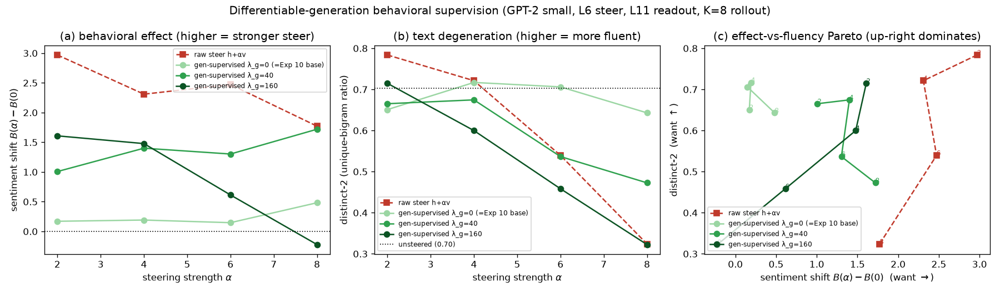
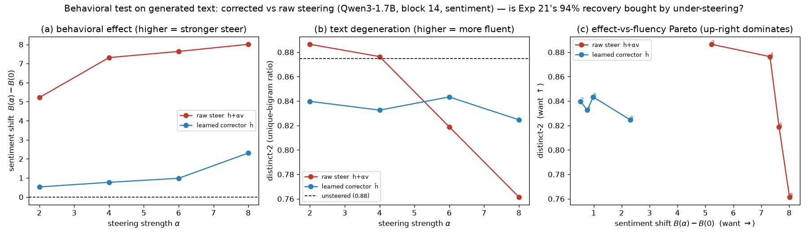
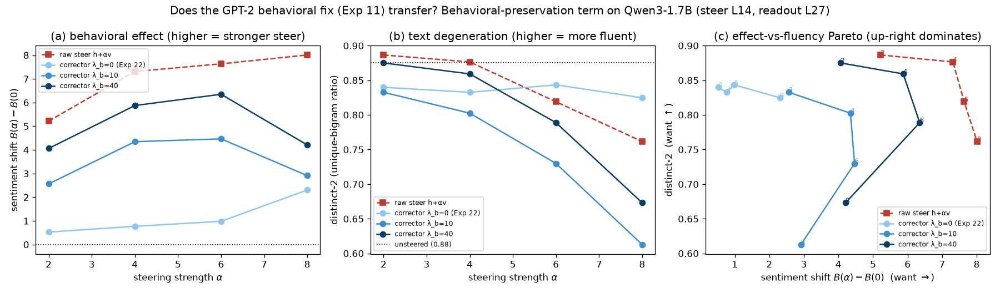
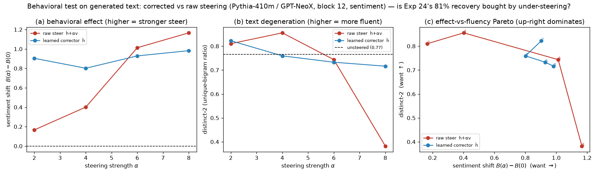

# ColdSteer — Part 4: Behavioral reality-check — from fluency to real steering in generation

> One of four topic-focused parts of the ColdSteer report (see REPORT.md for the index). Final, presentable, current-best only; history in CHANGELOG.md.

## Summary

The core fluency result (Part 1) is measured with a **teacher-forced ΔLM at matched projection, at a single layer**. That is a proxy: it fixes the layer-6 edit and checks how much steering damages next-token prediction on real text, but it never asks what the corrector does when it is actually used to *generate*. This part asks that harder question — when the corrector generates text, does it still steer the output? — and the answer both sharpens and qualifies the fluency win.

On GPT-2 (Experiment 10) the corrector prevents raw steering's collapse into repetition — distinct-2 stays near the 0.70 baseline while raw's crashes from ~0.78 to 0.32 — but its generated text is only **weakly steered**, roughly one-sixth of raw's behavioral sentiment effect. The reason is that the projection-preserving correction, though orthogonal to `v` in *activation* space, is **not** orthogonal to the downstream concept *readout*. Matched layer-6 projection is not matched behavioral steering. Experiment 22 reruns the identical protocol on Qwen3 and reproduces the under-steering caveat — the corrector's generated effect is only 10–29% of raw's — so the caveat is architecture-robust; but raw degenerates far less on Qwen3, making it a stronger baseline there. Experiment 25 finds the caveat is *milder* on Pythia-410m, where raw steering itself propagates weakly to generation, so the corrector loses little.

The remaining experiments try to close the gap. Experiment 11 (GPT-2) adds a term that preserves the downstream concept readout during training; it recovers 2–6× more behavioral effect while staying fluent, turning Experiment 10's tradeoff into outright **dominance** over raw at moderate steering — but no weighting reaches raw's strong pre-collapse effect, because matching a teacher-forced readout only partially transfers to autoregressive generation. Experiment 20 supervises the readout on the corrector's *own* generated continuation through a differentiable soft-token rollout; this breaks Experiment 11's effect ceiling and cleanly dominates at moderate steering, but over-weighting the generation term destabilizes and collapses at strong steering. In both cases the frontier moves out, not away.

Experiment 23 re-fits the Experiment-11 readout-preservation term on Qwen3 and separates *mechanism* from *payoff*: the mechanism is architecture-robust (it recovers 53–83% of raw's generated effect, versus 10–29% for the base corrector), but its Pareto advantage is not — because Qwen3's raw steering does not collapse, the corrector approaches raw's effect-fluency frontier without dominating it. The fix is a robust lever on generated effect; its payoff is gated by whether the raw baseline degenerates.

The overall stakes: the strong-effect-**and**-fluent corner remains genuinely hard for a projection-preserving corrector, and behavioral effect on generated text must be measured directly, not inferred from a teacher-forced ΔLM.

## Methods

### Data & Model

**Model.** GPT-2 small (124M parameters), via HuggingFace `transformers`. We hook the
**residual stream after block 6** (`resid_post`, the middle of GPT-2's 12 blocks), a 768-dim
vector per token. In HuggingFace terms this is `hidden_states[7]` (index `layer+1`, since
`hidden_states[0]` is the embedding).

**Text data.** FineWeb documents (a large open web-text corpus). We fit activation
statistics on **49,218 token activations** from 400 documents (128 tokens each) and measure
LM degradation on a **held-out 100 documents**.

**Steering vector.** A **DiffMean** sentiment direction: mean activation over 20 clearly
positive sentences minus mean activation over 20 matched negative sentences, at block 6.
It is used in **raw activation units** (not renormalized), giving `|v| = 11.1`; for
reference the mean clean-activation norm is `|h| = 112.2`. Steering strength `α` is therefore
in multiples of one "natural sentiment shift." We form the steered activation for a clean
activation `h`:

```math
z = h + \alpha\, v
```

and sweep `α ∈ {0, 1, 2, 3, 4, 6, 8}`.

### Metrics

All three metrics measure how far steering pushes the activation off the real-text
manifold; **higher = more off-manifold / more damage** for all three.

**Mahalanobis distance `D_M`** — distance from the steered activation to the cloud of real
activations, fit as a single Gaussian with mean `μ` and covariance `Σ` (estimated on the
49,218 clean tokens, with a small ridge `10⁻³·I` added to `Σ` for invertibility). It counts
how many standard deviations, in the whitened activation space, the point sits from typical
activations:

```math
D_M(x) = \sqrt{(x-\mu)^{\top}\, \Sigma^{-1}\, (x-\mu)}
```

We report the mean `D_M` over a 20,000-token sample. The reference value for **real
activations** is `D_M = 27.3`; a steered activation scoring well above this is off-manifold.

**Norm inflation ratio** — how much steering blows up the activation's length relative to a
clean activation:

```math
\rho(\alpha) = \frac{\mathbb{E}\,\lVert z \rVert}{\mathbb{E}\,\lVert h \rVert}
```

A value of 1 means the steered activation has a typical length; `ρ > 1` means it is
abnormally large.

**Δ LM loss** — the practical cost of steering. We patch `z = h + α·v` into `resid_post` at
block 6 for **every token position** during a forward pass and measure the mean next-token
cross-entropy (natural log), then subtract the unsteered baseline `α = 0`:

```math
\Delta\mathrm{LM}(\alpha) = \mathrm{CE}_{\text{next-token}}(z=h+\alpha v)\; -\; \mathrm{CE}_{\text{next-token}}(z=h)
```

`ΔLM` is in nats; `+ln(k)` nats means perplexity got `k×` worse. Larger = more fluency
damage.

**Projection retention (Experiment 2)** — how much of the intended steering edit survives
in the corrected activation, measured as the component of the net edit along the unit
steering direction `v̂ = v/|v|`. This is the quantity a corrector must NOT destroy (destroying
it would just be "turn off the steer"):

```math
\mathrm{retention} = \big\langle\, \hat{h} - h,\; \hat{v} \,\big\rangle
```

For raw steering and any correction of the form `ĥ = z + P_{v⊥}r`, this equals `α|v|` exactly,
so those methods are compared at **matched projection**.

**Behavioral metrics on generated text (Experiment 10).** `ΔLM` and projection retention are both
measured under teacher forcing at a single layer; neither certifies that the corrector, used to
*generate*, still steers the output. Experiment 10 measures two quantities on the model's own greedy
generations. We generate 30 continuation tokens from 48 held-out 12-token prompts with the steer applied
at `resid_post` block 6 at every position, then **re-encode the generated text with a clean forward pass
(no steer)** and score it. The **sentiment effect** is the mean projection of the continuation's block-6
activations onto `v̂`, reported as the shift from the unsteered greedy continuation `B(0)` (higher =
the produced text reads more strongly steered):

```math
B(\alpha) - B(0), \qquad B(\alpha) = \mathbb{E}_{t \in \text{continuation}}\big\langle\, h^{(6)}_t,\; \hat{v} \,\big\rangle
```

**Degeneration** is measured by **distinct-2**, the ratio of unique bigrams to total bigrams in the
generated continuation, averaged over prompts (lower = more repetitive / collapsed text; the unsteered
baseline is `0.70`):

```math
\text{distinct-2} = \mathbb{E}_{\text{prompts}}\; \frac{\lvert \{\, (w_i, w_{i+1}) \,\} \rvert}{(\text{\#continuation tokens}) - 1}
```

### Behavioral-preservation term (Experiment 11)

Experiment 10 shows the flagship corrector under-steers in generation because its layer-6 correction,
though orthogonal to `v`, is not orthogonal to the downstream concept readout. Experiment 11 supervises
that readout directly. We keep the Experiment-3 corrector, recipe, data and seed unchanged and add **one
loss term**. During each teacher-forced training step we also read out the sentiment projection at a
**downstream layer** `L2 = 11` (the final `resid_post`, `hidden_states[12]`, which feeds `ln_f` + the
output head), using a downstream DiffMean sentiment direction `ŵ` (unit vector; built once as the mean
block-11 activation over the 20 positive minus the 20 negative sentences, `|w| = 3.87`). For the corrected
activation `ĥ` this gives `p_corr` = the block-11 activation projected onto `ŵ`; for **raw** steering
`z = h + α v` (a separate no-grad forward in the same step) it gives the target `p_raw`. The behavioral term pushes the
corrected downstream readout toward raw steering's, and is added with weight `λ_b`:

```math
\mathcal{L} = \mathrm{CE}_{\text{next-token}}(\hat{h}) \;+\; \lambda_{\text{near}}\,\big\langle \lVert P_{v^{\perp}} r_\theta \rVert^2 \big\rangle \;+\; \lambda_{b}\, \Big\langle \big( (p_{\text{corr}} - p_{\text{raw}})/100 \big)^2 \Big\rangle
```

We train the family `λ_b ∈ {0, 10, 40}` (`λ_b = 0` recovers the Experiment-10 corrector exactly) and
score every one on the **identical Experiment-10 generation protocol** — 30 greedy tokens from 48
held-out prompts, sentiment effect `B(α)−B(0)` and distinct-2 on a clean re-encode — with raw steering
as the shared reference. This asks whether an explicit behavioral term moves the effect-vs-fluency Pareto
frontier of Experiment 10 outward.

### Differentiable-generation behavioral supervision (Experiment 20)

Experiment 11's behavioral term matches the downstream readout on a **teacher-forced** pass (the corrected
activation patched over *ground-truth* FineWeb tokens); its ceiling was traced to a proxy gap — a
teacher-forced readout only partially transfers to *autoregressive* generation. Experiment 20 supervises
the readout on the corrector's **own generated continuation** through a **differentiable soft-token
rollout**. Starting from the first `P = 8` real tokens of a training document (as input embeddings), we
roll out `K = 8` steps: at each step we forward the frozen model with the steer applied at `LAYER` at every
position, read the downstream sentiment projection `p^{\text{gen}} = \langle \text{resid}^{(L2)}_{\text{last}}, \hat{w}\rangle`
at the just-produced position, then feed the **softmax-weighted expected embedding** back as the next
input, so the whole rollout is differentiable in `r_\theta`:

```math
e_{t+1} = \mathrm{softmax}(\ell_t / \tau)\, W_e , \qquad \tau = 1 ,
```

where `\ell_t` are the step-`t` next-token logits and `W_e` is the (frozen) token-embedding matrix. The
target `p^{\text{gen}}_{\text{raw}}` is raw steering's readout on **its own** no-grad rollout. The
generation term, added with weight `\lambda_g`, backpropagates through the `K`-step unroll into `r_\theta`:

```math
\mathcal{L} = \mathrm{CE}_{\text{next-token}}(\hat{h}) \;+\; \lambda_{\text{near}}\,\big\langle \lVert P_{v^{\perp}} r_\theta \rVert^2 \big\rangle \;+\; \lambda_{g}\, \Big\langle \big( (p^{\text{gen}}_{\text{corr}} - p^{\text{gen}}_{\text{raw}})/100 \big)^2 \Big\rangle
```

Everything else is the Experiment-11 recipe (teacher-forced `CE` and `λ_near` terms unchanged, same seed
and data). We train the family `λ_g ∈ {0, 40, 160}` (`λ_g = 0` recovers the Experiment-10/11 base corrector
exactly) and score each on the **identical Experiment-10 generation protocol**. This asks whether
supervising on the *autoregressive* distribution — rather than a teacher-forced proxy — pushes the
effect-fluency Pareto further out than Experiment 11's teacher-forced term.

### Behavioral-fix transfer across the architecture boundary (Experiment 23)

Experiment 22 showed the under-steering caveat holds on Qwen3 and named the Experiment-11
behavioral-preservation term as the indicated fix, but did not test it. Experiment 23 re-fits that term on
Qwen3. The recipe is exactly Experiment 21's Qwen3 corrector (steer at block 14) plus the Experiment-11
behavioral term, now read out at a **downstream Qwen3 layer** `L2 = 27` (`hidden_states[28]`, the last
decoder block, which feeds the final norm + head), using a downstream DiffMean sentiment direction `ŵ`
(`|w| = 12.9`) built from the same 20/20 sentences at block 27. During each teacher-forced step the corrected
downstream readout `p_corr` (the block-27 activation projected onto `ŵ`) is pushed toward raw steering's
`p_raw` with weight `λ_b`, using the **same total loss defined for Experiment 11** (the LM cross-entropy +
`λ_near` minimal-correction penalty + `λ_b`-weighted readout-preservation term). We train the family
`λ_b ∈ {0, 10, 40}` (`λ_b = 0` loads the exact Experiment-21 checkpoint — the Experiment-22 corrector — as a
reproducibility anchor) and score every one on the **identical Experiment-22 generation protocol** (48
held-out prompts, 30 greedy tokens; sentiment effect `B(α)−B(0)` and distinct-2 on a clean re-encode), with
raw steering as the shared reference. This asks whether the fix that pushed the GPT-2 effect-fluency Pareto
out also transfers across the architecture boundary.

## Results

### Experiment 10 — behavioral reality-check: matched projection is not matched steering in generation


Every result above scores the corrector under teacher forcing at *matched projection* along `v`. That is
a proxy: it fixes the layer-6 edit but says nothing about what the corrector does when used to *generate*.
Using the flagship sentiment corrector, we greedily generate continuations under raw vs. corrected
steering and measure, on a clean re-encode of the output, the sentiment effect `B(α)−B(0)` (unsteered
baseline `B(0)=+0.34`) and distinct-2 (unsteered baseline `0.70`):

| α | effect raw `B−B₀` | effect corr `B−B₀` | distinct-2 raw | distinct-2 corr |
|---|-------------------|--------------------|----------------|-----------------|
| 2 | **+2.97** | +0.17 | 0.78 | 0.65 |
| 4 | **+2.31** | +0.19 | 0.72 | 0.72 |
| 6 | **+2.47** | +0.15 | 0.54 | 0.71 |
| 8 | +1.77 | +0.48 | **0.32** | **0.64** |

**Interpretation.** The corrector's fluency win is real but is **not free** — it comes partly at the cost
of the behavioral steer, a tradeoff the matched-projection `ΔLM` metric hid. Raw steering strongly
steers the text (`+2.97` at α=2, e.g. *"the weather is perfect. The temperature is perfect"*) but
collapses into repetition as α grows (distinct-2 `0.78→0.32`; α=8: *"the Southern-the-Bt and the
second-t-t-t-t-t-t"*). The corrector **fixes the degeneration** — its generations stay coherent and
near-baseline-diverse at every strength (distinct-2 `0.64–0.72`; α=8: *"It is located in the heart of
the city … a place to watch the city's skyline"*) — **but its text is only weakly steered** (effect
`+0.15–0.48`, ~one-sixth of raw's pre-collapse effect). The projection-preserving correction is
orthogonal to `v` in *activation* space yet **not** orthogonal to the downstream sentiment *readout*, so
minimizing LM loss at matched layer-6 projection drives the corrector to near-normal, lightly-steered
text. On the effect-vs-fluency Pareto neither method dominates: raw buys effect at the price of fluency,
the corrector buys fluency at the price of effect. The large `ΔLM` recoveries of Experiments 3–9 truly
measure reduced *disruption to processing real text*, but a substantial part of that reduction is a
**weaker propagated edit** in generation — so any deployment must verify behavioral effect on generated
text, not `ΔLM` alone.

### Experiment 11 — a behavioral-preservation term pushes the Pareto out (but a ceiling remains)


Adding one term that preserves the *downstream* sentiment readout (`λ_b`, pushing the corrector's
final-layer projection toward raw steering's) recovers much of the behavioral effect Experiment 10 lost,
while keeping generation fluent:

| α | eff raw | eff λ_b=0 | eff λ_b=10 | eff λ_b=40 | d2 raw | d2 λ_b=0 | d2 λ_b=10 | d2 λ_b=40 |
|---|---------|-----------|------------|------------|--------|----------|-----------|-----------|
| 2 | **+2.97** | +0.17 | +0.45 | +0.99 | 0.78 | 0.65 | 0.66 | **0.73** |
| 4 | **+2.31** | +0.19 | +0.87 | +1.31 | 0.72 | 0.72 | 0.61 | 0.65 |
| 6 | **+2.47** | +0.15 | +0.93 | +0.84 | 0.54 | 0.71 | 0.58 | 0.59 |
| 8 | +1.77 | +0.48 | +1.23 | +1.08 | **0.32** | 0.64 | 0.59 | 0.52 |

(`eff` = sentiment shift `B(α)−B(0)`, higher = more steered; `d2` = distinct-2, higher = more fluent;
unsteered baselines `B(0)=+0.34`, distinct-2 `0.70`. `λ_b=0` reproduces Experiment 10 to the digit.)

**Interpretation.** The behavioral term is a **real, cheap win that pushes the effect-fluency frontier
outward — but only at the fluent end.** Three findings. **(1) It recovers effect cheaply.** Adding `λ_b`
lifts the generated sentiment effect from Experiment 10's `+0.15–0.48` to `+0.8–1.3` (2–6×) while
distinct-2 stays `0.52–0.73` — well above raw steering's high-α collapse (0.32 at α=8) and near the
unsteered baseline of 0.70. **(2) The corrector now Pareto-dominates raw at moderate steering.** For a
sentiment effect around `+1`, the `λ_b=40` corrector holds distinct-2 at **0.73** (α=2, essentially
unsteered fluency), whereas raw steering only reaches an effect that low (`+1.77` at α=8) *after* it has
collapsed into repetition (distinct-2 0.32). Where Experiment 10 found "neither method dominates," an
explicit behavioral term yields a corrector that gets **both more steer and more fluency** than raw — so
long as moderate steering suffices. **(3) A hard ceiling remains.** No `λ_b` lifts the generated effect
past ≈+1.3; increasing `λ_b` from 10 to 40 stops raising it (it even falls at α=6, +0.93→+0.84) and only
raises training LM loss. The cause is a second layer of the same proxy gap Experiment 10 exposed: the
term successfully matches raw's *teacher-forced* downstream readout (the training behavioral loss falls to
~0.005, `p_corr ≈ p_raw`), yet matching a teacher-forced readout only *partially* transfers to the
autoregressive generation effect. So a behavioral-preservation term is the right next move — it converts
Experiment 10's non-dominating tradeoff into outright dominance over raw at moderate steering — but the
projection-preserving corrector still cannot reproduce raw's *strong* pre-collapse behavioral steering;
the Pareto is pushed out, not erased.

### Experiment 20 — supervising through differentiable generation breaks Experiment 11's ceiling



Experiment 11's ceiling came from supervising a *teacher-forced* readout. Experiment 20 instead supervises
the readout on the corrector's **own generated continuation** through a differentiable `K=8`-step soft-token
rollout (weight `λ_g`), scored on the identical generation protocol. `λ_g=0` is the Experiment-10/11 base
corrector:

| α | eff raw | eff λ_g=0 | eff λ_g=40 | eff λ_g=160 | d2 raw | d2 λ_g=0 | d2 λ_g=40 | d2 λ_g=160 |
|---|---------|-----------|------------|-------------|--------|----------|-----------|------------|
| 2 | **+2.97** | +0.17 | +1.01 | +1.61 | 0.78 | 0.65 | 0.67 | **0.71** |
| 4 | **+2.31** | +0.19 | +1.40 | +1.48 | 0.72 | 0.67 | 0.67 | 0.60 |
| 6 | **+2.47** | +0.15 | +1.30 | +0.61 | 0.54 | 0.71 | 0.54 | 0.46 |
| 8 | +1.77 | +0.48 | **+1.72** | −0.22 | **0.32** | 0.64 | 0.47 | 0.32 |

(`eff` = sentiment shift `B(α)−B(0)`, higher = more steered; `d2` = distinct-2, higher = more fluent;
unsteered baselines `B(0)=+0.34`, distinct-2 `0.70`. `λ_g=0` reproduces Experiments 10/11 to the digit.)

**Interpretation.** Supervising on the *autoregressive* distribution rather than a teacher-forced proxy
**pushes the effect-fluency frontier further out than Experiment 11's teacher-forced term — it breaks the
`≈+1.3` effect ceiling** — but the frontier stays sensitive at strong steering. Three findings. **(1) The
ceiling moves.** At α=8 the moderate corrector `λ_g=40` reaches a sentiment effect of **+1.72** — above
Experiment 11's best (`λ_b=10` gave +1.23, `λ_b=40` +1.08) and nearly matching *raw*'s already-collapsed
+1.77 — while keeping distinct-2 at **0.47** versus raw's collapsed **0.32**. At α=4 it reaches +1.40 (vs
Experiment 11's +1.31) at the same fluency. So the generation-aware signal recovers behavioral effect the
teacher-forced signal could not. **(2) At moderate steering the win is clean.** The stronger corrector
`λ_g=160` at α=2 reaches effect **+1.61 at near-baseline fluency 0.71** — dominating Experiment 11's best
moderate point (+0.99 at 0.73) — because at low α the differentiable rollout stays coherent and the readout
target is easy to match without degenerating. **(3) But over-weighting collapses at strong steering.**
`λ_g=160` overshoots: pushing the generation readout too hard destabilizes training (one step spiked the LM
loss to ~20) and at α≥6 the corrector *degenerates like raw* — effect falls to +0.61 (α=6) then **−0.22**
(α=8) with distinct-2 collapsing to **0.32**, its α=8 sample repeating *"the Southern-the-Beal and the
Southern-the-Beal…"* just as raw does. So the generation-aware term is a strictly better lever than the
teacher-forced one in the *moderate*-steering regime and pushes the achievable strong-α effect up
(+1.08→+1.72 at α=8), but the strong-effect-**and**-fluent corner still eludes: too little generation
weight under-steers, too much collapses. Differentiable-generation supervision **narrows** the proxy gap
Experiment 11 left open — it does not close it. The projection-preserving corrector's frontier is pushed
out a second time, still not erased.

### Experiment 22 — the under-steering caveat replicates on Qwen3 (behavioral generation)



| α | effect raw `B−B₀` | effect corr `B−B₀` | corr/raw effect | distinct-2 raw | distinct-2 corr |
|---|-------------------|--------------------|-----------------|----------------|-----------------|
| 2 | **+5.22** | +0.53 | 10% | 0.886 | 0.840 |
| 4 | **+7.31** | +0.77 | 11% | 0.876 | 0.833 |
| 6 | **+7.64** | +0.98 | 13% | 0.819 | 0.843 |
| 8 | +8.01 | +2.31 | 29% | **0.761** | 0.825 |

(Behavioral metrics as defined for Experiment 10; unsteered baselines `B(0)=+28.6`, distinct-2 `0.875`. Same
48 held-out prompts, 30 greedy tokens, steer at block 14 every position; the corrector is the exact Experiment
21 checkpoint, not retrained.)

**Observation.** Experiment 21's headline 94% recovery is a *teacher-forced* `ΔLM` at matched layer-14
projection. Run through actual generation, the corrector under-steers: its sentiment effect is only
`+0.53–2.31`, **10–29% of raw's** `+5.2–8.0`. On fluency the corrector holds distinct-2 flat at `0.825–0.843`
while raw dips to `0.761` at α=8 — so the corrector is still more fluent than raw at strong steering, but the
gap (0.06) is far narrower than on GPT-2, where raw *collapsed* to distinct-2 0.32 (Experiment 10). Sample at
α=8: raw *"…a welcoming family and a welcoming community. The community is a home and a family…"* (positive,
repetitive) vs corrected *"…situated in the heart of the city of Bridgend, just 15 minutes north of the city
of Bridgend"* (fluent, factual, barely steered).

**Interpretation.** The Experiment 10 mechanism is architecture-robust: the projection-preserving correction
is orthogonal to `v` in *activation* space but not to the downstream sentiment *readout*, so minimizing LM
loss on Qwen3 also yields near-normal, lightly-steered text. The large teacher-forced `ΔLM` recovery is
genuine as a measure of reduced disruption to processing real text, but a substantial part of it reflects a
weaker propagated behavioral edit here too. Matched projection ≠ matched behavioral steering is not a
GPT-2 quirk.

**Limitations.** Single concept/seed/layer, one architecture, and — unlike GPT-2 — the Experiment 11/20
behavioral-preservation terms were not re-fit on Qwen3, so we show the caveat holds but not (yet) that the fix
transfers. A second difference from GPT-2 complicates the Pareto read: raw steering degenerates far less on
Qwen3 (distinct-2 0.76 vs 0.32 at α=8), so raw is a stronger baseline here and the corrector's fluency edge is
smaller. The sentiment-effect scale is model-specific (Qwen3's `|h|` and `B(0)` are ~8× GPT-2's), so absolute
effects are not comparable across models — only the corr/raw *ratio* is.

**Next check.** Re-fit the Experiment 11/20 behavioral-preservation terms on Qwen3 to test whether the fix that
pushed the GPT-2 Pareto out also transfers across the architecture boundary. *(Done in Experiment 23.)*

### Experiment 23 — the GPT-2 behavioral fix transfers mechanically to Qwen3, but not its Pareto win



| α | eff raw | eff λ_b=0 | eff λ_b=10 | eff λ_b=40 | d2 raw | d2 λ_b=0 | d2 λ_b=10 | d2 λ_b=40 |
|---|---------|-----------|------------|------------|--------|----------|-----------|-----------|
| 2 | **+5.22** | +0.53 | +2.56 | +4.06 | 0.886 | 0.840 | 0.833 | 0.875 |
| 4 | **+7.31** | +0.77 | +4.35 | +5.87 | 0.876 | 0.833 | 0.802 | 0.859 |
| 6 | **+7.64** | +0.98 | +4.47 | +6.35 | 0.819 | 0.843 | 0.730 | 0.789 |
| 8 | +8.01 | +2.31 | +2.91 | +4.21 | 0.761 | 0.825 | 0.613 | 0.673 |

(`eff` = sentiment shift `B(α)−B(0)`, higher = more steered; `d2` = distinct-2, higher = more fluent;
unsteered baselines `B(0) = +28.6`, distinct-2 `0.875`. `λ_b=0` reproduces Experiment 22 to the digit.)

**Observation.** Adding the readout-preservation term raises the corrected generation's sentiment effect
sharply: from the base corrector's `+0.53–2.31` (10–29% of raw's, = Experiment 22) to `+4.06–6.35` at
`λ_b=40` — **53–83% of raw's effect** at α ≤ 6, a 2–8× increase — while distinct-2 stays coherent (0.673–0.875
at `λ_b=40`, no repetition collapse). At `λ_b=40` and α=8 the effect falls back to `+4.21` (below its own α=6
peak of +6.35) with distinct-2 dropping to 0.673 — a strong-steering over-steer wobble.

**Interpretation.** The Experiment-11 behavioral mechanism is **architecture-robust**: the projection-preserving
correction's non-orthogonality to the downstream sentiment readout, and the fix of supervising that readout,
carry from GPT-2 to Qwen3, recovering most of the generated effect the base corrector threw away. But the fix's
*Pareto advantage* does **not** carry. On GPT-2 the same term produced outright dominance over raw *because raw
steering there collapsed into repetition* (distinct-2 0.32) — a fluent-and-steered corrector dominated a
degenerate baseline. On Qwen3 raw does not collapse (distinct-2 only 0.761 at α=8, Experiment 22), so raw is a
strong-and-fluent baseline: at `λ_b=40` the corrector's distinct-2 (0.875→0.673) sits slightly *below* raw's
(0.886→0.761) at every α while its effect is also below raw's, so raw weakly dominates at matched α. The `λ_b`
sweep traces a frontier from the base corrector (fluent, weakly steered) *toward* raw (strongly steered, fluent)
without passing it. So the behavioral fix is a robust lever on generated effect, but its practical payoff is
**gated by whether raw steering degenerates** — a Pareto win where raw collapses (GPT-2), effect recovery
without dominance where raw stays fluent (Qwen3). This closes the behavioral arc (Experiments 10 → 11 → 20 →
22 → 23): matched projection ≠ matched steering everywhere; the readout-preservation fix transfers everywhere;
the size of its payoff depends on the baseline's failure mode.

**Limitations.** Single concept/seed, one downstream readout layer (`L2 = 27`), one non-GPT-2 architecture, and
the coarse `λ_b ∈ {0, 10, 40}` grid tested on GPT-2 — a finer sweep or the Experiment-20 differentiable-
generation variant might trace the Qwen3 frontier closer to raw. The sentiment-effect scale is model-specific
(Qwen3's `|h|` and `B(0)` are ~8× GPT-2's), so only the corr/raw *ratio* is comparable across models, not
absolute effects. The `λ_b=40`, α=8 over-steer wobble suggests the strong-steering instability seen in
Experiment 20 (`λ_g=160`) is also present here and was not separately stabilized.

**Next check.** A finer `λ_b` sweep (and the Experiment-20 differentiable-generation term) on Qwen3 to map how
close the corrected frontier can get to raw's strong-and-fluent corner, and whether the α=8 wobble is a
learning-rate/weight-schedule artifact rather than a fundamental limit.

### Experiment 25 — the under-steering caveat is mild on a third architecture (Pythia-410m, behavioral generation)

**Observation.** Experiment 24's 81% recovery on Pythia-410m is a teacher-forced `ΔLM`. Running the identical
Experiment 10/22 behavioral protocol (48 held-out prompts, 30 greedy tokens, steer at block 12 every position,
reusing the exact Experiment-24 corrector — no retraining) gives the sentiment effect `B(α)−B(0)` and distinct-2
on a clean re-encode (unsteered baselines `B(0) = −4.77`, distinct-2 `0.77`):

| α | effect raw `B−B₀` | effect corr `B−B₀` | distinct-2 raw | distinct-2 corr |
|---|-------------------|--------------------|----------------|-----------------|
| 2 | +0.17 | +0.90 | 0.81 | 0.82 |
| 4 | +0.40 | +0.80 | 0.86 | 0.76 |
| 6 | +1.01 | +0.93 | 0.74 | 0.73 |
| 8 | +1.17 | +0.98 | 0.38 | 0.72 |

**Interpretation.** Unlike GPT-2 (Experiment 10, corrector effect ~1/6 of raw) and Qwen3 (Experiment 22, 10–29%
of raw), on Pythia the corrector's generated effect is *comparable to* raw's — above raw at α≤4 and 84–92% of
raw at α≥6 — and at α=8 it Pareto-*dominates* raw (effect +0.98 at distinct-2 0.72, where raw collapses to 0.38).
The mechanism is that raw steering itself propagates weakly on Pythia here (effect peaks at only +1.17), so there
is little behavioral effect for the projection-preserving corrector to lose. This says the size of the
"matched projection ≠ matched steering" penalty is architecture-dependent and tracks **how strongly raw steering
propagates** to generation in a given model.

**Limitations.** The effect magnitudes are small on Pythia (raw peaks at +1.17), a low-signal regime, so this is
best read as "the Experiment 10/22 under-steering penalty is mild here," not as evidence the corrector steers
*more* than raw in general; single concept/seed; the effect scale is model-specific (only corr/raw ratios compare
across models). The α=8 raw distinct-2 collapse (0.38) mirrors GPT-2, confirming the fluency benefit is real.

**Next check.** The Experiment 11/20 behavioral-preservation terms on Pythia if a stronger behavioral steer is
required, and a wider α grid to reach a regime where raw steers Pythia more strongly.



## Conclusion

Across three architectures the same lesson holds: **matched projection is not matched steering in generation.** A corrector that preserves the layer-6 edit along `v` and minimizes teacher-forced LM loss produces fluent but only lightly-steered text (Experiment 10, ~one-sixth of raw's effect on GPT-2), because the correction is orthogonal to `v` in activation space but not to the downstream concept readout. The caveat is architecture-robust — it replicates on Qwen3 (Experiment 22, 10–29% of raw) — and it is milder on Pythia (Experiment 25), where raw steering itself propagates weakly, so the corrector loses little. The size of the under-steering penalty tracks how strongly raw steering propagates to generation in a given model.

An explicit downstream-readout-preservation term is the right lever. On GPT-2 it recovers 2–6× more behavioral effect and turns Experiment 10's tradeoff into outright dominance over raw at moderate steering (Experiment 11), but a teacher-forced readout ceiling remains near ≈+1.3; supervising instead through a differentiable soft-token rollout on the corrector's own continuation breaks that ceiling (α=8 effect +1.08→+1.72) and dominates cleanly at moderate steering, yet over-weighting the generation term destabilizes and collapses at strong steering (Experiment 20). In both cases the frontier is pushed out, not erased. The fix's mechanism transfers across the architecture boundary — it recovers 53–83% of raw's generated effect on Qwen3 — but its Pareto payoff is gated by whether the raw baseline degenerates: a win where raw collapses (GPT-2), effect recovery without dominance where raw stays fluent (Qwen3) (Experiment 23).

The overall lesson for this topic: the strong-effect-**and**-fluent corner remains genuinely hard for a projection-preserving corrector, and behavioral effect on generated text must be measured directly, not inferred from a teacher-forced ΔLM.
