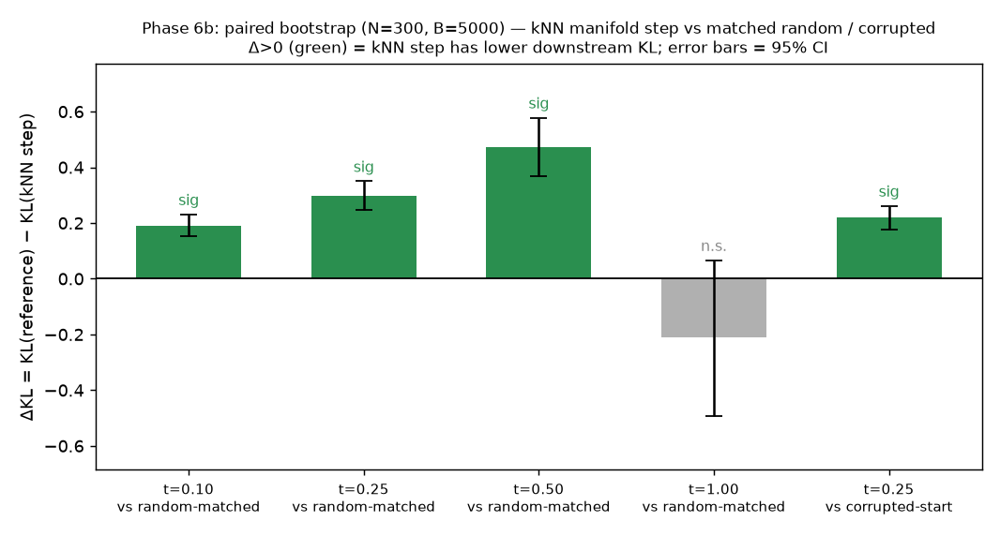
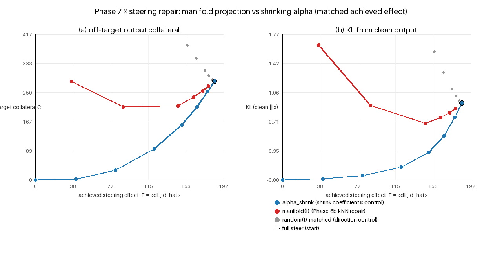

# REPORT — Direction #6: What makes real activations "real"?

**Model/data:** GPT-2 small, residual stream `resid_post` (= `hidden_states[L+1]`), layers {3,6,9},
all token positions pooled, FineWeb. Real activations REUSED from the Direction-3 cache
(`../dir3_manifold/data/acts_layer{3,6,9}.npy`, [200000,768] float16). Environment had only numpy
(no sklearn/scipy); all metrics (AUROC/AUPRC, logistic, MLP, kNN, PCA, Mahalanobis) are pure-numpy.
The functional probe uses `transformers` (reinstalled `--no-deps`; torch 2.9.0+cu130 / numpy 2.3.3
left untouched) on the A10 GPU.

## Question
Do real residual activations have local statistical / geometric / functional properties beyond their
first two moments, and do those properties generalize across hard synthetic negatives? (Hypothesis H1.)

## Benchmark
- **Positives:** real activations, split into contiguous TRAIN/EVAL blocks with a 5k-row gap (a
  leakage-*reduction* heuristic — the Direction-3 cache stores activations in document order but
  per-row document IDs were not saved, so this is "contiguous split + gap", not a verified
  document-level split); negatives derived from EVAL reals only; statistics fit on TRAIN only.
- **Negative families (7):** isotropic Gaussian, covariance-matched Gaussian (Cholesky of shrinkage
  cov), coordinate-shuffle (norm preserved exactly), norm-preserving perturbation, **convex
  interpolation between two reals** (norm-matched), top-PCA-tangent perturbation, orthogonal-complement
  perturbation. The last three are norm-matched, manifold-aware hard negatives.
- **Scores (10):** norm, mean-L2, Mahalanobis (shrinkage), PCA reconstruction error, coordinate-quantile,
  kNN distance (statistical); next-token entropy, max-softmax-prob, plateau-KL, max-logit (functional).
  NOTE: the *discrimination* functional probe (Phase 3, `functional_features.py`) continues the model
  from the activation as a SINGLE-POSITION input, so it measures intrinsic model sensitivity, not
  in-context fidelity. The *prediction* and *causal* phases (5 & 6) use the corrected genuinely
  in-context method (forward hook over the full prompt; see Correction section).
- **Protocols:** per-family AUROC/AUPRC; leave-one-corruption-family-out (LOFO) for learned and combined
  detectors; cross-depth replication at layers 3/6/9.

## Methods — metric & baseline definitions
All discrimination uses **AUROC** with label $y=1$ = fake/anomaly, $y=0$ = real; $f$ denotes the frozen
GPT-2 continuation from the activation to next-token logits, $p=\mathrm{softmax}(f(x))$.

```math
\mathrm{AUROC}=\Pr\!\big(s(x^-)<s(x^+)\big)=\frac{1}{n_+n_-}\sum_{i:y_i=1}\sum_{j:y_j=0}\Big(\mathbb{1}[s_i>s_j]+\tfrac12\mathbb{1}[s_i=s_j]\Big)
```

Because a score's anomaly orientation is not always known a priori, single-score AUROCs are reported
two-sided as $\max(\mathrm{AUROC},\thinspace 1-\mathrm{AUROC})$.

**Statistical baselines** (fit on TRAIN reals only; $\mu,\Sigma$ = train mean/covariance):

```math
s_\text{norm}(x)=\lVert x\rVert_2,\qquad s_\text{mean\_l2}(x)=\lVert x-\mu\rVert_2
```

```math
s_\text{maha}(x)=(x-\mu)^\top \Sigma_s^{-1}(x-\mu),\quad \Sigma_s=(1-\gamma)\Sigma+\gamma\,\mathrm{diag}(\Sigma)+\epsilon I,\ \gamma=0.05
```

```math
s_\text{pca}(x)=\big\lVert (x-\mu)-V_kV_k^\top(x-\mu)\big\rVert_2\ \ (\text{top-}k\text{ PCs}),\qquad s_\text{knn}(x)=\min_{r\in R}\lVert x-r\rVert_2
```

where $R$ is a 5 000-sample reference set of train reals (1-NN density). `coord_quantile` sums
per-coordinate empirical tail probabilities under the train marginal.

**Functional scores** (single forward from the activation; Phase 3):

```math
\text{entropy}=-\sum_v p_v\log p_v,\qquad \text{MSP}=\max_v p_v,\qquad \text{logit\_max}=\max_v f(x)_v
```

```math
\text{plateau-KL}=\frac1M\sum_{m=1}^{M}\mathrm{KL}\!\big(p\,\Vert\,p_m'\big),\quad p_m'=\mathrm{softmax}\!\big(f(x+\epsilon\lVert x\rVert u_m)\big),\ \epsilon=0.02,\ M=4
```

with $u_m$ i.i.d. unit-random directions.

**Downstream degradation** (Phases 5–6, genuinely in-context): corrupt only the last-token
resid_post@L6 via a forward hook over the full prompt, then

```math
\mathrm{KL}_\downarrow=\mathrm{KL}\!\big(p_\text{clean}\,\Vert\,p_\text{corrupt}\big)\ \text{at the last position.}
```

**Prediction** uses Spearman rank correlation $\rho$ and the **partial** Spearman controlling
distance-to-original $d=\lVert x-x_0\rVert$ (rank-residualize score and $\mathrm{KL}_\downarrow$ on $d$,
then correlate). **Causal repair** compares external $\mathrm{KL}_\downarrow$ and clean-argmax NLL at
matched L2 move budget, across repair operators: *scalar-score descent* (Adam on Mahalanobis or
plateau-KL; Phase 6) and the Phase-6b *nonparametric manifold projection* — a partial step of fraction
$t$ toward the mean of the $k{=}16$ nearest real train activations,

```math
x_t \;=\; x_\text{corrupt} + t\,\big(\bar{\mathrm{NN}}_k(x_\text{corrupt}) - x_\text{corrupt}\big),\qquad \bar{\mathrm{NN}}_k(x)=\tfrac1k\!\!\sum_{i\in\mathrm{NN}_k(x)}\!\! x_i^{\text{real}}
```

using no reference to the clean target — each step is compared to a random move of identical L2 size and
to the oracle move toward the true clean activation. **Bootstrap CIs** (Phase 3 capstone) are percentile intervals $[q_{2.5},q_{97.5}]$
over $B=2000$ resamples of the real and family rows (with replacement), with orientation fixed from the
full sample. **Phase-6b repair CIs** use a *paired* bootstrap ($B=5000$ resamples of the 300 prompt
indices, shared across methods since each method's KL is measured on the same prompt) of the mean KL
delta $\Delta = \mathrm{KL}(\text{reference}) - \mathrm{KL}(\text{kNN step})$; a step is significantly
better when the CI of $\Delta$ excludes $0$.

**Steering preservation** (Phase 7). The steering vector is a difference-of-means (contrastive
activation addition) of the last-token resid@L6 over 20 positive- vs 20 negative-sentiment sentences,
$v=\bar{x}^{+}-\bar{x}^{-}$; steering adds $x_s=x_0+\alpha v$ at a fixed strong $\alpha$ (with
$\lVert\alpha v\rVert\approx 0.8\lVert x_0\rVert$). The output change is decomposed in vocab-mean-centred
logit space $\Delta L=f(x)-f(x_0)$ along the linear readout direction $\hat d$ (the normalized per-prompt
response of steering in the small-$\alpha$ regime) into the **achieved effect** and **off-target
collateral**:

```math
E(x)=\langle \Delta L,\hat d\rangle,\qquad C(x)=\lVert \Delta L - E(x)\,\hat d\rVert,\qquad \hat d=\frac{f(x_0+\alpha_s v)-f(x_0)}{\lVert f(x_0+\alpha_s v)-f(x_0)\rVert}.
```

Higher $E$ = more of the intended steering; lower $C$ (and lower KL-from-clean, lower next-token entropy)
= better validity. At *matched* $E$, the manifold step $x_t$ is compared against the shrink-alpha control
$x_0+f\alpha v$ (walk back along $-v$) and a matched-size random move. Claim 5 succeeds only if the
manifold step reaches an $E$ with strictly lower off-target $C$ than shrink-alpha at the same $E$.

## Figures
Figures 1–8 are rendered from cached result CSVs by `experiments/make_plots.py` (pure PIL); figure 9
(Phase 2c) by `experiments/plot_fig9.py`, figure 10 (bootstrap CIs) by `experiments/bootstrap_ci.py`,
figure 11 (Phase 3c in-context discrimination) by `experiments/plot_fig11.py`, figure 12 (Phase 6b
manifold-projection repair) by `experiments/plot_fig12.py`, and figure 13 (Phase 6b paired-bootstrap
CIs) by `experiments/plot_fig13.py` (matplotlib), and figure 14 (Phase 7 steering repair) by
`experiments/plot_fig14.py` (pure PIL) — all from the cached `results/*.csv`.





## Key results
1. **No single statistic is "realness."** Norm is a shortcut (AUROC 0.50 on the two norm-matched
   families). Each strong baseline has a structural blind spot.
2. **Local density (kNN) and global covariance (Mahalanobis) are complementary and depth-stable.**
   kNN macro 0.913 at L6; it is the only method catching covariance-matched Gaussians (0.97, which
   Mahalanobis cannot see by construction, 0.53). Mahalanobis owns low-variance-direction moves
   (shuffle 1.0, orth_pert 0.88–0.92, norm_pert 0.86). Together they cover Gaussian/shuffle/perturbation
   negatives at AUROC 0.86–1.0 across all three layers.
   - **Sink-confound control (Phase 2c, `position_stratified.py`).** On a genuine document-level split
     (even/odd docs, no shared token) that removes pos-0 attention-sink tokens (norm 3041 vs 88
     elsewhere, 0.46% of rows), the norm/mean_l2 baselines COLLAPSE (macro 0.72→0.51, 0.90→0.67) — their
     apparent discrimination was largely a sink artifact that inflated the fitted Gaussian variance —
     while **Mahalanobis (0.847→0.848) and kNN (0.913→0.830) are robust**, confirming covariance/density
     are real signals and not sink confounds. kNN remains the only baseline beating chance on realistic
     cov-matched Gaussians after sink removal (0.781).
3. **Learned discriminative detectors memorize generators and do NOT generalize.** Logistic/MLP trained
   on three families and tested on a held-out fourth give LOFO macro 0.68/0.74 — *below* the
   unsupervised kNN baseline (0.91) — collapsing to ~chance on unseen covariance-matched Gaussian
   (0.48–0.51) and isotropic Gaussian (logreg 0.49). Realness is better modeled as a one-class/density
   property than a classification boundary.
4. **The subtle hard core — interpolation — is anomalous by being too CENTRAL, not too far.** A convex
   combination of two real activations (renormed to original norm) is invisible to one-sided "too-far"
   anomaly scores and to local density (kNN 0.50, since it sits among real neighbors). But it has
   *lower* Mahalanobis distance than real (658 vs 803; norm exactly matched): a **two-sided** global
   Mahalanobis detects it at ~0.68. Real activations occupy a characteristic-distance *shell*;
   averaging falls into the over-typical interior (high-dimensional Gaussian-annulus intuition). An
   independent **functional probe** (entropy / plateau-KL) also catches interpolation at ~0.61,
   evidencing a genuine functional component of realness. **Bootstrap 95% CIs** (Phase-3 capstone,
   B=2000, `bootstrap_ci.py`) confirm these borderline signals are not noise: on interp, entropy
   [0.58,0.62], plateau-KL [0.60,0.63], and two-sided Mahalanobis [0.67,0.70] all exclude chance,
   whereas kNN [0.48,0.52] straddles 0.50 (interpolation is invisible to *local* density). The
   Mahalanobis CI does not overlap the functional CIs (it is significantly the strongest interp
   discriminator), and kNN's cov_gauss CI [0.97,0.98] does not overlap Mahalanobis [0.53,0.57].
   **In-context discrimination (Phase 3c, `incontext_discrimination.py`) makes the functional axis the
   strongest interp detector of all.** Re-injecting each candidate at the last-token position during a
   full forward over its native prompt (forward hook, so late-layer attention sees real context) and
   scoring by the *intrinsic* plateau-KL raises interp AUROC from 0.63 (out-of-context) to **0.776**,
   above two-sided Mahalanobis (0.69); tangent_pert rises 0.58→0.73 and cov_gauss 0.94→0.98. Native
   context is what makes the functional plateau load-bearing — the functional realness structure is a
   property of the activation *in context*, understated when the activation is scored in isolation.
   (`entropy`/`msp` do not orient consistently across families; plateau-KL is the discriminating
   functional feature.)
5. **Opposite-direction anomalies break combined detectors.** Because interpolation is anomalous in the
   opposite direction from ordinary corruptions, a combined logistic over {Mahalanobis, kNN, entropy,
   plateau-KL} trained LOFO generalizes to covariance-matched Gaussian (0.999) but FAILS on interpolation
   (0.54) — a concrete, reproducible generalization limit for any single realness score. (Caveat: the
   per-family combined LOFO AUROC is reported with held-out-label orientation, `max(au, 1-au)`; this is
   an optimistic diagnostic of separability, not a strictly orientation-fixed deployed-detector number.
   The qualitative split — generalizes to cov_gauss, fails on interp — is robust to orientation.)
6. **The functional axis PREDICTS downstream degradation; the density axis is a proximity proxy.** In a
   context-aware sweep, plateau-KL/entropy predict true in-context KL(clean‖corrupt) beyond
   distance-to-original (partial ρ +0.17…+0.57, positive in both noise and interp sweeps), while
   Mahalanobis/kNN add nothing over proximity. So the property best for *discriminating* interpolations
   (two-sided Mahalanobis) differs from the property best for *predicting* downstream harm (functional).
7. **No scalar realness SCORE is a valid causal objective, but a nonparametric MANIFOLD projection is
   (Phases 6 & 6b).** Gradient descent on Mahalanobis or plateau-KL to "repair" a corrupted activation
   makes downstream KL WORSE than the corrupted start and worse than a matched random move (Mahalanobis
   → over-central shell-trap; plateau-KL → Goodhart degenerate region). BUT a *fractional* kNN
   manifold-projection step (t≈0.25 toward the mean of the 16 nearest real activations, objective-free)
   is the first repair to causally IMPROVE behaviour — in-context KL 0.78→**0.57**, below both the
   corrupted start and a matched-size random move (0.86) — because the manifold gives a valid *direction*
   scalar scores lack. It must stay in a small trust region: the full projection overshoots the shell
   (KL 2.14 > random 1.93). The oracle move toward the true clean activation is the ceiling (KL→0.003).
   Discriminative/predictive ≠ causal for scalar scores; the manifold prior partially closes the gap.

## Correction (post-review, codex 20260623T024606Z): genuinely in-context re-run of Phases 5 & 6
An external review correctly flagged that the first Phase-5/6 scripts continued the forward pass by
feeding a **single position** `[B,1,768]` through the late blocks, so later-layer attention could not
attend to the prompt — i.e. the "in-context KL" was actually single-position late-block continuation.
Phases 5 and 6 were **re-run with a genuine in-context method** (`context_validation_v2.py`,
`causal_repair_v2.py`): a forward hook overwrites ONLY the last-token resid_post@L6 during a FULL
model forward, so all other positions keep their true context. Sanity: severity-0 corruption gives
mean downstream KL = 0.0000 exactly (the hook injects the true clean residual). **Both conclusions
survive the correction:**
- **Claim 3 holds (in-context).** Functional plateau-KL/entropy keep positive partial-ρ over the
  distance control in BOTH sweeps (noise: plateau-KL +0.51, entropy +0.35; interp: plateau-KL +0.25,
  entropy +0.19); raw plateau-KL Spearman actually *rises* in-context (0.55→0.79 noise, 0.13→0.52
  interp). Density scores (Mahalanobis/kNN) keep NEGATIVE partials on the noise sweep — proximity
  proxies, as before. The headline magnitudes are essentially unchanged.
- **Claim 4 still fails (in-context), now with properly move-matched controls** (addressing the review's
  second point that `func_descent` lacked a move-matched random control): maha_descent in-context KL
  0.78→3.33 vs its matched random move 1.99; func_descent →8.82 vs its OWN func-budget-matched random
  move 2.20; oracle clean-direction move →0.009. Both descents are worse than their *exactly* matched
  random controls. (The in-context corrupted-start KL is 0.78, lower than the buggy 2.20, because
  context anchors the prediction — the single-position version overstated corruption impact — but the
  qualitative verdict is identical.)

## Verdict (5-claim ladder)
- **Discrimination — YES**, but only via a multi-axis score (density ⊕ two-sided covariance ⊕
  functional); no single statistic suffices.
- **Generalization — PARTIAL.** Generalizes across Gaussian/shuffle/perturbation families and across
  layers 3/6/9, but not to opposite-direction interpolation negatives.
- **Prediction — PARTIAL/YES, functional axis only.** In a *genuinely in-context* corruption-severity
  sweep (corrupt last-position resid_post of 400 real prompts via a forward hook, continue the FULL
  forward, measure true KL(clean‖corrupt); severity-0 → KL 0 exactly), the functional scores
  plateau-KL/entropy predict downstream KL *beyond* the distance-to-original control (partial Spearman
  +0.19…+0.51, positive across both noise and interp sweeps); statistical density scores add no value
  over proximity (negative partials on the noise sweep). The *functional* axis carries the incremental
  predictive signal, the *density* axis is a proximity proxy. (Verified on the corrected in-context
  re-run, `context_validation_v2.py`.)
- **Causality — SCORE-DEPENDENT (scalar scores fail; a nonparametric manifold step partially succeeds).**
  Gradient-descending a corrupted activation to improve EITHER a density (Mahalanobis) or functional
  (plateau-KL) *scalar* realness score makes the true downstream KL WORSE than the corrupted start and
  worse than a *move-matched* random move: Mahalanobis-descent collapses into the over-central interior
  (the shell-distance trap), func-descent Goodharts the flatness score into a degenerate region
  (`causal_repair_v2.py`, per-descent move-matched controls). BUT Phase 6b (`manifold_repair.py`) tests
  the PLAN's open alternative — a *nonparametric manifold projection* toward the mean of the k=16 nearest
  real activations (objective-free: no reference to the clean target) — and finds a **fractional (t≈0.25)
  step is the first repair that causally IMPROVES behaviour**, lowering in-context KL below both the
  corrupted start (0.78→0.57) and a matched-size random move (0.86). Both gaps are **95%-CI significant**
  under a paired bootstrap over the 300 prompts (`manifold_repair_ci.py`, B=5000): ΔKL vs corrupted-start
  +0.22 [+0.18, +0.26], ΔKL vs matched-random +0.30 [+0.25, +0.35]. The real-activation manifold thus
  supplies a valid repair *direction* that scalar scores lack; the step must stay in a small trust region
  (the full kNN projection overshoots the shell and loses the manifold advantage — t=1.00 vs matched
  random ΔKL −0.21 with CI [−0.49, +0.07] that straddles 0, i.e. becomes indistinguishable from random).
  The oracle
  move toward the true clean activation is the ceiling (in-context KL 0.78→0.003 at full budget), so the
  scalar-score failure is the score, not the optimizer. Net: these realness *scalars* are valid
  detectors/predictors but invalid causal objectives, whereas a small manifold-projection step is a
  valid (if incomplete) one.
- **Steering preservation — NO (well-controlled null, Phase 7).** Applied to a real difference-of-means
  steering vector at matched achieved effect $E$, the Phase-6b manifold-projection step does NOT preserve
  the intended effect better than simply shrinking the steering coefficient: shrink-alpha has lower
  off-target collateral $C$ (e.g. at $E{=}145$: 148 vs 212), lower KL-from-clean (0.31 vs 0.69) and lower
  entropy (3.73 vs 4.15). The manifold step only reduces distance-to-manifold (its own objective), which
  does not buy output validity. It still beats a matched-size *random* move (so the Phase-6b "valid
  direction vs random" result holds), but Direction-1's control is alpha-shrink, and alpha-shrink
  Pareto-dominates. The manifold repair is useful for *unstructured* corruption, not for *structured*
  steering edits.
- **H1 — SUPPORTED.** Real activations carry geometric (shell-distance) and functional (model-sensitivity)
  structure beyond first/second moments. The effect is real but smaller and more orientation-dependent
  than a naive "interpolations fool everything" reading; the honest framing is that statistics need a
  *two-sided* view and a complementary functional probe to capture realness.

## Limitations
- The Phase-3 discrimination functional probe treats each activation as a single-position input
  (intrinsic model sensitivity, not in-context fidelity). This is now addressed: Phase 3c re-scores the
  functional features genuinely in-context (forward hook, full prompt) and finds context *strengthens*
  the plateau-KL discriminator (interp 0.63→0.78). The remaining gap is that Phase 3c injects
  vector-space negatives at the real last position rather than generating negatives from an in-context
  process (e.g. steered/SAE activations produced during a forward); that fuller benchmark is future work.
- The combined-detector LOFO AUROC uses held-out-label orientation (diagnostic, not orientation-fixed).
- Partial-correlation evidence for prediction uses approximate rank-residual partials; the consistent
  positive functional partials are robust, the exact magnitudes are not.
- The main pipeline pools all token positions, including pos-0 "attention-sink" tokens (norm ≈ 3000).
  This confound is now controlled in Phase 2c (document-level split, sink-stratified): it inflates the
  norm/mean_l2 baselines but leaves Mahalanobis/kNN unchanged. A sink-stratified re-run of the
  cross-depth Phase-2b and the functional phases is still future work.
- GPT-2 small only; single model. No cross-model transfer.
- Bootstrap 95% CIs are reported for the Phase-3 capstone single scores (Phase-3 CI table); the
  cross-depth, LOFO-detector, prediction, and causal-repair numbers do not yet carry CIs.

## Implications for Direction 1 (steering)
Two-sided global Mahalanobis is a good *diagnostic* for the "too-central"/over-shrunk regime that
naive small-alpha steering produces (real activations occupy a characteristic-distance shell, not the
interior). BUT Phase 6 is a clear warning: do NOT use these scalar realness scores as *optimization
objectives* for steering repair — gradient descent on Mahalanobis or plateau-KL reward-hacks them and
degrades behavior below even a random move. A usable causal objective must constrain movement toward
the data shell/manifold — and Phase 6b shows what that looks like concretely: a **fractional kNN
manifold-projection step** (move partway toward nearby real activations, small trust region) is the
first objective-free repair that beats both the corrupted start and a matched random move, whereas a
full projection overshoots the shell. So a Direction-1 repair should use a small nonparametric
manifold-projection step, NOT a scalar-score penalty and NOT a full projection. Any steering correction
must still be evaluated against in-context downstream KL at *matched achieved steering effect*, with
reward-hacking checked via metrics outside the objective.

**Phase 7 tests exactly that, and delivers a cautionary null.** Applied to a real difference-of-means
steering vector at matched achieved effect, the Phase-6b manifold step does *not* beat the trivial
control of shrinking the steering coefficient — shrink-alpha has strictly lower off-target collateral,
KL-from-clean, and entropy at every matched effect. The reason is structural: Phase-6b's manifold repair
excels when the corruption is *unstructured* (random noise has no direction to walk back along), but a
steering edit is *structured* along $v$, and the cheapest faithful validity/effect tradeoff is to shrink
$\alpha$ (walk back along $-v$), which the direction-agnostic kNN step cannot beat. The practical
Direction-1 takeaway is therefore the opposite of a naive "project steered activations onto the
manifold" recipe: for a *linear* steering vector, coefficient scaling is already the better control, and
a manifold-aware correction would need to be *readout-constrained* (preserve $E$ while denoising the
orthogonal complement) to have any chance of beating it — an open direction.

## Reproduce
`experiments/mvp_benchmark.py` (Phase 2 L6) · `position_stratified.py` (Phase 2c sink-confound control,
doc-level split) · `train_detectors.py` (LOFO detectors) ·
`baselines_layers.py` (cross-depth + hard negatives) · `functional_features.py` (functional probe) ·
`combined_score.py` (combined + interp correction) · `bootstrap_ci.py` (Phase-3 capstone bootstrap CIs) ·
`incontext_discrimination.py` (Phase-3c in-context vs out-of-context functional discrimination) ·
`context_validation_v2.py` (Phase-5 CORRECTED
in-context prediction) · `causal_repair_v2.py` (Phase-6 CORRECTED in-context scalar-score causal repair,
negative result) · `manifold_repair.py` (Phase-6b kNN manifold-projection repair, partial positive) ·
`manifold_repair_ci.py` (Phase-6b paired-bootstrap CIs on the KL deltas) ·
`steering_repair.py` (Phase-7 steering-preservation: manifold vs shrink-alpha) · `plot_fig12.py`/`plot_fig13.py`/`plot_fig14.py`
(figs 12–14). The pre-correction single-position versions (`context_validation.py`, `causal_repair.py`) are
retained for provenance. Results in `results/*.csv`, `results/*.json` (the `_v2` files are canonical
for Phases 5/6).
