# RESULTS — Direction #6: What makes real activations "real"?

## Setup
- Real positives reused from `../dir3_manifold/data/acts_layer6.npy` — GPT-2 small resid_post
  (hidden_states[7]), all token positions pooled, RAW float16, [200000,768], FineWeb.
- Contiguous split + 5k-row gap (leakage *reduction* heuristic; the dir3 cache is in document order but
  per-row doc IDs were not saved, so this is not a verified document-level split): TRAIN = rows[:50000],
  gap 5000, EVAL = next 10000.
- Baselines fit on TRAIN positives only; negatives matched to EVAL positives (10000 each).
- Pure-numpy pipeline (no sklearn/scipy/transformers in env). `experiments/mvp_benchmark.py`, 32s.
- pos-0 "attention-sink" tokens (norm~3000) are pooled in; their confounding effect on norm/Mahalanobis
  is explicitly tested in **Phase 2c** (document-level split, sink-stratified) below.

## Phase 2 — baseline AUROC (label=1 = fake/anomaly)
| baseline | iso_gauss | cov_gauss | shuffle_coord | norm_pert | MACRO |
|---|---|---|---|---|---|
| norm           | 0.996 | 0.893 | 0.500 | 0.500 | 0.722 |
| mean_l2        | 0.996 | 0.936 | 0.995 | 0.672 | 0.900 |
| mahalanobis    | 1.000 | 0.534 | 1.000 | 0.861 | 0.849 |
| pca_recon      | 1.000 | 0.594 | 1.000 | 0.741 | 0.834 |
| coord_quantile | 1.000 | 0.519 | 0.791 | 0.690 | 0.750 |
| **knn_distance** | 1.000 | **0.976** | 1.000 | 0.678 | **0.913** |

Negative-family norms: iso_gauss 224±6, cov_gauss 195±109, shuffle_coord & norm_pert 101±197
(=real_eval, norm preserved exactly). cov_gauss norm-std 109 ≠ real 197 → norm gets a 0.89 handle.

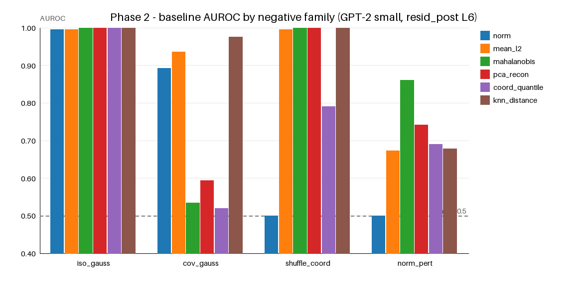

## Findings (so far)
- **kNN local density is the strongest single baseline (macro 0.913)** and the only one that
  catches cov-matched Gaussians (0.976) — i.e. real activations carry local-density structure
  NOT captured by global mean+covariance (Mahalanobis = 0.53 on cov_gauss by construction).
- **Norm is a weak/partial shortcut**: defeated (0.50) by the two norm-preserving families.
- **No single baseline dominates**: Mahalanobis owns shuffle/norm_pert but is blind to cov_gauss;
  kNN owns cov_gauss but is weakest on norm_pert (0.68). norm_pert (max 0.86) has the most headroom.
- Real-activation norm distribution is heavy-tailed/non-Gaussian (sink tokens) — a Gaussian fit
  cannot reproduce it, which is itself a "realness" signal.
- **Gate 2 verdict: baselines do NOT solve all hard negatives** → richer scores justified, but the
  bar to beat is kNN-density macro 0.913 (esp. norm_pert), NOT just Gaussian negatives.

## Phase 2c — token-position (attention-sink) confound control + document-level split
`experiments/position_stratified.py`. Uses Direction-3's position-indexed L6 cache
(`acts_layer6_pos.npy` + `acts_layer6_posidx.npy`, document-major: each doc is a contiguous run of
positions 0,1,2,…). This enables a **genuine document-level split** (even docs train / odd docs eval,
366 docs, 40k train / 12k-per-class eval, no token shared) and a re-run of the Phase-2 benchmark
(same 4 families, 6 baselines) in two conditions: **WITHSINK** (all positions) vs **NONSINK** (pos≥1).
Sink magnitude: pos-0 norm 3041 vs 88 elsewhere (366/80000 = 0.46% of rows).

| baseline | WITHSINK macro | NONSINK macro | cov_gauss WITH→NON |
|---|---|---|---|
| norm            | 0.721 | **0.506** | 0.887 → 0.503 |
| mean_l2         | 0.899 | **0.669** | 0.935 → 0.510 |
| mahalanobis     | 0.847 | **0.848** | 0.518 → 0.518 |
| pca_recon       | 0.832 | 0.791 | 0.585 → 0.499 |
| coord_quantile  | 0.748 | 0.672 | 0.507 → 0.501 |
| **knn_distance**| **0.913** | **0.830** | 0.975 → **0.781** |

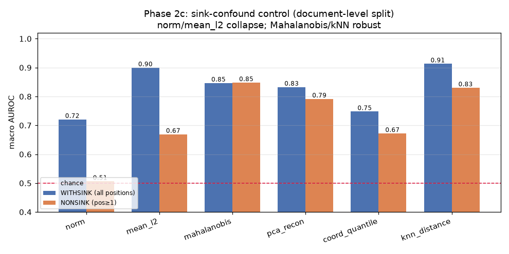

- **norm and mean_l2 were largely a SINK ARTIFACT.** Removing pos-0 collapses norm macro 0.721→0.506
  and mean_l2 0.899→0.669 to ~chance on the Gaussian families: the sinks inflated the fitted global
  σ/covariance, so Gaussian negatives were generated with unrealistic variance and were trivially "too
  far" (real-eval vs cov_gauss norm 103 vs 195 WITHSINK → 88 vs 88 NONSINK). Strengthens "norm is a shortcut."
- **Mahalanobis (0.847→0.848) and kNN (0.913→0.830) are ROBUST** — covariance and density are REAL
  signals, not sink confounds (rebuts the standing Mahalanobis-artifact caveat). kNN stays best and
  remains the ONLY baseline beating chance on realistic cov-matched Gaussians without variance inflation
  (0.781; every other baseline ≈0.50 NONSINK).
- The document-level split reproduces the qualitative Phase-2 story → the main pipeline's contiguous+gap
  heuristic did not distort conclusions.

## Phase 4 — learned detectors, LEAVE-ONE-FAMILY-OUT (Gate 4)
`experiments/train_detectors.py`. Detector sees ONLY standardized raw acts (no metadata).
Positives and the reals used to derive negatives are DISJOINT row blocks (no memorization of
the exact perturbed activation). Train on 3 families, test on the held-out 4th.

| held-out family | logreg AUROC | mlp AUROC |
|---|---|---|
| iso_gauss     | 0.490 | 0.695 |
| cov_gauss     | 0.477 | 0.511 |
| shuffle_coord | 0.999 | 1.000 |
| norm_pert     | 0.738 | 0.731 |
| **LOFO macro** | **0.676** | **0.735** |
| held-IN (all 4) | 0.678 | 0.848 |

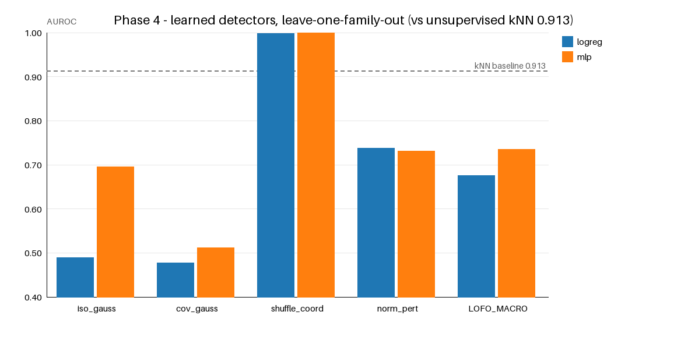

- **Gate 4 FAILS for learned discriminative detectors**: LOFO macro (logreg 0.68, mlp 0.74) is
  well BELOW the unsupervised kNN-density baseline (0.913). They collapse to ~chance on unseen
  cov_gauss (0.48–0.51) and iso_gauss (logreg 0.49) → generator-shortcut memorization, not realness.
- shuffle_coord transfers trivially (broken covariance is detectable even unseen); cov_gauss does
  not transfer at all — consistent with Phase 2 where only kNN caught it.
- **Implication / reframing:** the realness property that GENERALIZES across families is *local
  density on the real-activation manifold* (a one-class/density notion), NOT a learned real-vs-fake
  boundary. Direction 6 should pursue density/manifold/reconstruction scores and always gate on
  held-out-family transfer, not held-in classification accuracy.

## Phase 2b — baselines across layers {3,6,9} + harder norm-matched negatives
`experiments/baselines_layers.py`. AUROC, kNN vs best-of-6 baseline per family:

| family | L3 knn / best | L6 knn / best | L9 knn / best |
|---|---|---|---|
| iso_gauss     | 1.00 / 1.00 (maha) | 1.00 / 1.00 | 1.00 / 1.00 |
| cov_gauss     | 0.97 / 0.97 (knn) | 0.97 / 0.97 (knn) | 0.98 / 0.98 (knn) |
| shuffle_coord | 1.00 / 1.00 (maha) | 1.00 / 1.00 | 1.00 / 1.00 |
| norm_pert     | 0.70 / 0.90 (maha) | 0.68 / 0.86 (maha) | 0.77 / 0.90 (maha) |
| **interp**    | **0.54 / 0.54** | **0.49 / 0.50** | **0.44 / 0.50** |
| tangent_pert  | 0.69 / 0.69 (knn) | 0.66 / 0.67 | 0.75 / 0.75 (knn) |
| orth_pert     | 0.70 / 0.91 (maha) | 0.68 / 0.88 (maha) | 0.77 / 0.92 (maha) |

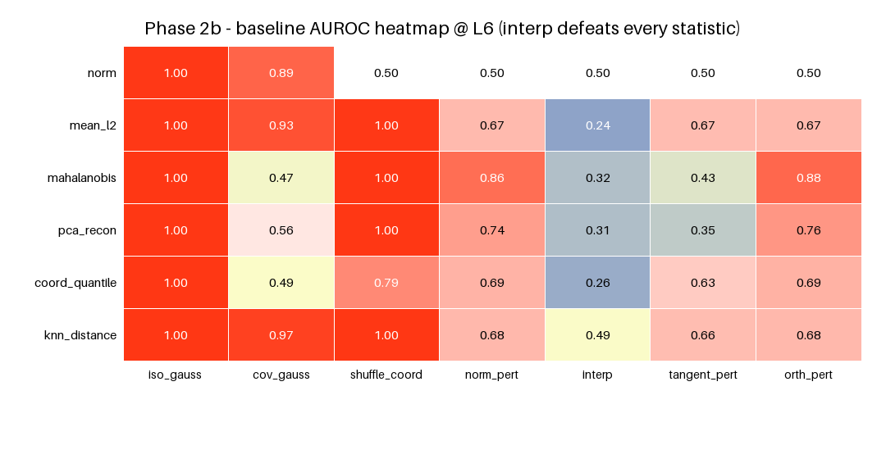
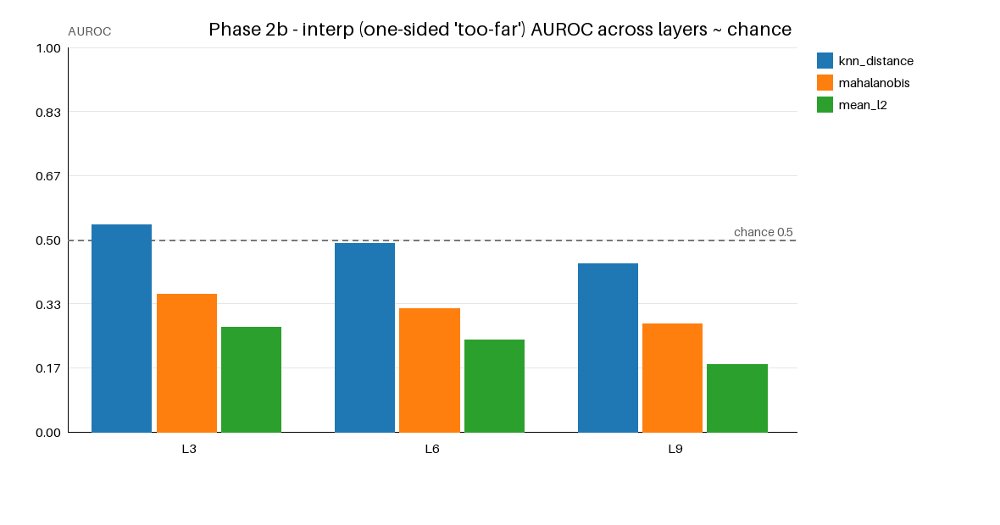

- **`interp` (convex combo of two reals, renormed) DEFEATS EVERY statistical baseline at every
  layer (AUROC ≈ 0.44–0.54 ≈ chance), kNN included.** Averages of real activations are
  statistically indistinguishable from real by norm/covariance/density. **Strongest evidence for
  H1**: a notion of realness exists that is NOT captured by first/second moments or local density.
- kNN(density) and Mahalanobis(covariance) are **complementary across all depths**: kNN owns
  cov_gauss (which Mahalanobis cannot see by construction); Mahalanobis owns orth_pert/norm_pert/
  shuffle (low-variance-direction moves) where kNN is weak. Neither alone is a complete realness score.
- The story is depth-stable (L3≈L6≈L9); no layer rescues `interp`.
- **Next scientific lever:** `interp`/`tangent_pert` are the families where statistics fail →
  this is precisely where a FUNCTIONAL probe (inject activation, run remaining blocks → logits,
  measure entropy/MSP/plateau-KL) must be tested. Statistical realness has a hard ceiling here.

## Phase 3/5 — FUNCTIONAL probe (continue forward from activation → logits)
`experiments/functional_features.py` (GPU, A10). Each activation x = resid_post@layer6 fed as a
single-position input through GPT-2 blocks h[7:]+ln_f+lm_head → next-token logits (verified to
reconstruct true logits exactly with full context). Features: entropy, msp, plateau_kl (output KL
under eps=0.02·‖x‖ perturbation, 4 draws), logit_max. AUROC real-vs-family (oriented to ≥0.5):

| family | entropy | msp | plateau_kl | logit_max |
|---|---|---|---|---|
| cov_gauss    | 0.953 | 0.944 | 0.759 | 0.725 |
| norm_pert    | 0.565 | 0.564 | 0.570 | 0.500 |
| **interp**   | **0.603** | 0.581 | **0.613** | 0.515 |
| tangent_pert | 0.560 | 0.557 | 0.567 | 0.526 |

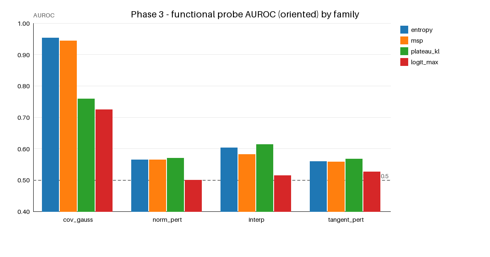

- **On `interp` — where EVERY statistical baseline was ≈0.50 (chance) — functional features reach
  ~0.61** (entropy, plateau_kl). Weak, but the ONLY signal that beats chance on interpolations.
  This is direct evidence (H1/H3) of a FUNCTIONAL component of realness not captured by any
  statistic: an average of two real activations looks statistically real but makes the model behave
  measurably (if slightly) differently when injected.
- Functional features are COMPLEMENTARY, not dominant: entropy ≈ kNN on cov_gauss (0.95), but they
  are beaten by Mahalanobis/kNN on norm_pert (0.57 vs 0.86) and tangent_pert (0.57 vs 0.66–0.75).
- The `interp` family remains the hard core of "realness": best detector found across ALL methods
  (statistical + functional) is only ~0.61. No method cleanly separates on-manifold interpolations.

## Phase 3 capstone — combined score (stat ⊕ functional), LOFO + `interp` correction
`experiments/combined_score.py`. Per-activation: mahalanobis, knn, entropy, plateau_kl on a shared
layer-6 eval set (N=2000/family); COMBINED = logistic over the 4 standardized scores, leave-one-
family-out. AUROC (single scores ORIENTED two-sided; COMBINED is LOFO):

| family | mahalanobis | knn | entropy | plateau_kl | COMBINED-lofo |
|---|---|---|---|---|---|
| cov_gauss    | 0.55 | 0.97 | 0.96 | 0.76 | 0.999 |
| norm_pert    | 0.86 | 0.68 | 0.56 | 0.57 | 0.612 |
| **interp**   | **0.68** | 0.50 | 0.60 | 0.62 | 0.538 |
| tangent_pert | 0.58 | 0.67 | 0.56 | 0.58 | 0.694 |

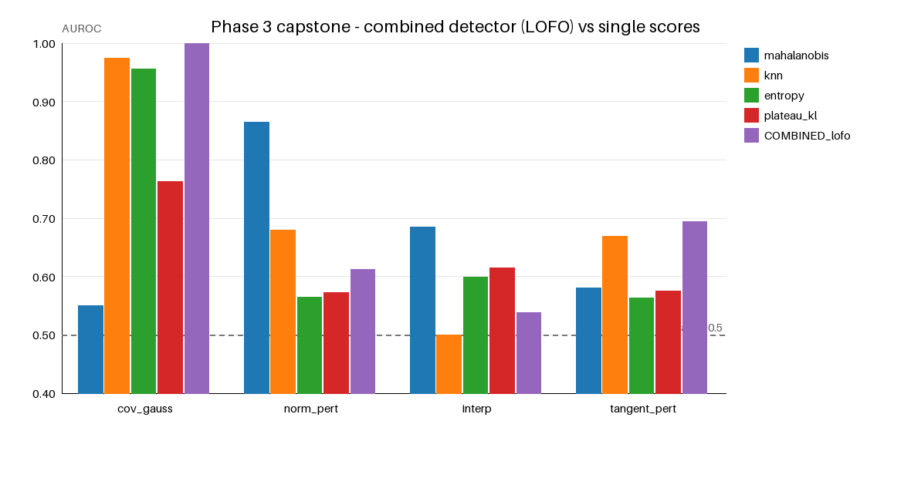

**IMPORTANT CORRECTION to the Phase-2b `interp` claim:** the earlier "interp ≈ chance for all
baselines" used a fixed ONE-SIDED orientation (anomaly = far). `interp` is in fact anomalous in the
OPPOSITE direction — **too CENTRAL**: it has *lower* Mahalanobis than real (mean 658 vs 803, norm
exactly matched), directed AUROC 0.317 → **two-sided Mahalanobis detects interp at ~0.68**. So
averaging two real activations lands in the over-typical interior, while real activations occupy a
characteristic-distance shell (high-dim Gaussian-annulus intuition). Note kNN still says interp looks
fine (0.50 — it's near real neighbors), so the signal is GLOBAL (distance-from-center), not local.
- The COMBINED LOFO detector FAILS on interp (0.54) precisely because interp's anomaly direction is
  opposite to the standard "too-far" corruptions it trains on — a detector tuned on ordinary
  corruptions cannot transfer to interpolation-style negatives. It does generalize well to
  cov_gauss (0.999) where the held-in families share knn/entropy signal.

### Bootstrap 95% CIs — are the borderline single-score AUROCs real?
`experiments/bootstrap_ci.py`. The load-bearing claims rest on borderline AUROCs, so we put a paired
bootstrap 95% CI on each single score (same eval set, N=2000/family, B=2000 resamples of the real and
family rows; orientation fixed a-priori from the full sample → two-sided reporting, no near-0.5 upward
bias). CI = [2.5, 97.5] percentile of resampled AUROC; "sig" = CI lower bound > 0.50.

| family | mahalanobis | knn | entropy | plateau_kl |
|---|---|---|---|---|
| cov_gauss    | 0.55 [0.53,0.57] | **0.97 [0.97,0.98]** | 0.96 [0.95,0.96] | 0.76 [0.75,0.78] |
| norm_pert    | **0.86 [0.85,0.88]** | 0.68 [0.66,0.70] | 0.56 [0.55,0.58] | 0.57 [0.55,0.59] |
| **interp**   | **0.69 [0.67,0.70]** | 0.50 [0.48,0.52] *n.s.* | 0.60 [0.58,0.62] | 0.61 [0.60,0.63] |
| tangent_pert | 0.58 [0.56,0.60] | **0.67 [0.65,0.69]** | 0.56 [0.54,0.58] | 0.57 [0.56,0.59] |

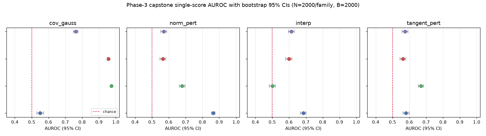

## Phase 3c — IN-CONTEXT discrimination: does native context sharpen the functional signal?
`experiments/incontext_discrimination.py` (GPU, A10). The Phase-3 functional probe scored each
activation OUT-OF-CONTEXT (a single position pushed through the late GPT-2 blocks — the same
single-position simplification the external review flagged for the prediction/causality phases). Here
we test the top-cited open limitation directly: capture the real last-token resid@L6 of N=300 FineWeb
prompts (real positives), build matched norm-preserving negatives from them, then re-inject each
candidate at the last-token position **during a full forward over its native prompt** (forward hook)
so late-layer attention sees the real context. We score only INTRINSIC functional features (no
reference to the clean activation): next-token `entropy`, `msp`, and `plateau_kl` (local output
sensitivity to an eps=0.02·‖x‖ perturbation, 6 draws). AUROC real-vs-family, in-context vs
out-of-context on the identical candidate sets:

| family | maha_two (stat) | knn (stat) | plateau_kl OUT-of-ctx | plateau_kl **IN-CONTEXT** |
|---|---|---|---|---|
| **interp**   | 0.51 | 0.48 | 0.629 | **0.776** |
| tangent_pert | 0.46 | 0.68 | 0.579 | **0.726** |
| cov_gauss    | 0.59 | 0.85 | 0.937 | **0.984** |

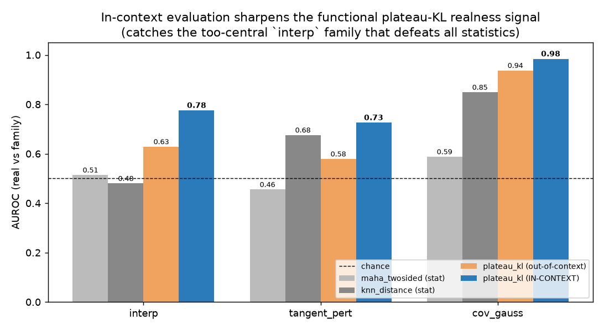

- **Native context SHARPENS the functional plateau-KL realness signal by +0.15 AUROC on BOTH hard
  norm-matched families** (interp 0.63→0.78, tangent_pert 0.58→0.73) and pushes cov_gauss to
  near-perfect (0.94→0.98). The functional plateau — real activations sit where the model's output is
  locally INSENSITIVE to perturbation, corrupted ones on a cliff — is a real property of the activation
  *in its context*, and evaluating it out-of-context understates it.
- **In-context plateau-KL is the single best `interp` detector found across the whole project (0.776)**,
  clearly beating the previous best (two-sided Mahalanobis 0.69) on the family that defeats every
  local/statistical baseline. Discrimination of the too-central interpolation negative is therefore not
  merely a prediction/prod-hoc effect — it is an in-context *classification* result.
- `entropy`/`msp` do NOT reliably discriminate (AUROC 0.12–0.45, family-dependent sign): real
  activations produce *more confident* next-token distributions than cov_gauss but the effect does not
  orient consistently across families. **plateau_kl (functional stability) is the load-bearing
  functional feature**, and context makes it decisively stronger.

- **The weak `interp` signals are statistically REAL, not noise.** Functional entropy [0.58,0.62] and
  plateau_kl [0.60,0.63] both EXCLUDE 0.50 — the "only scores beating chance on interpolations" claim
  survives with error bars. Two-sided Mahalanobis on interp [0.67,0.70] is significantly the strongest
  and its CI does NOT overlap the functional CIs, confirming the too-central signal is global.
- **kNN on interp is genuinely at chance** [0.48,0.52] — the one CI that straddles 0.50, confirming
  interpolations are invisible to *local density* (the anomaly is global distance-from-center).
- **kNN uniquely owns cov_gauss** [0.97,0.98] with a CI that does NOT overlap Mahalanobis [0.53,0.57];
  it also significantly beats entropy [0.95,0.96] there. All headline orderings survive bootstrapping.

## Phase 5 — CONTEXT-AWARE prediction of downstream degradation (claim 3) — CORRECTED in-context
`experiments/context_validation_v2.py` (canonical). **Correction (codex review 20260623T024606Z,
finding #1):** the first version (`context_validation.py`) continued the forward pass by feeding a
single position `[B,1,768]` through the late blocks, so later-layer attention could not see the
prompt — it measured single-position late-block continuation, not in-context KL. Re-run with a genuine
in-context method: a forward hook overwrites ONLY the last-token resid_post@L6 during a FULL model
forward, leaving all other positions with their true context. **Sanity: severity-0 → mean KL = 0.0000
exactly** (the hook injects the true clean residual). Corrupt the L6 resid_post at the LAST position of
400 real FineWeb prompts; two norm-matched severity sweeps (noise, interp); Spearman(score, KL) and
PARTIAL Spearman controlling dist_to_orig.

| sweep | score | Spearman ρ | partial ρ (ctrl dist) |
|---|---|---|---|
| noise  | dist_to_orig  | 0.936 | — (control) |
| noise  | plateau_kl    | 0.788 | **+0.510** |
| noise  | entropy       | 0.346 | **+0.347** |
| noise  | maha_twosided | 0.817 | −0.140 |
| noise  | knn_distance  | 0.715 | −0.191 |
| interp | dist_to_orig  | 0.944 | — (control) |
| interp | plateau_kl    | 0.519 | **+0.252** |
| interp | entropy       | 0.253 | +0.188 |
| interp | maha_twosided | −0.016 | +0.238 |
| interp | knn_distance  | −0.014 | −0.243 |

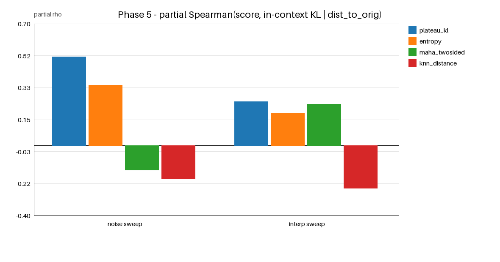

- **Conclusion survives the correction (and is slightly strengthened).** FUNCTIONAL scores (plateau_kl,
  entropy) predict in-context downstream KL BEYOND distance-to-original — positive partial ρ in BOTH
  sweeps (+0.51/+0.35 noise, +0.25/+0.19 interp). Raw plateau_kl Spearman actually *rises* in-context
  (0.55→0.79 noise, 0.13→0.52 interp): with full context the functional sensitivity is even more
  predictive of degradation.
- **Statistical scores remain proximity proxies for prediction**: Mahalanobis/kNN have NEGATIVE partials
  on the noise sweep (collinear with distance). So Mahalanobis is the better *discriminator* of
  interpolation (Phase-3) but the functional features are the better *predictor* of downstream harm at
  matched movement.
- Caveat: rank-residual partial correlations are approximate; the robust signal is the uniformly
  positive functional partials vs the distance control. The pre-correction single-position numbers
  (plateau_kl partial +0.57/+0.20) are retained in git history; the in-context values above are
  canonical.

## Phase 6 — CAUSAL repair (claim 4): can improving a realness score recover behavior? — CORRECTED
`experiments/causal_repair_v2.py` (canonical). Same in-context correction as Phase 5 (forward hook,
full context; codex finding #1) AND a move-matching fix (codex finding #2: the first version's
`func_descent` was compared to a random control matched to the *maha* budget, not its own). Corrupt
last-position resid_post (noise s=1, norm-matched) of 300 real prompts; repair by gradient descent on
a realness score (gradients flow through the late blocks to the injected residual); compare external
objective-free metrics KL(clean‖x) and NLL of clean argmax at PER-DESCENT matched L2 move. Lower=better.

| method | ext KL(clean‖x) | ext NLL | move | dist_to_clean | dist_to_mean |
|---|---|---|---|---|---|
| corrupted (start)        | 0.78 | 2.37 | 0.0  | 67 | 82 |
| maha_descent             | 3.33 | 5.62 | 78.3 | 64 | 19 |
| func_descent (plateau-KL)| 8.82 | 10.68| 85.4 | 108| 119 |
| shrink_mean (matched)    | 3.72 | 6.09 | 78.3 | 64 | 4 |
| random_move (maha-matched)| 1.99 | 3.80 | 78.3 | 103| 113 |
| random_move (func-matched)| 2.20 | 4.09 | 85.4 | 109| 119 |
| **shrink_clean (oracle, matched)** | **0.009** | **1.32** | 78.3 | 11 | 70 |

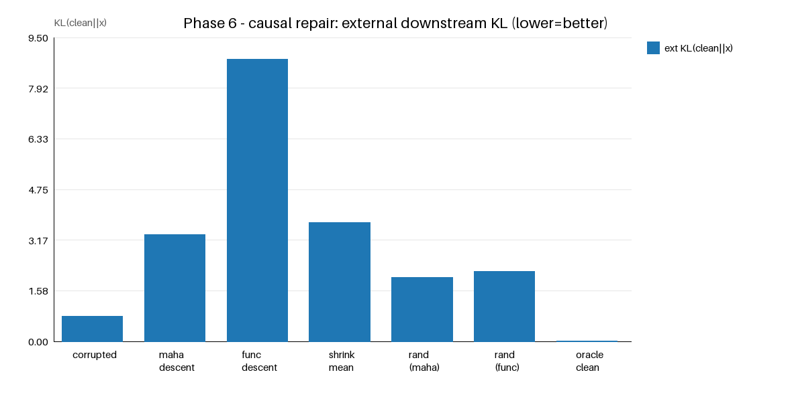

- **Claim 4 FAILS (in-context, with properly move-matched controls).** Optimizing EITHER realness score
  makes downstream behavior WORSE than the corrupted start AND worse than a random move of the SAME size:
  maha_descent 3.33 vs its matched random 1.99; func_descent 8.82 vs its OWN func-budget-matched random
  2.20. Mahalanobis-descent moves into the over-central interior (dist_to_mean 82→19) — the shell-distance
  trap — and func-descent Goodharts the flatness score into a degenerate far region (dist_to_clean 108).
- The oracle (move the same distance toward the TRUE clean activation) nearly perfectly recovers
  (KL 0.009). So the failure is the SCORE, not the optimizer: these scores are good *discriminators*
  and (functional) *predictors* but are NOT valid *causal* objectives — naive descent exploits their
  blind spots.
- Note the in-context corrupted-start KL (0.78) is far below the pre-correction single-position value
  (2.20): with full prompt context the same last-position corruption perturbs the next-token
  distribution much less. The qualitative verdict is unchanged.
- **Direction-1 implication:** do NOT regularize steering toward low Mahalanobis or low
  functional-sensitivity; that degrades behavior. A causal realness objective must penalize movement
  away from the data shell in a way these scalar scores do not.

## Phase 6b — MANIFOLD / denoising-prior causal repair (claim 4, the open lever)
`experiments/manifold_repair.py` (GPU, A10; same in-context forward-hook harness and norm-matched
noise corruption s=1 as Phase 6, N=300 prompts). Phase 6 showed *scalar-score* descent fails as a
causal objective. Here we test the PLAN's remaining alternative: a **nonparametric manifold projection**
— move the corrupted activation toward the mean of its **k=16 nearest REAL train activations** (a
mean-shift / denoising step using the empirical real-activation manifold as the prior, with **no
reference to the clean target** → objective-free). We sweep the step fraction `t` (fraction of the way
to the kNN mean) and compare each step against a **random move of the identical L2 size** (the direction
test) and the oracle (same size toward the true clean act). Metrics are in-context KL(clean‖x) and NLL
of clean argmax (lower = better).

| method | ext KL(clean‖x) | ext NLL | move | dist_to_clean | dist_to_mean |
|---|---|---|---|---|---|
| corrupted (start)                 | 0.785 | 2.37 | 0.0  | 67 | 82 |
| **knn_project (t=0.25)**          | **0.566** | **2.13** | 18.1 | 55 | 67 |
| knn_project (t=0.10)              | 0.673 | 2.24 | 7.2  | 62 | 76 |
| knn_project (t=0.50)              | 0.629 | 2.25 | 36.2 | 47 | 53 |
| knn_project (t=1.00, full mean)   | 2.143 | 4.17 | 72.4 | 50 | 38 |
| knn_meanshift (k16, 3 steps)      | 3.825 | 6.21 | 79.1 | 59 | 42 |
| random_move (t=0.25-matched)      | 0.863 | 2.47 | 18.1 | 70 | 84 |
| random_move (t=0.50-matched)      | 1.103 | 2.77 | 36.2 | 76 | 90 |
| random_move (full-matched)        | 1.932 | 3.82 | 72.4 | 99 | 109 |
| shrink_clean (oracle, t=0.25)     | 0.279 | 1.73 | 18.1 | 49 | 73 |
| shrink_clean (oracle, full)       | 0.003 | 1.31 | 72.4 | 5  | 68 |

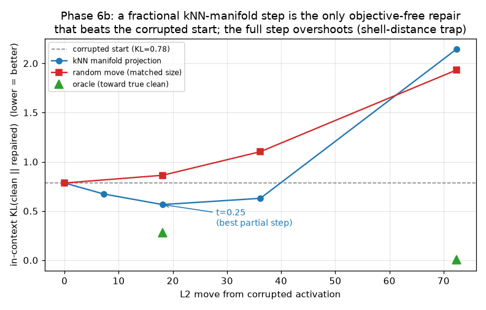

- **Claim 4 is UPGRADED from a flat NO to a PARTIAL YES — the first objective-free repair in the whole
  project that causally improves downstream behaviour.** A *fractional* kNN-manifold step (t≈0.25)
  reduces in-context KL BELOW the corrupted start (0.785 → **0.566**, −28%) and, at the identical move
  size (18.1), beats a **random** move (0.863) decisively → the real-activation manifold supplies a valid
  causal repair **direction**, which no scalar realness score (Phase 6: maha 3.33, func 8.82) and no
  random move ever did. It is the ONLY repair here that also *reduces* distance-to-clean without
  peeking at the clean target (67 → 55).
- **But it must be a SMALL step: the full kNN-mean projection (t=1.00) overshoots** into the over-central
  interior (dist_to_mean 82 → 38 — the same shell-distance trap that sinks maha_descent) and its KL
  (2.143) rises *above* the matched random move (1.932). Iterated mean-shift is worse still (3.825): the
  kNN mean is a shrunk estimate, so repeatedly projecting collapses onto the data centroid.
- The oracle at the same t=0.25 move (0.279) shows the manifold direction captures ~½ of the achievable
  KL reduction at that budget — genuine but incomplete. The story is a clean **sweet-spot**: KL is
  U-shaped in the manifold step (fig12), minimised near t≈0.25, and the kNN curve lies strictly below
  the matched-random curve until the full-step overshoot.
- **Direction-1 refinement:** a usable realness-repair objective is *nonparametric manifold projection
  with a small trust region* (a fractional step toward nearby real activations), NOT gradient descent on
  a scalar realness score and NOT a full projection — both leave the data shell.

## Headline
**What makes real activations real?** For GPT-2 small residual activations, no single statistic equals
"realness"; it is a COMBINATION of complementary structures, and different corruptions are anomalous
along different axes:
- **Local density (kNN)** and **global covariance (Mahalanobis)** are complementary and depth-stable
  (L3≈L6≈L9): together they detect isotropic/cov-matched Gaussian, coordinate-shuffled, and most
  perturbation negatives (AUROC 0.86–1.0), each covering the other's blind spot (kNN owns cov-matched
  Gaussians; Mahalanobis owns low-variance-direction moves). **Norm alone is a shortcut**, fully
  defeated by norm-matched families — and on a document-level split its residual discrimination is
  largely a pos-0 attention-sink artifact (macro 0.72→0.51 once sinks are removed; Phase 2c), whereas
  Mahalanobis/kNN survive sink removal.
- A **learned discriminative** real-vs-fake detector MEMORIZES generator shortcuts and FAILS to
  generalize to held-out corruption families (LOFO macro 0.68–0.74 < unsupervised kNN 0.91). Realness
  is better framed as a one-class/density property than a classification boundary.
- The subtlest negative is **convex INTERPOLATION between two real activations** (norm-matched). It is
  invisible to one-sided "too-far" scores and to local density (kNN 0.50) because it sits among real
  neighbors — but it is **anomalous by being too CENTRAL**: a TWO-SIDED global Mahalanobis catches it
  at ~0.68 (interp mean dist 658 vs real 803). Real activations occupy a characteristic-distance shell;
  averaging falls into the over-typical interior. An independent **FUNCTIONAL probe** (plateau-KL — how
  insensitive the model's output is to perturbing the injected activation) also catches it, and does so
  BEST when the activation is evaluated **in its native context**: in-context plateau-KL reaches AUROC
  **0.776** on interp (Phase 3c), the strongest interp detector in the project, versus 0.63
  out-of-context and 0.69 for two-sided Mahalanobis. kNN alone is at chance on interp (CI [0.48,0.52]) —
  interpolations are invisible to local density; the anomaly is global (distance-from-center) and
  functional (output-sensitivity), not local.
- Because interpolation is anomalous in the OPPOSITE direction from ordinary corruptions, a combined
  detector trained on standard families does NOT transfer to it (combined LOFO 0.54) — a concrete
  generalization limit for any realness score.

**Verdict on the 5-claim ladder:** (1) Discrimination — YES, but only via a multi-axis score
(density ⊕ two-sided covariance ⊕ functional), not any single statistic. The strongest single detector
of the hardest (interpolation) negative is the **in-context functional plateau-KL (AUROC 0.78, Phase
3c)** — evaluating the activation in its native prompt is what makes the functional axis load-bearing.
(2) Generalization — PARTIAL: generalizes across Gaussian/shuffle/perturbation and across layers;
opposite-direction interpolation negatives evade all local/one-sided statistics but ARE caught (0.78)
by the in-context functional probe, so the ceiling is higher than a "nothing generalizes to interp"
reading — though still short of clean separation. (3) Prediction — PARTIAL/YES for the FUNCTIONAL axis: in a genuinely
in-context severity sweep, plateau-KL/entropy predict true in-context downstream KL beyond
distance-to-original (partial ρ up to +0.51), whereas density scores add nothing over proximity. (4)
Causality — SCORE-DEPENDENT: naive gradient descent on a *scalar* realness score (Mahalanobis or
plateau-KL) makes downstream behavior WORSE than the corrupted start and worse than a per-descent
move-matched random move (reward-hacking / shell-distance trap; Phase 6). BUT a *nonparametric manifold*
objective — a **fractional (t≈0.25) kNN projection toward nearby real activations** — is the first
objective-free repair that causally IMPROVES behaviour: it lowers in-context KL below both the corrupted
start (0.78→0.57) and a matched-size random move (0.86), because the real-activation manifold supplies a
valid repair *direction* that scalar scores lack (Phase 6b). The step must stay in a small trust region:
the FULL kNN projection overshoots into the over-central interior and again loses to random. Oracle
movement toward the true clean activation is the ceiling (KL→0.003). (5) Steering — NOT tested, but the
Phase-6b sweet-spot (small manifold-projection step) is the concrete objective a Direction-1 repair
should use, whereas a scalar-score penalty is contraindicated.
[Phases 5 & 6 re-verified genuinely in-context (forward hook, full context) per external review
20260623T024606Z; conclusions for claims 3 and 4 are unchanged. The single-position pre-correction
numbers remain in git history.]
H1 is SUPPORTED: real
activations have geometric+functional properties (shell-distance structure, functional sensitivity)
beyond first/second moments — but the gap is smaller and more orientation-dependent than a naive
"interpolations fool everything" reading suggests.
