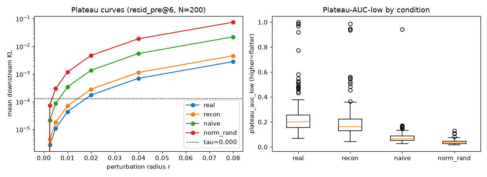
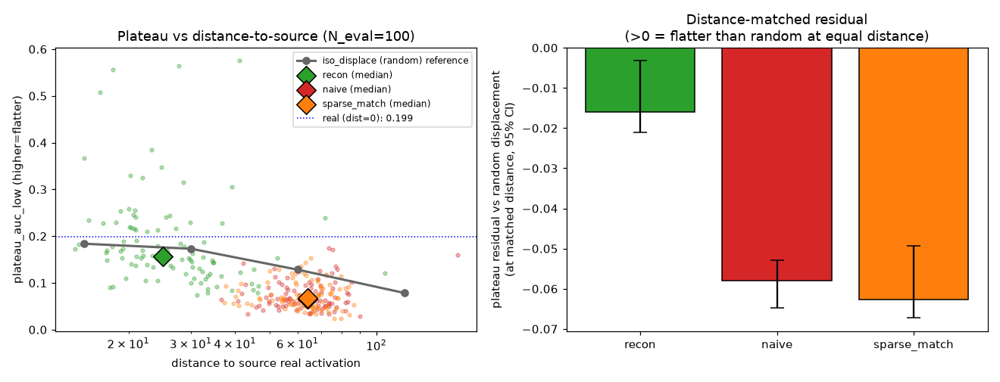
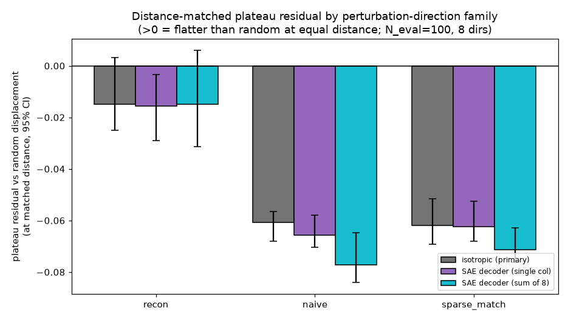
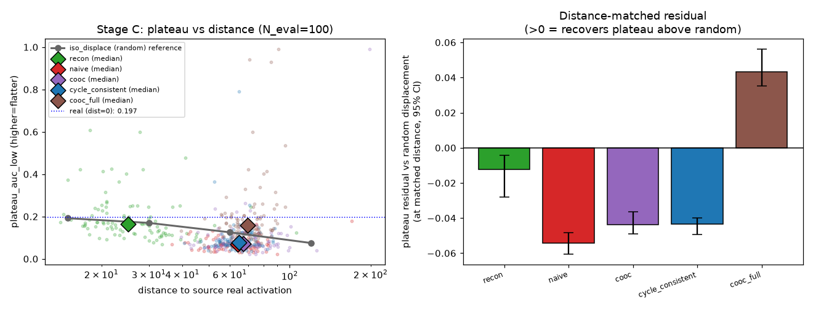
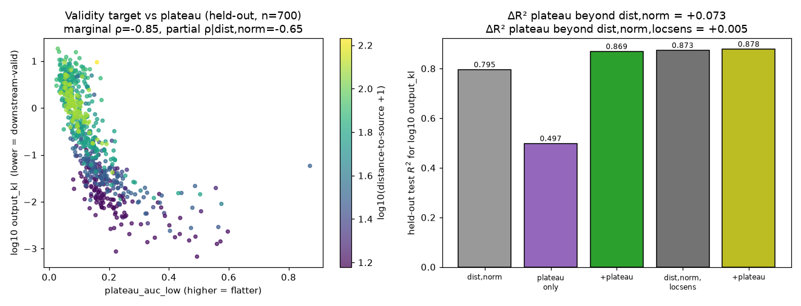
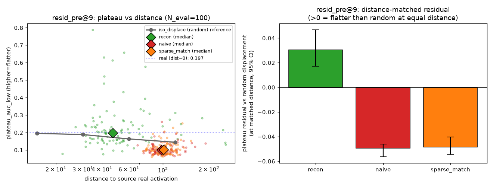

# Plateau-ness as a test for SAE activation validity — Direction 8 report

## Summary

We ask whether **"plateau-ness"** — the local flatness of a model's downstream response to
small perturbations of a residual-stream activation — is a useful *independent* diagnostic of
**SAE activation validity**: i.e., whether a sparse-autoencoder reconstruction or composed
SAE-latent code is a "downstream-valid" activation, beyond what trivial baselines already say.

Across a GPT-2-small / resid_pre@6 / public-SAE pipeline we find a clean **null with a named
cause**:

1. **(H1, reproduced)** Real activations and SAE reconstructions have wider downstream-response
   plateaus than naive independent SAE-latent compositions, and this is **not** a norm artifact.
2. **(H2, negative)** The gap **does not survive matching on distance-to-source**. At equal
   distance from a real activation, no SAE-decoded condition is flatter than a *random*
   displacement; reconstructions sit *on* the random-displacement curve and naive compositions
   sit *below* it. Sparsity/coefficient matching does not help.
3. **(H3, negative)** *Improved* synthetic codes do not recover plateau either: co-occurrence-aware
   supports and encode–decode cycle-consistent codes both stay **below** the random-displacement
   reference at matched distance. Only a genuine real-derived code plateaus *above* it — the missing
   ingredient is real-activation manifold membership, not better latent-code statistics.
4. **(H4, negative once controlled)** Plateau predicts an independent downstream-validity target
   (output-KL) beyond distance+norm — **but this predictive value is entirely local
   sensitivity.** A single fixed-radius KL captures it; plateau's plateau-*shape* adds nothing.

**Conclusion:** in this setup plateau-ness is a **closeness-to-real proxy plus a local-robustness
measure**, *not* an SAE interpretability-validity diagnostic. Of the candidate notions
(provenance detection, OOD detection, downstream-invalidity detection, mere local robustness),
the evidence says **mere local robustness** (+ distance-to-real). This agrees with Direction 9
(plateau-as-OOD weak) and Direction 6 (plateau predicts downstream KL but only as local
sensitivity).

## Methods

### Data & Model

- **Model:** GPT-2 small (124M), HuggingFace `gpt2`, eval mode, full in-context forward passes.
- **Hook / layer:** `blocks.6.hook_resid_pre` (= output of transformer block 5), **last
  non-padding token**. All candidate activations are injected at this point via a forward hook
  that overwrites only the last-token residual; the rest of the prompt is the true context.
- **SAE:** `jbloom/GPT2-Small-SAEs-Reformatted`, file `blocks.6.hook_resid_pre`
  ($d_\text{in}=768$, $d_\text{sae}=24576$). Encoder convention chosen empirically by
  reconstruction error (mean $\lVert \hat{x}-x\rVert$ = 27.7 with `b_dec` subtracted before
  encoding vs 380.8 without ⇒ `apply_b_dec_to_input=True`):
  $z=\mathrm{ReLU}\big((x-b_\text{dec})W_\text{enc}+b_\text{enc}\big)$ and
  $\hat{x}=zW_\text{dec}+b_\text{dec}$.
- **Data:** FineWeb text cache (`../dir3_manifold/data/fineweb_texts.json`), sequence length 64,
  prompts with $\ge 16$ real tokens. **N = 200** source prompts (Stages A/B/D). Stage B/D score
  on a **held-out half** (sources $\ge N/2$).
- **Compute hygiene:** shared A10, `set_per_process_memory_fraction(0.225)`,
  `torch.set_num_threads(2)`, batch 32, no torch/CUDA changes.

### Perturbation path and the primary plateau metric

For an activation $x$ and a unit direction $d$ ($\lVert d\rVert_2=1$) we perturb along a
norm-relative radius $r$:

```math
x(r) = x + r\,\lVert x\rVert_2\, d .
```

The **downstream response** is the last-token next-token KL between the unperturbed and
perturbed candidate, both placed in the same prompt context:

```math
\mathrm{KL}(r) = \mathrm{KL}\big(p_{x}\;\Vert\;p_{x(r)}\big)
=\sum_{v} p_{x}(v)\,\log\frac{p_{x}(v)}{p_{x(r)}(v)} .
```

To handle non-monotone curves we take the cumulative max
$\mathrm{KL}_{\uparrow}(r)=\max_{r'\le r}\mathrm{KL}(r')$. The **primary metric**, normalized
low-response plateau area (higher = wider low-response plateau), is

```math
\texttt{plateau\_auc\_low}
= \frac{1}{r_{\max}}\,\mathbb{E}_{d}\!\int_{0}^{r_{\max}}
\mathrm{clip}\!\Big(1-\tfrac{\mathrm{KL}_{\uparrow,d}(r)}{\tau},\,0,\,1\Big)\,dr ,
```

evaluated on the radius grid $r\in\lbrace 0,.0025,.005,.01,.02,.04,.08\rbrace$, averaged over directions
**within** an activation (directions/radii are repeated measures, not independent samples).

- **Direction family (primary):** isotropic Gaussian directions normalized to unit $\ell_2$
  (model-agnostic, available for every condition). Robustness to this choice is tested in
  **Stage B-dir** with single-column and sparse-sum SAE-decoder directions.
- **Threshold $\tau$:** $\tau=\mathrm{median}_\text{real}\thinspace\mathrm{KL}(r{=}0.02)$, calibrated on
  a **held-out real split** (sources $<N/2$) so $\tau$ never sees the scored activations
  ($\tau_\text{held-out}=1.33\times10^{-4}$).

### Conditions (paired by source prompt)

| condition | construction |
|---|---|
| **real** | captured real resid_pre@6 last-token activation |
| **recon** | $\hat{x}=\mathrm{decode}(\mathrm{encode}(x))$ |
| **naive** | independent latent composition: $k\sim$ empirical $L_0$, indices $\sim$ feature frequency, coefficients $\sim$ empirical active-coefficient marginal, then decoded |
| **sparse_match** | naive but $k=$ source's own $L_0$ and coefficients rescaled to the source's active-coefficient RMS |
| **norm_rand** | random direction rescaled to the real norm |
| **iso_displace** ($\texttt{iso}\delta$) | $x_\text{real}+\delta\thinspace d$, isotropic unit $d$, so distance $\equiv\delta$ exactly, at $\delta\in\lbrace 15,30,60,120\rbrace$ — a **random off-manifold displacement** reference |
| **cooc** (Stage C) | a *real* example's active feature **set** (support) + coefficients from the empirical marginal — isolates support co-occurrence over `naive` |
| **cycle_consistent** (Stage C) | naive candidates **filtered** to $\lVert\mathrm{encode}(\mathrm{decode}(z))-z\rVert/\lVert z\rVert$ below the 75th percentile of real-code cycle error ($\tau_\text{cyc}=0.342$; pass rate 0.56%) |
| **cooc_full** (Stage C) | a genuine **real-derived** code (SAE reconstruction of *another* real example), paired to the source only for distance — positive control |

### Baselines

- **norm** $=\lVert x\rVert_2$.
- **distance-to-source** $=\lVert x_c-x_\text{real}\rVert_2$ (the dominant confound; pooled
  Spearman(plateau, distance) $=-0.64$).
- **iso_displace reference** $R(\delta)$ = median `plateau_auc_low` of the random-displacement
  family as a function of distance $\delta$; for a condition at distance $\Delta$ its
  **distance-matched residual** is $\rho_c = s_c - R(\Delta_c)$, where $s_c$ is the condition's own
  `plateau_auc_low` and $R$ is interpolated in $\log$-distance. $\rho_c>0$ ⇒ flatter than a random
  point at equal distance.
- **local sensitivity** $\texttt{locsens}=\log_{10}\big(\overline{\mathrm{KL}}(r{=}0.02)+10^{-8}\big)$,
  a *single* fixed-radius KL (the Direction-6 `plateau_kl`).

### Independent downstream-validity target (Stage D)

For a candidate $x_c$ paired to its source prompt, inject $x_c$ in full context and score

```math
\texttt{output\_kl}(x_c)=\mathrm{KL}\big(p_\text{real}\;\Vert\;p_{x_c}\big),
```

where $p_\text{real}$ is the next-token distribution with the **real** source activation in
context. **Low `output_kl` = downstream-valid.** Predictive evaluation pools 7 candidate
conditions $\times\thinspace N=200$ (1400 rows), **splits by source prompt** (no source across both
folds), standardizes features on train, fits plain linear least squares to $\log_{10}$
`output_kl`, and reports **held-out test $R^2$** and partial Spearman. The decisive comparison
is $\Delta R^2$ from adding plateau, both beyond $\lbrace$dist, norm$\rbrace$ and beyond
$\lbrace$dist, norm, locsens$\rbrace$.

### Statistics

Unit of analysis = source activation. Paired bootstrap over source prompts (3000 resamples) for
paired differences and distance-matched residuals; 95% CIs reported. One primary metric, one
primary direction family, one primary layer/SAE; everything else is secondary.

## Results

### Stage A — real / reconstruction vs naive synthetic (N=200, 8 directions)

| condition | `plateau_auc_low` (median) | norm | $L_0$ |
|---|---|---|---|
| real | **0.200** | 79.5 | 32.5 |
| recon | **0.162** | 68.4 | 32.5 |
| naive | 0.066 | 60.0 | 34.5 |
| norm_rand | 0.035 | 79.5 | 0 |

Paired gap vs real (median, 95% bootstrap CI): recon 0.017 [0.010, 0.024]; naive 0.122
[0.108, 0.138]; norm_rand 0.160 [0.148, 0.176]. Every CI excludes zero. **Not a norm artifact:**
norm_rand carries the *same* norm as real yet is flattest, and the lower-norm naive is flatter
than the higher-norm norm_rand; pooled Spearman(plateau, norm) $=+0.06$.



### Stage B — distance-to-source matched control (decisive H2 test)

Random-displacement reference (N_eval=100, 6 directions, held-out $\tau$):

| $\delta$ (distance) | 15 | 30 | 60 | 120 |
|---|---|---|---|---|
| iso_displace `plateau_auc_low` | 0.184 | 0.173 | 0.128 | 0.078 |

Plateau falls monotonically with distance for random displacement **alone** — distance
reproduces most of the Stage A ordering. Distance-matched residual $\rho_c$ (median, 95% CI):

| condition | median dist | plateau | ref @ dist | residual $\rho_c$ | 95% CI | verdict |
|---|---|---|---|---|---|---|
| recon | 25.1 | 0.157 | 0.176 | **−0.016** | [−0.021, −0.003] | ≈ on the random curve |
| naive | 64.0 | 0.065 | 0.124 | **−0.058** | [−0.065, −0.053] | **below** random |
| sparse_match | 64.1 | 0.068 | 0.124 | **−0.063** | [−0.067, −0.049] | **below** random |

**No SAE-decoded condition plateaus above the random-displacement reference at matched
distance.** recon's advantage is closeness-to-real; naive/sparse_match are *less* flat than a
random point at equal distance; sparsity/coefficient matching does not recover plateau.



### Stage B-dir — direction-family robustness of the below-random deficit

Stage B used isotropic perturbation directions. To rule out an isotropic artifact we recompute
the distance-matched residual $\rho_c$ under three perturbation-direction families in one run
(N=200, N_eval=100, 8 directions, held-out $\tau$ per family): **iso** (isotropic Gaussian unit
directions), **sae_single** (a single unit-normed SAE decoder column $W_\text{dec}[j]$, $j$ drawn
from real-active features by frequency), and **sae_sparse** (a normalized signed sum of 8 active
decoder columns). $\rho_c<0$ ⇒ **less** flat than a random displacement at equal distance.

| family | recon $\rho$ | naive $\rho$ | sparse_match $\rho$ |
|---|---|---|---|
| iso (primary) | −0.015 [−0.025, +0.003] | −0.061 [−0.068, −0.057] | −0.062 [−0.069, −0.052] |
| sae_single | −0.016 [−0.029, −0.003] | −0.066 [−0.071, −0.058] | −0.062 [−0.068, −0.052] |
| sae_sparse | −0.015 [−0.032, +0.006] | **−0.077** [−0.084, −0.065] | **−0.071** [−0.076, −0.063] |

The ordering is identical under every family: recon sits essentially *on* the random-displacement
curve, while **naive and sparse_match sit clearly below it**. No family reverses the finding; the
naive deficit is if anything *larger* along SAE decoder directions (sae_sparse −0.077 vs iso
−0.061) — the opposite of SAE-specific plateau validity. Pooled Spearman(plateau, distance)
$\in\lbrace-0.64,-0.60,-0.62\rbrace$ across families. **The Stage B null is direction-family robust, not an
isotropic artifact.**



### Stage C — do improved synthetic codes recover plateau? (H3)

Do *higher-order* synthetic codes climb above the random-displacement reference at matched
distance? We test **cooc** (real support + marginal coefficients), **cycle_consistent** (naive
candidates filtered to encode–decode self-consistency at the real-code-p75 cycle-error quantile),
and a **cooc_full** positive control (a genuine real-derived code at large distance). Same
distance-matched residual $\rho_c$ as Stage B; $\rho_c>0$ ⇒ flatter than random at equal distance.

| condition | median dist | plateau | ref @ dist | residual $\rho_c$ | 95% CI | verdict |
|---|---|---|---|---|---|---|
| recon (ref) | 25.1 | 0.164 | 0.176 | −0.012 | [−0.028, −0.004] | ≈ on random curve |
| naive (ref) | 64.0 | 0.068 | 0.121 | −0.054 | [−0.061, −0.048] | below random |
| **cooc** | 67.3 | 0.070 | 0.117 | **−0.044** | [−0.049, −0.036] | **below** random |
| **cycle_consistent** | 64.9 | 0.077 | 0.120 | **−0.043** | [−0.049, −0.040] | **below** random |
| **cooc_full** | 69.8 | 0.159 | 0.115 | **+0.043** | [+0.035, +0.056] | **above** random |

Neither improved construction recovers plateau: **cooc** and **cycle_consistent** stay clearly
below the random-displacement curve ($\approx-0.04$), only marginally above naive. Realistic support
co-occurrence and encode–decode self-consistency are **not** sufficient. The one condition that
plateaus *above* random is **cooc_full** — a genuine real-derived activation ($+0.043$, even at a
large distance from the paired source). So **H3 is negative for constructible codes**: the missing
ingredient is genuine real-activation manifold membership, which code-space constraints do not
synthesize (matching the a-priori H3 null: "may require higher-order model-computation
compatibility"). This is the positive control Stage B lacked — a real, downstream-valid activation
is flatter than a random displacement at any matched distance.



### Stage D — does plateau predict downstream validity beyond baselines? (project gate)

Held-out test $R^2$ for predicting $\log_{10}$ `output_kl`:

| model (features) | held-out $R^2$ | Spearman(pred, true) |
|---|---|---|
| baseline (dist, norm) | 0.795 | 0.874 |
| plateau only | 0.498 | 0.851 |
| + plateau (dist, norm, plateau) | **0.869** | 0.915 |
| baseline + locsens (dist, norm, locsens) | 0.873 | 0.924 |
| all (dist, norm, locsens, plateau) | **0.878** | 0.924 |

| added-value test | $\Delta R^2$ | partial Spearman (held-out) |
|---|---|---|
| plateau beyond {dist, norm} | **+0.073** | **−0.65** |
| plateau beyond {dist, norm, locsens} | **+0.005** | **−0.16** |

Marginal held-out Spearman vs $\log_{10}$ `output_kl`: plateau **−0.85**, locsens **+0.84**,
dist +0.75, norm −0.22.

- **Beyond distance+norm, plateau predicts downstream validity** (ΔR²=+0.073, partial ρ=−0.65):
  flatter candidates are more downstream-valid at matched distance/norm (replicating Direction 6).
- **But that value is entirely local sensitivity.** A single fixed-radius KL already captures it
  (marginal ρ=+0.84), and once it is in the model plateau adds **essentially nothing**
  (ΔR²=+0.005, partial ρ=−0.16). The plateau *shape* (AUC over radii) carries no
  downstream-validity information beyond one local-sensitivity number.



### Stage E — cross-layer generalization (resid_pre@9)

We rerun the decisive Stage B distance-matched test at a **later** layer,
`blocks.9.hook_resid_pre` (output of block 8), with its own matching jbloom SAE
($d_\text{sae}=24576$; `b_dec` subtracted, recon error 59.2 vs 904.6), identical logic
($\tau_\text{held-out}=2.36\times10^{-4}$, iso_displace reference, distance-matched residual, bootstrap
CIs); N=200, N_eval=100, 6 directions. The reference decays more gently with distance than at L6
(0.195 / 0.189 / 0.163 / 0.145 at $\delta=15/30/60/120$).

| condition | median dist | plateau | ref @ dist | residual $\rho_c$ | 95% CI | verdict |
|---|---|---|---|---|---|---|
| recon | 47.0 | 0.199 | 0.172 | **+0.030** | [+0.017, +0.047] | **above** random (survives dist-match) |
| naive | 97.8 | 0.100 | 0.150 | **−0.050** | [−0.056, −0.046] | **below** random |
| sparse_match | 100.9 | 0.103 | 0.149 | **−0.048** | [−0.055, −0.040] | **below** random |

Pooled Spearman(plateau, distance) $=-0.46$. **The synthetic-composition null generalizes:**
`naive` and `sparse_match` plateau clearly below the random-displacement reference at L9 too, so no
*constructed* SAE code beats a random point at equal distance and distance still dominates. The one
cross-layer change is that **`recon` now plateaus *above* the reference** (+0.030 vs −0.016 at L6):
a faithful reconstruction is a genuine real-derived activation and at this later layer earns
above-random plateau credit — sharpening the Stage C real-manifold-membership reading rather than
overturning the null.



## Conclusion

In this GPT-2-small resid_pre@6 / public-SAE setup, plateau-ness is **not** an independent
SAE interpretability-validity diagnostic. It decomposes into two ordinary quantities:

1. **closeness-to-real** — the apparent real/recon advantage over naive compositions vanishes
   under distance-to-source matching, and SAE-decoded points are never flatter than a random
   displacement at equal distance (Stage B);
2. **local robustness / sensitivity** — plateau's only held-out predictive value for the
   independent output-KL validity target is captured by a single fixed-radius KL; the plateau
   shape adds nothing beyond it (Stage D).

So among the four candidate notions — synthetic-provenance detection, off-distribution
detection, local downstream-invalidity detection, and mere local robustness — the evidence
identifies plateau-ness as **mere local robustness, plus distance-to-real**. This is a complete
null that names its cause and is consistent with the neighboring directions (D9: plateau-as-OOD
weak; D6: plateau predicts downstream KL but as local sensitivity, and is reward-hackable).

**Scope and caveats.** One primary metric (`plateau_auc_low`), one layer/SAE (resid_pre@6,
jbloom 24k). **Direction-family robustness is confirmed** (Stage B-dir): the naive/sparse
below-random deficit holds — slightly stronger — under single-column and sparse-sum SAE-decoder
perturbation directions, not just isotropic ones. **Improved synthetic constructions are tested
and do not overturn the null** (Stage C): co-occurrence-aware and cycle-consistent codes stay
below the random-displacement curve; only genuine real-derived codes exceed it, so the deficit is
not a marginal-code-statistics artifact but a real-manifold-membership one. **Cross-layer
generalization is confirmed** (Stage E, resid_pre@9): the synthetic-composition null holds at a
second layer (naive/sparse below random), with the one change being that a faithful SAE
reconstruction earns above-random plateau at the later layer (+0.030 vs ≈0 at L6) — a layer-
dependent *reconstruction* effect that sharpens, rather than overturns, the real-manifold-membership
reading. The project-level null thus holds across two layers under one primary metric.
