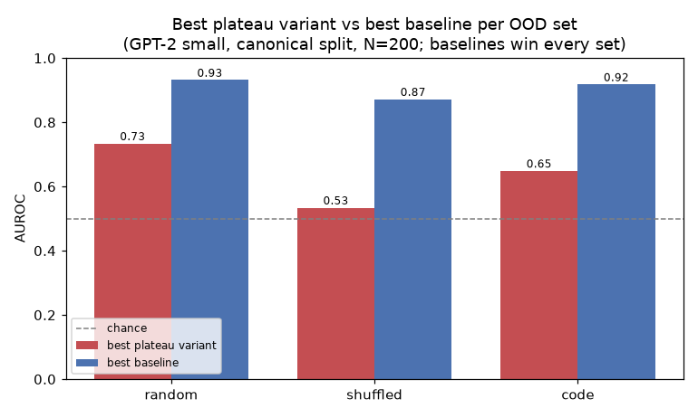

# REPORT — Direction #9: Plateau-ness as an OOD / Anomaly Detector

## Summary
**Question.** Can the *plateau-ness* of GPT-2's loss landscape — how flat the model's next-token
distribution is to local perturbations of an internal activation — act as an out-of-distribution (OOD)
detector? And does measuring it **inside** the residual stream beat the simpler **input-space** version?

**Answer — negative.** Measured honestly (Jacobian-Frobenius of the output distribution), plateau-ness
is a **weak** OOD detector and **loses to standard baselines on every OOD set tested**: it tops out at
AUROC ≈ 0.73 and is reversed in deep residual layers. Maximum-Softmax-Probability (MSP) wins synthetic
OOD, and Mahalanobis / cupbearer relative-Mahalanobis win the real domain shift where MSP collapses.
For the genuine plateau metric **input-space is best**, so there is **no value in measuring internally**.
A null result is complete and acceptable per PLAN.md.



**Figure — what each bar is.** For every OOD set the figure shows the single strongest *plateau
variant* (red) against the single strongest *baseline* (blue), each bar annotated with the exact
`method@measurement-point` it represents. Concretely: **random** — best plateau `plateau-jacFrob@input`
(0.73) vs best baseline `MSP` (0.93); **shuffled** — `plateau-perturbation@resid3` (0.53) vs `MSP`
(0.87); **code** — `plateau-jacFrob@input` (0.65) vs `cup-RMD@resid6` (0.92). "Plateau variants" are the
methods under test (`plateau-jacFrob`, `plateau-perturbation`); the `selfNLL-grad` confidence *control*
is excluded from the red bar. The baseline pool is {MSP, L2 norm, naive Mahalanobis, cup-RMD, cup-QUE}.
The blue bar wins in every set. (Regenerate with `experiments/make_summary_plot.py`, which derives the
best-per-set directly from `results/auroc_table.csv`.)

## Methods

### Data & Model
- **Model:** GPT-2 small (124M), run on GPU (NVIDIA A10, sm_86, CUDA 13.2). VRAM capped per BUDGET.md.
- **In-distribution (ID):** held-out FineWeb text (`data/fineweb_sample.txt`).
- **OOD sets (3):** `random` tokens (uniform over the vocab), `shuffled` tokens (ID tokens with order
  permuted — same unigram statistics, wrong order), and `code` (Python source read offline from
  numpy/torch site-packages — a *real* domain shift of valid text).
- **Measurement points (4):** token-embedding input space, and the residual stream `resid_post` after
  transformer blocks **{3, 6, 9}**. The last-token activation $h \in \mathbb{R}^{768}$ is used.
- **Sample sizes:** $N=200$ sequences per set, `seq_len=64`. Covariance baselines are fit on a separate
  **1000** ID sequences. The ID split is the **canonical split** (see below), saved to
  `results/split/canonical_split.npz` and shared byte-for-byte by the plateau table and the
  real-cupbearer table.

**What "canonical split" means.** The FineWeb ID pool is shuffled once with a fixed permutation
`randperm(seed=7)` and cut into two disjoint index sets: the first 1000 sequences (`fit = perm[:1000]`)
are the *reference* used to fit every ID statistic (the Gaussian $(\mu,\Sigma)$ for Mahalanobis, the
cupbearer detectors), and the next 200 (`test = perm[1000:1200]`) are the held-out *ID test* examples
scored against the OOD sets for AUROC. It is "canonical" because it is the **one fixed split every method
and every table uses** — the plateau/standard-baseline table, the vendored-cupbearer table, and the
real-cupbearer-package table all read these exact same indices. Fixing the seed makes the ID fit
reproducible; sharing the indices byte-for-byte makes every method-vs-method comparison strictly
apples-to-apples (same ID examples, same held-out set), which is what an earlier review required.

### Evaluation metric
All scores are oriented *a priori* so that **higher = more OOD** (no post-hoc sign flipping). Detection
quality is the area under the ROC curve, equal to the probability a random OOD example outscores a
random ID example:

```math
\mathrm{AUROC} = \Pr\big(s(x_{\text{OOD}}) > s(x_{\text{ID}})\big)
   = \frac{1}{N_{\text{ID}}N_{\text{OOD}}}\sum_{i}\sum_{j} \mathbb{1}\!\left[s(x^{\text{OOD}}_j) > s(x^{\text{ID}}_i)\right].
```

An $\mathrm{AUROC} < 0.5$ therefore means the signal is **reversed** for that set (ID scores higher than
OOD). With $N=200$, sampling noise on AUROC is $\approx \pm 0.035$; gaps below ~0.05 are not significant.

### Plateau scores (the methods under test)
Let $h$ be the activation at the measurement point and $p(\cdot\mid x)=\mathrm{softmax}(f(h))$ the
next-token distribution obtained by continuing the forward pass from $h$.

**plateau-jacFrob** (the genuine metric) — Frobenius norm of the Jacobian of the log-probabilities
w.r.t. $h$, via a Hutchinson estimator with $k=4$ random standard-Gaussian output directions $v_i$:

```math
s_{\text{jacFrob}}(x) \;=\; \Big\| \tfrac{\partial \log p(\cdot\mid x)}{\partial h} \Big\|_F
   \;\approx\; \sqrt{\tfrac{1}{k}\sum_{i=1}^{k}\Big\| \tfrac{\partial \langle v_i,\,\log p\rangle}{\partial h} \Big\|_2^2 }.
```

A label-free measure of output-distribution flatness: **flatter (lower) = in-distribution**.

**plateau-perturbation** — mean next-token KL divergence after $M=16$ random unit perturbations of
fixed magnitude $\epsilon=6$ applied at $h$:

```math
s_{\text{pert}}(x) \;=\; \frac{1}{M}\sum_{j=1}^{M} D_{\mathrm{KL}}\!\big(p(\cdot\mid h)\,\big\|\,p(\cdot\mid h+\epsilon u_j)\big),\qquad \|u_j\|_2=1.
```

Sharper response (higher KL) = more OOD.

**selfNLL-grad** (transparency control = iter-1's mislabeled "jacobian") — gradient norm of the
model's own argmax negative log-likelihood; kept to show it is confidence-adjacent:

```math
s_{\text{selfNLL}}(x) \;=\; \Big\| \tfrac{\partial\,[-\log p(\hat y\mid x)]}{\partial h} \Big\|_2,
   \qquad \hat y = \arg\max_y p(y\mid x).
```

### Baselines
**MSP** — one minus the maximum softmax probability:

```math
s_{\text{MSP}}(x) = 1 - \max_y p(y\mid x).
```

*Why it detects OOD:* a model trained on in-distribution text is, on average, **more confident** on
inputs like its training data — one next-token candidate takes most of the probability mass, so
$\max_y p$ is high and $s_{\text{MSP}}$ is low. On OOD inputs the model is more often uncertain, the
softmax is flatter, $\max_y p$ drops, and $s_{\text{MSP}}$ rises. So higher $s_{\text{MSP}}$ = more
OOD. This is the classic maximum-softmax-probability baseline (Hendrycks & Gimpel, 2017). Its failure
mode is exactly the `code` set: GPT-2 can be *confidently wrong* on a fluent but out-of-domain input,
which is why MSP collapses to 0.359 there while distance-based baselines still fire.

**L2 norm** — activation magnitude at the point: $s_{\text{L2}}(x) = \Vert h\Vert_2.$

**Mahalanobis** — squared distance to a Gaussian $(\mu,\Sigma)$ fit on 1000 ID activations:

```math
s_{\text{maha}}(x) = (h-\mu)^\top \Sigma^{-1} (h-\mu).
```

**cup-RMD** — cupbearer's relative Mahalanobis: the ID-class distance minus a background-class
distance $(\mu_0,\Sigma_0)$ fit on the pooled data, which cancels generic-norm effects:

```math
s_{\text{RMD}}(x) = (h-\mu)^\top \Sigma^{-1}(h-\mu) \;-\; (h-\mu_0)^\top \Sigma_0^{-1}(h-\mu_0).
```

**cup-QUE** — cupbearer's Quantum-Entropy / SPECTRE detector: a quadratic form on the ID-whitened
activation $\tilde h=\Sigma^{-1/2}(h-\mu)$ that up-weights directions of excess untrusted covariance
$\tilde\Sigma$,

```math
s_{\text{QUE}}(x) \;\propto\; \tilde h^\top\,\exp\!\big(\alpha(\tilde\Sigma - I)\big)\,\tilde h.
```

It is fit **once** on the ID set (used as both trusted and untrusted reference) and applied uniformly.

Baselines `cup-RMD` / `cup-QUE` are reported two ways: **vendored** (cupbearer's detector math copied
verbatim into `experiments/cupbearer_helpers.py`, in `auroc_table.csv`) and from the **real cupbearer
package** run in an isolated conda env `cupenv` (`auroc_cupbearer.csv`). On the canonical split the two
agree essentially exactly for RMD (code@resid6: 0.918 = 0.918); for QUE the real package is the
reference (see Limitations).

## Results
Full machine-readable numbers: `results/auroc_table.csv` (87 rows) and `results/auroc_cupbearer.csv`
(48 rows). ROC and score-distribution plots: `results/plots/`. The pivot table and per-set summary are
in **RESULTS.md**. Verdict per OOD set:

| OOD set | best plateau | best baseline | plateau beats baselines? |
|---|---|---|---|
| **random** | plateau-jacFrob@input **0.734** | MSP **0.932** (L2@input 0.859, maha@input 0.834) | **NO** |
| **shuffled** | plateau-perturbation@resid3 **0.534** | MSP **0.872** | **NO** (jacFrob reversed, 0.07–0.37) |
| **code** | plateau-jacFrob@input **0.649** | cup-RMD@resid6 **0.918** (maha@resid6 0.913, cup-QUE 0.910) | **NO** (MSP collapses to 0.359) |

- **The genuine plateau metric is weak.** `plateau-jacFrob` peaks at 0.734 (random@input) / 0.649
  (code@input) and is *reversed* on shuffled and in deep residual layers (ID is locally steeper than
  OOD there). `plateau-perturbation` is similarly weak (≤0.70).
- **iter-1's "strong jacobian" was a confidence signal in disguise.** The renamed `selfNLL-grad` scores
  random 0.923 ≈ MSP 0.932 and **collapses on code (≈0.52) just like MSP (0.359)** — it tracks model
  confidence, not plateau geometry.
- **Properly-powered baselines dominate.** MSP wins synthetic OOD. On the code domain shift MSP
  collapses, but cupbearer relative-Mahalanobis (cup-RMD@resid6 0.918) and well-fit naive Mahalanobis
  (0.913) are the strongest detectors in the study. With a 1000-sample fit, Mahalanobis does **not**
  collapse in deep layers.
- **Internal vs input-space:** for the genuine `plateau-jacFrob`, **input-space is best** and the
  residual stream is worse/reversed → **no value in measuring plateau-ness internally**. (The strong
  baselines are the opposite: Mahalanobis/cup-RMD need a deep residual layer to catch the code shift.)

## Conclusion
Plateau-ness, measured honestly as the flatness of the output distribution, is a **weak OOD detector
that is beaten by standard *and* cupbearer baselines on every OOD set**, and measuring it inside the
residual stream provides no advantage over the simpler input-space signal. The best detectors are MSP
(synthetic OOD) and relative/naive Mahalanobis in a deep residual layer (real domain shift). This is a
clean negative result, which PLAN.md declares complete and acceptable.

## Limitations / honest caveats
- $N=200 \Rightarrow \pm0.035$ AUROC noise; the qualitative ranking (baselines > plateau on every set)
  is far larger than this and robust to it.
- **cup-QUE scope.** The *vendored* cup-QUE rows in `auroc_table.csv` are **transductive** (each scored
  set used its own untrusted covariance) and are superseded/caveated. The **real-package** cup-QUE
  (`auroc_cupbearer.csv`) is fit once on ID and applied uniformly — a consistent fixed-function
  detector — but should be read as *a cupbearer-code detector variant* (untrusted_data = the ID set),
  not necessarily the definitive SPECTRE/QUE anomaly-mixture protocol; with 768-dim activations its
  covariance is rank-limited. This does not affect the conclusion: cup-RMD and naive/cup Mahalanobis
  already beat plateau strongly on code.
- The real-package run reuses precomputed last-token activations (not cupbearer's full task/data
  harness); this isolates the *detector* comparison, which is exactly the baseline question asked.
- One model (GPT-2 small) and three OOD sets. A broader model/OOD sweep could shift magnitudes but is
  unlikely to overturn a result this one-sided.
- The shared base env intermittently lost `transformers`/`tokenizers` (reinstalled `--no-deps` each
  time, torch/numpy untouched and verified); details in `experiments/ENV_NOTES.md`.
