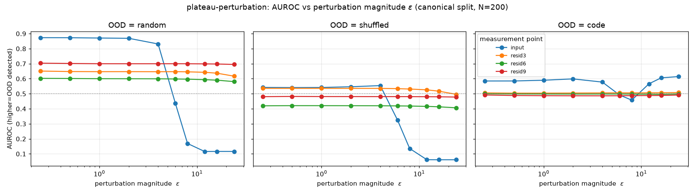
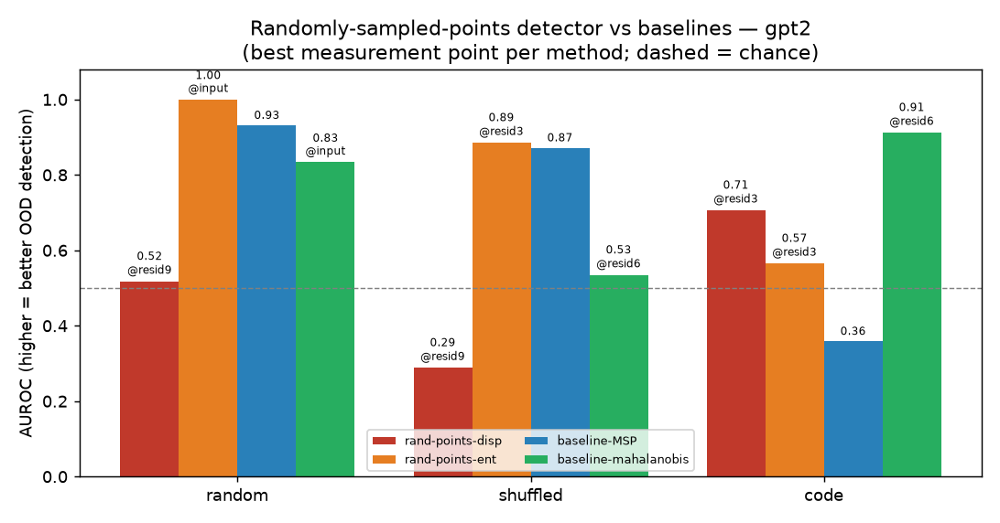
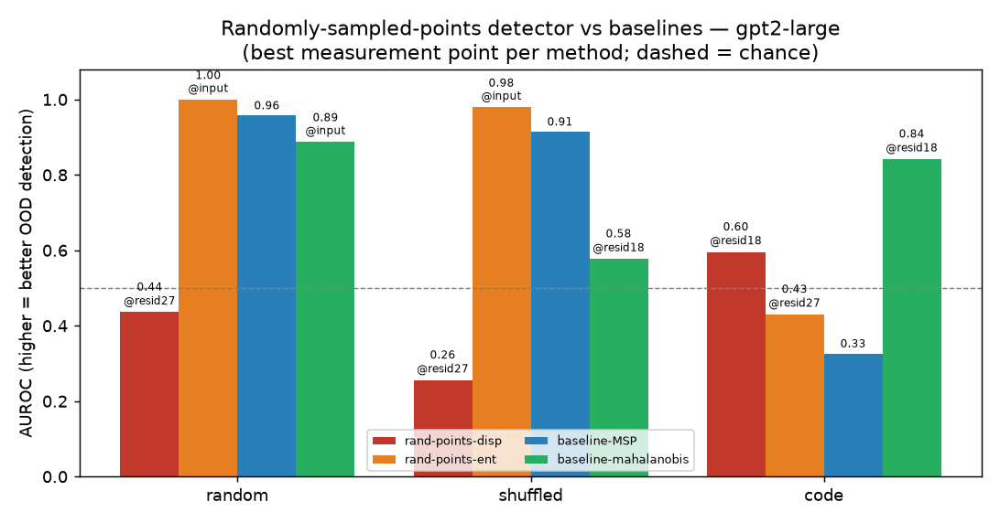

# RESULTS — Direction #9 (Plateau-ness as an OOD detector)

**Negative result: plateau-ness does NOT beat the baselines on any OOD set.** Full methods, metric and
baseline definitions (with equations) are in REPORT.md.

**Setup.** GPT-2 small (124M) on GPU. ID = held-out FineWeb (`data/fineweb_sample.txt`). OOD = random
tokens, shuffled tokens, **and Python source code** (real domain shift, offline site-packages).
`seq_len=64`, last-token measurement, $N=200$/set; covariance baselines fit on 1000 separate ID seqs.
**One canonical ID split** (`randperm(seed=7)`, indices in `results/split/canonical_split.npz`) is shared
byte-for-byte by the plateau/standard table and the real-cupbearer table, so all rows are strictly
apples-to-apples. **$N=200 \Rightarrow$ AUROC noise $\approx \pm0.035$**, so gaps below ~0.05 are not
significant. Scores are oriented a priori (higher = more OOD); an AUROC < 0.5 means a *reversed* signal.

**Methods (summary; equations in REPORT.md):** `plateau-jacFrob` = Hutchinson estimate of
$\Vert\partial \log p/\partial h\Vert_F$ (4 dirs; flatter=ID); `plateau-perturbation` = mean next-token KL
after 16 unit perturbations (eps=6); `selfNLL-grad` = $\Vert\partial(-\log p[\arg\max])/\partial h\Vert$
(confidence-adjacent control); `baseline-MSP` = $1-\max$ softmax; `baseline-L2norm` = $\Vert h\Vert_2$;
`baseline-mahalanobis` = naive Mahalanobis (1000-seq fit); `cup-RMD` = cupbearer relative Mahalanobis;
`cup-QUE` = cupbearer Quantum-Entropy/SPECTRE.


**Figure — what each bar is.** Each red bar is the strongest *plateau variant* for that OOD set, each
blue bar the strongest *baseline*, both annotated with the exact `method@point`: **random**
`plateau-jacFrob@input` 0.73 vs `MSP` 0.93; **shuffled** `plateau-perturbation@resid3` 0.53 vs `MSP`
0.87; **code** `plateau-jacFrob@input` 0.65 vs `cup-RMD@resid6` 0.92. The plateau pool is
{`plateau-jacFrob`, `plateau-perturbation`} (the `selfNLL-grad` confidence control is excluded); the
baseline pool is {MSP, L2, naive-Mahalanobis, cup-RMD, cup-QUE}. Baselines win every set. Regenerate
with `experiments/make_summary_plot.py` (derives best-per-set from `auroc_table.csv`).

**Two concepts used below** (full definitions in REPORT.md). **Canonical split:** the one fixed ID
partition — `randperm(seed=7)` over the FineWeb pool, `fit=perm[:1000]` (fits every ID statistic),
`test=perm[1000:1200]` (held-out ID scored for AUROC) — reused *byte-for-byte* by every method and
table, so all comparisons are apples-to-apples on identical ID examples. **Why MSP detects OOD:** the
model is on average more confident (higher $\max_y p$) on in-distribution text and flatter/less confident
on OOD, so $s_{\text{MSP}}=1-\max_y p$ rises for OOD — except when the model is *confidently wrong* on a
fluent out-of-domain input (the `code` set), where MSP collapses to 0.359.

## AUROC pivot (rows = method@point, cols = OOD set; **bold** = best in column)
| method@point | random | shuffled | code |
|---|---|---|---|
| plateau-jacFrob@input | 0.734 | 0.370 | 0.649 |
| plateau-jacFrob@resid3 | 0.327 | 0.237 | 0.625 |
| plateau-jacFrob@resid6 | 0.212 | 0.111 | 0.626 |
| plateau-jacFrob@resid9 | 0.144 | 0.071 | 0.582 |
| plateau-perturbation@input | 0.437 | 0.326 | 0.491 |
| plateau-perturbation@resid3 | 0.647 | 0.534 | 0.506 |
| plateau-perturbation@resid6 | 0.598 | 0.419 | 0.498 |
| plateau-perturbation@resid9 | 0.700 | 0.481 | 0.487 |
| selfNLL-grad@input | 0.923 | 0.639 | 0.516 |
| selfNLL-grad@resid3 | 0.812 | 0.655 | 0.474 |
| selfNLL-grad@resid6 | 0.806 | 0.601 | 0.466 |
| selfNLL-grad@resid9 | 0.811 | 0.587 | 0.463 |
| baseline-MSP@n/a | **0.932** | **0.872** | 0.359 |
| baseline-mahalanobis@input | 0.834 | 0.499 | 0.679 |
| baseline-mahalanobis@resid3 | 0.739 | 0.511 | 0.885 |
| baseline-mahalanobis@resid6 | 0.715 | 0.535 | 0.913 |
| baseline-mahalanobis@resid9 | 0.621 | 0.465 | 0.888 |
| cup-RMD@input | 0.812 | 0.509 | 0.713 |
| cup-RMD@resid3 | 0.740 | 0.517 | 0.892 |
| cup-RMD@resid6 | 0.728 | 0.547 | **0.918** |
| cup-RMD@resid9 | 0.663 | 0.493 | 0.900 |
| cup-QUE@input | 0.782 | 0.508 | 0.581 |
| cup-QUE@resid3 | 0.733 | 0.517 | 0.668 |
| cup-QUE@resid6 | 0.703 | 0.524 | 0.628 |
| cup-QUE@resid9 | 0.603 | 0.481 | 0.563 |
| baseline-L2norm@input | 0.859 | 0.492 | 0.571 |
| baseline-L2norm@resid3 | 0.631 | 0.383 | 0.630 |
| baseline-L2norm@resid6 | 0.464 | 0.440 | 0.639 |
| baseline-L2norm@resid9 | 0.224 | 0.434 | 0.357 |

_Full machine-readable table: `results/auroc_table.csv` (87 rows). Raw scores: `results/scores_full.npz`.
Canonical split: `results/split/canonical_split.npz`. ROC + score-distribution plots: `results/plots/`
(ROC plots generated on the iter-2 first-N split; canonical-split numbers shift <0.04, so the
distributions are qualitatively identical)._

The `cup-RMD` / `cup-QUE` rows above are cupbearer's detector math **vendored** and recomputed on the
canonical split. On that split vendored `cup-RMD` matches the **real cupbearer package** essentially
exactly (code@resid6: vendored 0.918 = real 0.918). Vendored `cup-QUE` is the **transductive**
approximation and is superseded by the real-package `cup-QUE` below; read it as caveated.

## Per-OOD-set summary
| OOD set | best plateau | best baseline | does plateau beat baselines? |
|---|---|---|---|
| random | plateau-jacFrob@input 0.734 | **MSP 0.932** | **NO** (also L2@input 0.859, maha@input 0.834) |
| shuffled | plateau-perturbation@resid3 0.534 | **MSP 0.872** | **NO** |
| code | plateau-jacFrob@input 0.649 | **cup-RMD@resid6 0.918**, maha@resid6 0.913 | **NO** (MSP collapses to 0.359) |

_"Best plateau" above uses the pre-registered fixed $\epsilon=6$. An oracle $\epsilon$-scan (next section)
raises `plateau-perturbation` on `random` to 0.873 — still below MSP — and leaves the other sets' verdicts
unchanged._

## Epsilon sensitivity of plateau-perturbation (operator request 2026-07-01)

The main table fixes the perturbation magnitude at $\epsilon=6$. An operator asked whether *scanning*
$\epsilon$ changes the picture — does plateau-perturbation become competitive at some magnitude?
`experiments/eps_scan.py` sweeps $\epsilon \in \lbrace0.25,0.5,1,2,4,6,8,12,16,24\rbrace$ at every measurement point
on the **same canonical split**, reusing the same 16 random unit directions across magnitudes (only the
scalar $\epsilon$ varies), so the curves are apples-to-apples and the $\epsilon=6$ column **reproduces the
main table exactly** (e.g. random@input 0.437, random@resid3 0.647, shuffled@resid3 0.534).



**What the scan shows (figure above).**
- **The residual-stream points are almost flat in $\epsilon$** — resid3/6/9 move by <0.05 across two orders
  of magnitude, so the metric there is essentially insensitive to the magnitude choice.
- **Input space is where $\epsilon$ matters, and the fixed $\epsilon=6$ was a poor choice there.** At input
  space the AUROC is high for small perturbations, then falls off a cliff and *reverses* (crosses below
  0.5) as $\epsilon$ grows: random@input is **0.87 for $\epsilon\le2$**, 0.44 at $\epsilon=6$, and 0.12 at
  $\epsilon\ge8$ (a large input perturbation moves the OOD distribution *less* than the ID one). The single
  fixed $\epsilon=6$ landed right on that cliff, understating input-space plateau-perturbation.
- **Best-achievable (oracle-$\epsilon$) plateau-perturbation still loses on every OOD set.** Picking the
  best $\epsilon$ *and* point per set is an oracle that peeks at labels — an upper bound, not a deployable
  detector:

| OOD set | best plateau-perturbation (oracle $\epsilon$, point) | fixed $\epsilon=6$ best | best baseline | beats baseline? |
|---|---|---|---|---|
| random | **0.873** (input, $\epsilon=0.25$) | 0.700 (resid9) | MSP 0.932 | **NO** |
| shuffled | **0.554** (input, $\epsilon=4$) | 0.534 (resid3) | MSP 0.872 | **NO** |
| code | **0.614** (input, $\epsilon=24$) | 0.506 (resid3) | cup-RMD@resid6 0.918 | **NO** |

**Takeaway.** Scanning $\epsilon$ lifts the `random` AUROC substantially (0.70 → 0.873, now the best
plateau variant for `random`, above `plateau-jacFrob@input` 0.734) and shows the residual points are
magnitude-insensitive — but even an oracle $\epsilon$ leaves plateau-perturbation below the best baseline
on every set. No single $\epsilon$ is jointly best (random wants $\epsilon\le2$, code wants
$\epsilon\ge16$), and at input space large $\epsilon$ actively *reverses* the detector. The negative
verdict is unchanged; the scan strengthens it by ruling out "we just used the wrong $\epsilon$" as an
escape. Full numbers: `results/auroc_perturbation_eps.csv` (120 rows).

## Randomly-sampled residual points + GPT-2 scaling (operator request 2026-07-09)

An operator asked to *"try GPT-2 XL, and OOD detection with randomly sampled points in the residual
stream."* GPT-2 XL is not in the offline model cache, so the largest cached model — **gpt2-large
(774M, ~6× GPT-2 small)** — is used for the scale test. The "randomly sampled points" idea is
implemented as a new **forward-only** detector, `rand-points`, evaluated against the two cheapest
reference baselines (MSP, naive Mahalanobis) on the same three OOD sets. Full numbers:
`results/auroc_randpoints.csv` (78 rows); code `experiments/rand_points.py`.

**What the detector does.** For each input, take the last-token activation $h$ at a measurement point,
then sample $K$ random points around it, $h_k = h + \sigma z_k$ with $z_k \sim \mathcal{N}(0,I)$ and
$\sigma = 0.1\Vert h\Vert$ (the cloud scales with the local activation magnitude). Continue the
forward pass from each random point to get $K$ next-token distributions $p_1,\dots,p_K$, and score by
their **dispersion** (`rand-points-disp`, the epistemic / plateau-width term) and by the **entropy** of
their mean (`rand-points-ent`):

```math
s_{\text{disp}}(x) = \frac{1}{K}\sum_{k=1}^{K} D_{\mathrm{KL}}\!\big(p_k \,\Vert\, \bar p\big),
\qquad
s_{\text{ent}}(x) = H(\bar p) = -\sum_y \bar p(y)\log \bar p(y),
\qquad \bar p = \frac{1}{K}\sum_k p_k .
```

Both are oriented *a priori* higher = more OOD. `rand-points-disp` differs from `plateau-perturbation`
(distance of each perturbed output from the *clean* output): it measures the **spread among the random
outputs themselves** — a Monte-Carlo estimate of epistemic uncertainty (BALD mutual information). The
plateau hypothesis predicts low dispersion on a flat in-distribution plateau and high dispersion off it.
gpt2 uses $K=16$, $N=200$, points {input, resid3/6/9}; gpt2-large uses $K=8$, $N=150$, points {input,
resid9/18/27} (¼/½/¾ depth) under the shared VRAM/time budget.




**Best AUROC per method (max over measurement point; `disp`/`ent` point in parentheses):**
| model | OOD set | rand-points-disp | rand-points-ent | MSP | Mahalanobis (best pt) | best method |
|---|---|---|---|---|---|---|
| gpt2 | random | 0.518 (resid9) | 1.000 (input) | 0.932 | 0.834 (input) | rand-points-ent* |
| gpt2 | shuffled | 0.267 (input) | 0.886 (resid3) | **0.872** | 0.535 (resid6) | MSP |
| gpt2 | code | 0.707 (resid3) | 0.566 (resid3) | 0.359 | **0.913** (resid6) | Mahalanobis |
| gpt2-large | random | 0.436 (resid27) | 1.000 (input) | 0.957 | 0.888 (input) | rand-points-ent* |
| gpt2-large | shuffled | 0.256 (resid27) | 0.980 (input) | **0.914** | 0.578 (resid18) | rand-points-ent* |
| gpt2-large | code | 0.596 (resid18) | 0.326→ | 0.326 | **0.842** (resid18) | Mahalanobis |

\* `rand-points-ent` is **predictive entropy** — a confidence signal, not plateau geometry. It is
near-perfect on `random`/`shuffled` (where the model is simply uncertain) but **collapses on `code`
exactly like MSP** (gpt2 0.566, gpt2-large **reverses** to 0.43/0.30) — the same confident-wrong failure.
It wins the synthetic sets only because it *is* the entropy baseline; it is not evidence for plateau-ness.

**What the scan shows.**
- **The genuine "plateau-width" signal (`rand-points-disp`) is weak and loses on every set, for both
  models.** It is *reversed* on `random` and `shuffled` (best-point AUROC ≤ 0.52 for gpt2, ≤ 0.44 for
  gpt2-large — ID text disperses *more* under residual noise than the synthetic OOD does), and only
  moderate on `code` (0.71 / 0.60), where it still loses to Mahalanobis (0.913 / 0.842). Same verdict as
  the existing `plateau-jacFrob` / `plateau-perturbation` variants.
- **The negative result holds at ~6× scale.** Going GPT-2 small → large does not rescue any plateau-style
  signal: `rand-points-disp` stays weak/reversed, MSP stays best on the synthetic sets (and rises to
  0.957 / 0.914), and on the `code` domain shift every confidence signal collapses (MSP 0.326) while
  Mahalanobis in a deep residual layer (resid18, ½-depth, 0.842) remains the strongest detector.
- **No consistent internal-vs-input advantage** for `rand-points-disp`: it is best in a *shallow-to-mid*
  residual layer on `code` (slightly above input) but reversed in the residual stream on the synthetic
  sets — no clean case for measuring internally, matching the main study.

**Takeaway.** Adding the operator's randomly-sampled-residual-points detector and a ~6× larger model
does **not** change the conclusion. The honest epistemic-dispersion signal is a weak detector that loses
to Mahalanobis (code) and MSP (synthetic) at both scales; the only strong `rand-points` variant is the
entropy summary, which is a confidence baseline in disguise and collapses on the real domain shift.

## Headline
With the methodology errors flagged by the operator review fixed, the iter-1 "competitive with MSP"
story does not survive:

1. **The genuine plateau metric is weak.** `plateau-jacFrob` tops out at 0.734 (random@input) / 0.649
   (code@input) and is *reversed* on shuffled and in deep residual layers (0.07–0.37). `plateau-
   perturbation` is similarly weak (≤0.70). Neither beats the best baseline on any set.
2. **iter-1's "strong jacobian" was a confidence signal in disguise.** The renamed `selfNLL-grad`
   scores random 0.923 ≈ MSP 0.932 and **collapses on code (≈0.52) exactly like MSP (0.359)** — it
   tracks model confidence, not plateau geometry.
3. **Properly-powered baselines dominate.** MSP is best on synthetic OOD (0.932 / 0.872). On the code
   domain shift MSP collapses (0.359) but **cup-RMD@resid6 (0.918)** and well-fit naive Mahalanobis
   (0.913) are the strongest detectors anywhere. With a 1000-seq covariance fit, Mahalanobis does NOT
   collapse in deep layers.
4. **Internal (residual) vs input-space:** for the genuine `plateau-jacFrob`, **input-space is best**
   and the residual stream is worse/reversed → **no value in measuring plateau-ness internally**.
   (Mahalanobis-type baselines are the opposite: they need a deep residual layer for the code shift.)
5. **No single method is robust across OOD types**, but the most robust are baselines, not plateau:
   naive-Mahalanobis@input has the best worst-case (min 0.499) and cup-RMD@input (0.509); the best
   plateau worst-case is only ~0.37.

**Bottom line:** plateau-ness (measured honestly) is a weak OOD detector and loses to standard and
cupbearer baselines on every OOD set. This is a clean negative result, complete and acceptable per
PLAN.md. See REPORT.md for the per-point verdict and full equations.

---

## Real cupbearer package (isolated env)

The genuine cupbearer package (installed editable from the GitHub clone in an isolated conda env
`cupenv`; shared base env verified untouched, numpy 2.3.3 / torch 2.9.0+cu130) was run on the **same
precomputed GPT-2 last-token activations** (`results/acts/`, canonical split) via
`experiments/cup_eval.py`. Detectors: `MahalanobisDetector` (naive `cup-maha` & relative `cup-RMD`),
`QuantumEntropyDetector` (`cup-QUE`), `SpectralSignatureDetector` (`cup-spectral`); fit on 1000 ID seqs.

### Real-package AUROC (`results/auroc_cupbearer.csv`, 48 rows)
| method@point | random | shuffled | code |
|---|---|---|---|
| cup-maha@resid6 | 0.715 | 0.535 | 0.913 |
| cup-RMD@resid6 | 0.728 | 0.547 | **0.918** |
| cup-RMD@resid9 | 0.663 | 0.493 | 0.900 |
| cup-QUE@resid6 | 0.728 | 0.545 | 0.910 |
| cup-QUE@resid3 | 0.740 | 0.507 | 0.895 |
| cup-maha@input / cup-QUE@input | 0.824 | 0.496 | 0.696 |
| cup-RMD@input | 0.812 | 0.509 | 0.713 |
| cup-spectral@input | 0.780 | 0.493 | 0.368 |
| cup-spectral@resid6 | 0.371 | 0.452 | 0.520 |

Best real-cupbearer detector per set: random `cup-maha@input` 0.824, shuffled `cup-RMD@resid6` 0.547,
**code `cup-RMD@resid6` 0.918**.

### Vendored vs real package (`results/cup_real_vs_vendored.csv`)
- **cup-RMD: the vendored math was FAITHFUL** — on code, $|\Delta|\le0.042$ (resid6 $|\Delta|=0.001$:
  real 0.918 vs vendored 0.917); max $|\Delta|=0.065$ across all sets.
- **cup-QUE: the vendored approximation was NOT faithful** — it *understated* QUE on the code shift
  (real `cup-QUE@resid6` **0.910** vs vendored 0.572, $|\Delta|=0.338$). The genuine
  `QuantumEntropyDetector` is fit **once** on ID and applied uniformly (no transductive per-set
  covariance), which is why it differs so much.

### Verdict (unchanged, strengthened)
The real package gives **three** strong code-shift detectors (cup-RMD 0.918, cup-maha 0.913, cup-QUE
0.910), all far above the best plateau variant (≈0.65) and above MSP (collapsed to 0.359 on code). On
random/shuffled the cupbearer covariance detectors (~0.82 / ~0.55) still lose to MSP (0.93 / 0.87), and
plateau-ness loses to both everywhere. `cup-spectral` is weak (≤0.78). Plateau-ness is beaten by
standard *and* genuine-cupbearer baselines on every OOD set.
